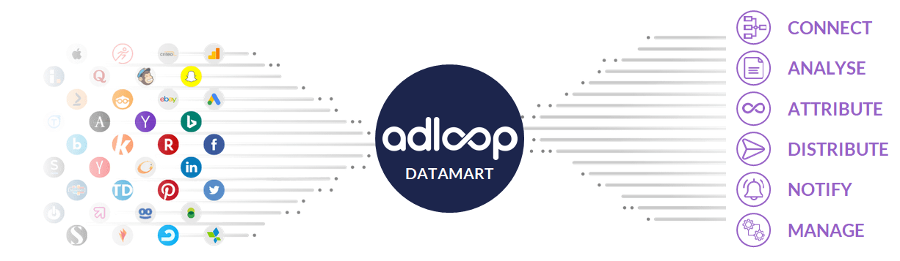

## What is Adloop?
Adloop is a  **marketing data storage unit**  with a set of  **functionnalities**  here to  **help digital marketers' everydays' life.** 

For better clarity, we have ranked Adloop functionnalities in 6 broad categories.

### CONNECT : Everything starts with a Data Source
Adloop does not collect data directly, it feeds itself from external Data sources which are : 

* Your  **Ad platforms**  which give you data that we usually call  **_Ad-Centric_**  : Impressions, clicks, ad names, campaign types, etc.

* Your  **Analytics**  tools feeding Adloop in users behavior’s data on your sites and apps  **_(Site-Centric_**  data) : Pages viewed, add to the basket, account setup, purchase, visits demographic, etc.

* Your  **CRM**  or **business**  apps used to identify clients or prospects, communicate with them, know what they bought, etc. That is  **_User-Centric_** .

All those data are sent to Adloop via  **_API_**  data connectors which are updated automatically every 3 hours.

To connect a Data Source to Adloop, go check out the  **Data Source**  page. 

### ANALYZE : A powerful reports system
Have you ever dreamed of being able to analyzing all your Platforms, Analytics and Attributed data  **in one single place** ? Are you a wonderful analyst who wants to see  **5 UTM**  then 12 metrics or KPIs in one single report ? You are getting tired or doing copy-paste in Excel to compare your  Google Ads and  Facecook Ads campaigns ?

Adloop is going to be your best friend!

To be more efficient, we put at your disposal a set of  **reports templates** . You can  **save**  them,  **share**  them with your team or simply look at shared reports.

noteTo analyze data, go check out the  **Reports**  page.

To analyze data, go check out the  **Reports**  page.

### ATTRIBUTE: Data-driven marketing attribution
Years of R&D to offer you the best attribution algorithm on the market. Data-driven and based on users behavior analysis, the  **Adloop Tracking & Attribution**  technology is going to put together the conversion paths (or non conversion paths)  and build several reports based on those :

* Conversions and revenues attributed with all KPIs related to the conversion : Attributed CPA, attributed ROAS…

* Complete conversion path linked with order ID

* Most frequent conversion path with a search system to identify winning scenarios.

* Recommendations of calculated actions for each ad updated in real time

fc6c24c9-aa5f-4d09-9f6a-0218406d80362ba761d4-dd38-4dca-9cc8-a5bbdc974848DECIDEDThe Data Source  **Adloop Tracking & Attribution**  collect specific data from Adloop. It has to be activated and set up to be able to use the  **Attribution**  and the  **Recommandations**  tools.
* The Data Source  **Adloop Tracking & Attribution**  collect specific data from Adloop. It has to be activated and set up to be able to use the  **Attribution**  and the  **Recommandations**  tools.

### DISTRIBUTE : feeding external apps data
A data-extract system allowing to feed external systems in real time.

With DISTRIBUTE, no need to lose time doing copy-paste or looking for data in various platforms, everything is  **automatized** .

Export destinations' connectors make possible to send data : 

* By mail, FTP or shared storages like Google Drive

* To Data visualization apps like **Google Data Studio** ,  **Tableau** , or  **Power BI** 

* To Datamarts like Google  **Big Query** ,  **AWS** ,  **Azure**  or  **Snowflake** 

Distribute the metrics and KPIs that you need in real time using our  **Export center.** 

### NOTIFY : For informed and reactive teams
You always need to be notified about your campaigns without the burden of login to the ad plaforms or to Analytics tools? NOTIFY allows you to create alarms on whichever Data sources with whichever KPIs you need and to send them to yourself by mail or on any messaging app you want like  **Slack** ,  **Google Chat**  or  **MS Teams** .

Set up the notifications and keep your teams informed and alert with the  **Notification center** .

### MANAGE : A global management of the marketing data
To organize your  **data menus**  as you want, to create  **matching**  rules between platforms and Analytics tools, to define  **calculated metrics**  that are specific to your activity, Adloop will offer you a simple interface to  **manage your data.** 

*****

[[category.storage-team]] 
[[category.confluence]] 
