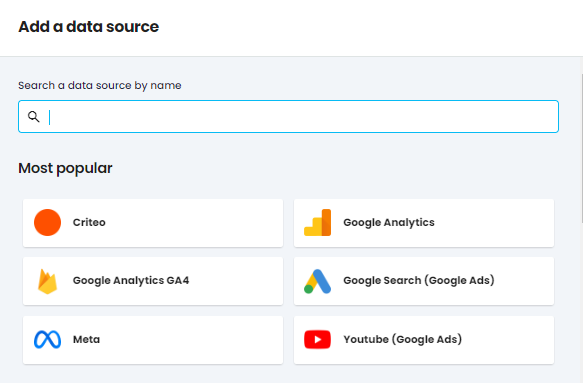
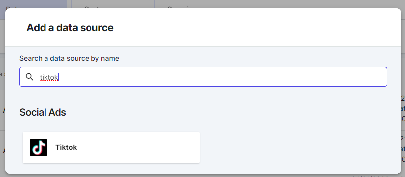
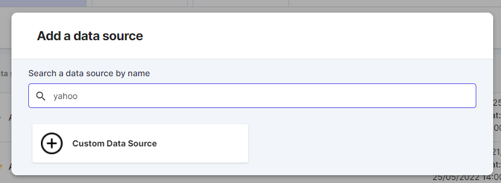
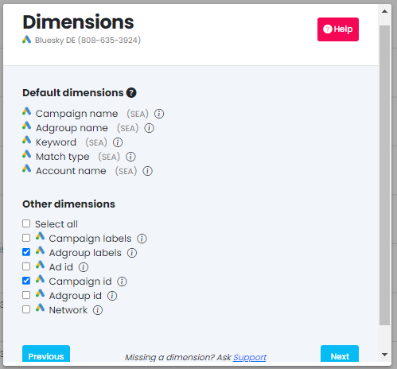
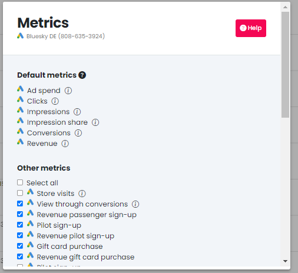
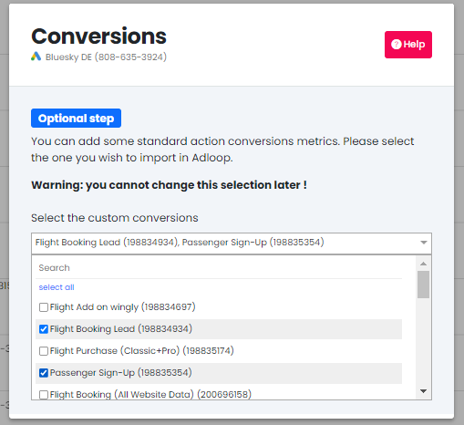
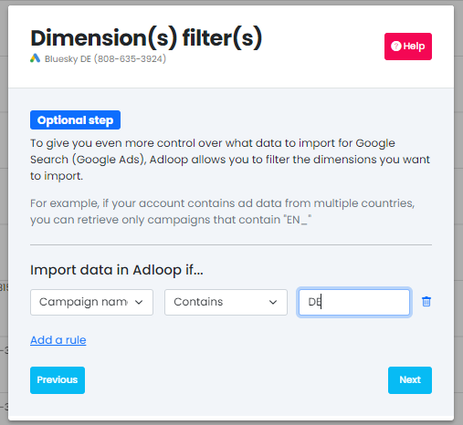
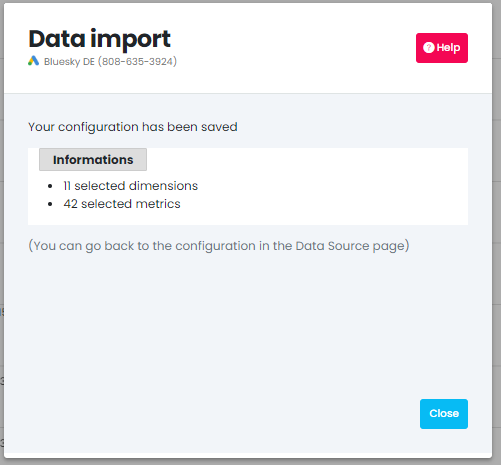

For the main Advertising Platforms, we are able to fetch automatically the data, several times a day, after the source is added in your Adloop space. 

A data source is missing? Contact our Support Team to add it on our road map! 

## 1. Add a data source
In the Data Sources tab, click on "Add" and select the desired data source.

The most popular ones can be found at the top and after they are organized per categories: Search, Shopping, Social…

You can also use the search bar to find directly the source you are looking for. 

If the source is not yet available, you can use our [[custom data source function|Custom-data-sources]] to import data! 

Once you have found your data source, click on it and follow the instructions on the screen. 

### 1- Dimensions selection
Normalized dimensions are imported by default, but you can choose to import additionnal dimensions by ticking them. 

### 2- Metrics selection
Normalized metrics are imported by default, but you can choose to import additionnal metrics by ticking them. 

### 3- Data-sources specific steps
Some connectors have optional steps.

*  **Google & Facebook: custom conversions import** 

If you have set-up custom conversions on Google and Facebook thanks to conversion pixels, you can import them in Adloop as well. 

### 4- Filter the data (optional)
You can choose to filter the entering data based on the naming of the campaigns, adgroups etc. 

This is very useful if you have all your countries campaigns regrouped in the same Ad Account but you want to split your Adloop data per country. 

It’s important to note! When adding more than one filter on the dimensions it’s either AND/OR depending on which operator you are using!

* if it is a "positive" operator (eg: contains, equals), it will be an OR

* if it is a "negative" operator (eg: is not equal to, does not contain), it will be an AND

So imagine you are doing something like the screen, it will be: IF the campaign begins with "Black Friday" or "Xmas" AND does not contain EN AND HU

.png)

### 5- Import
At the end of the process, click on the Start Import button and the data will start flowing in! 

We will gather a full year of data history.

## Connecting data sources
[https://www.youtube.com/watch?v=BiBYYhq1tPg&list=PLQ4YExrLQZJK_n0ICcYT5ijp1bY743qYP&index=2&ab_channel=AdloopMediaOptimizationPlatform](https://www.youtube.com/watch?v=BiBYYhq1tPg&list=PLQ4YExrLQZJK_n0ICcYT5ijp1bY743qYP&index=2&ab_channel=AdloopMediaOptimizationPlatform)

*****

[[category.storage-team]] 
[[category.confluence]] 
