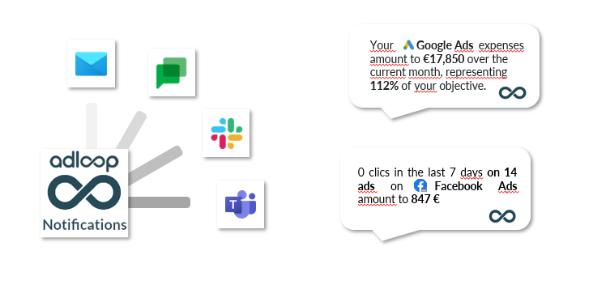

Notifications allow teams to be informed about events that have taken place on their campaigns without having to log in to Adloop. #timesavings 

## 1 - Our goal: tell you what’s happening on your campaigns
Adloop tells you what is happening on your campaigns without having to access your Ads or Analytics platforms.  

 **_What kind of informations will I get?_** 

One or ore marketing channels at the same time, or Campaign or even a Creative

 **_What triggers Notifications?_** 

Notifications are triggered according to the parameters you set up. It can be a threshold or just following changes on a Metric. 

 **_How frequently?_** 

You choose the frequency, or, if you choose the threshold or objectif reached kind of notification, Adloop will notify you immediately. 

 **_Where will I get those Notifications?_** 

Several Destinations are available, we aim at notifying a person but also a team. Email is a mean of Notifications, but also professional chat apps like Slack, Google Chat or Teams. 

## 2 - Building Notifications in Adloop  
 **Prerequisite**  - For Notifications to work, you must have set-up:  

* One or several  **Data Sources** 

* One or several [[ **Integrations** |Integrations]]

A notification requires several elements in order to function properly: 

|  **Element**  |  **Details**  | 
|  --- |  --- | 
|  **Notification type**  | The trigger of the notification, the event that will trigger the notification sending. Notification types are chosen by the Adloop team, that can add new ones.    | 
|  **Destination**  | The app the notification will be sent to. You must have created your [[Integrations. |Integrations]] | 
|  **Source**  | The Date Source you want to be notified about. The Source defines the content of the notification. You can, in some cases, select several Sources for a Notification. You can also filter the Source to limit the scope (for example, you can select a single   **Facebook Ads** campaign). | 
|  **Métrics**  | The metrics that trigger the Notification. For example: <ul><li>if you select the   **Ad spend**  Metrics, you want a notification based on the spends of the selected Source. 

</li><li>if you select  **Conversion** , we trigger a notification based on the number of conversions coming from  **Bing Ads** 

</li></ul> | 
|  **Frequency**  | How frequently you will be receive the Notification.  | 
|  **Period**  | Period on which the metrics will be analyzed. | 
|  **Name**  | The notification name, you can choose what you want, but we advise you to be precise, because if you receive 15 notifications per day, you will be glad you named them well.   | 

## 3 - Notifications available in Adloop

|  **Notification**  |  **Description**  | 
|  --- |  --- | 
|  **ZERO**  | You receive a notification when a Metric equals to 0 Examples:<ul><li>Receive each Monday the  **Google Ads**  keywords that had 0 conversion ( **Conversions**  Metric) over the last week

</li><li>Receive each day the  **Facebook Ads**  ads with 0 click yesterday. 

</li></ul> | 
|  **THRESHOLD**  | Receive a notification when a threshold is reached or surpassed Examples: <ul><li>Receive a Notification when my spends ( **Ad Spend**  Metric) are more than 10 000€ in 7 days on  **Google Ads** 

</li></ul> | 
|  **OBJECTIVE**  | Receive a notification to follow a progression towards a goal (in % of the goal). Examples:<ul><li>Receive each monday how my spends ( **Ad Spend**  Metric) are progressing towards my goal of 10 000€ in 7 days on  **Google Ads** 

</li></ul>noteThe Goal Notification is different from the Threshold Notification as it tells you regularly how you are doing regarding your goal and not only when it is reached. 

The Goal Notification is different from the Threshold Notification as it tells you regularly how you are doing regarding your goal and not only when it is reached. 

 | 
|  **VARIATION**  | Receive a notification when a Metric is changing by a certain %, either up or down, as compared to a previous period. Examples:<ul><li>Receive a notification when the  **Google ads,**  **ad spend**  varies by more than 10% in 7 over the past week.

</li></ul> | 
|  **MONITORING**  | Receive a notification indicating the value of a Metric on a certain period. Examples:<ul><li>Recieve a notification on how many  **Conversions**  you have done in  **Google Ads**  in a set time period.

</li></ul> | 

## Daily notifications
[https://www.youtube.com/watch?v=TO-W7mwsRZQ&list=PLQ4YExrLQZJK_n0ICcYT5ijp1bY743qYP&index=13&ab_channel=AdloopMediaOptimizationPlatform](https://www.youtube.com/watch?v=TO-W7mwsRZQ&list=PLQ4YExrLQZJK_n0ICcYT5ijp1bY743qYP&index=13&ab_channel=AdloopMediaOptimizationPlatform)

*****

[[category.storage-team]] 
[[category.confluence]] 
