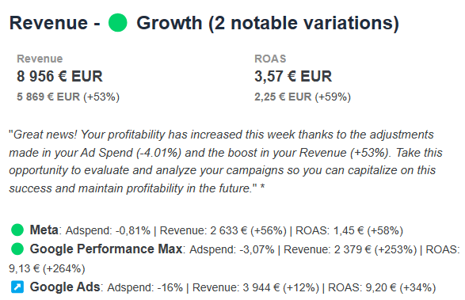

Our Smart Alerts are  **highlighting important variations**  on your key metrics and indicators, to draw your attention on what really matters. 

In our Budget Alerts, you’ll find some elements highlighted in red or in green, on addition of the variation in % that are available for all the metrics in the alert. 

Those highlighted elements show an unsual, unexpected, abnormal variation in regards of the Ad Spend variation. 

In the example above, the Ad Spend increased by 36%, while the conversions number remained stable with a 2.89% increase. This stability in conversions is not considered normal given that the investments increased quite a lot during this same period. 

This is a negative anomaly - a positive anomaly would just be the opposite. 

In our Weekly / Monthly Recap Alert, you’ll find some changes in channels performances outlined. In this Alert, we don’t list channels performances that remained stable for the period or that didn’t significant Ad Spend. 

In this focus, we’ll present first the positive anomalies, then negative anomalies, then positive changes and finally negative changes. 

In the Smart Alert Weekly Recap, the anomaly detection is also based on the Ad Spend variation. 

If we look closely at the Meta Data which presents a positive anomaly: the Ad Spend was stable while the revenue grew by 56%: this performance is not what could have been expected with the budget change. This is why we are drawing attention on it. 

We also have a positive anomaly for Google Perf Max, given the stable Ad Spend and the Revenue increasing by 253%

But why don’t we flag an anomaly for Google Search ? Its Ad Spend decreased by 16% while the revenue grew by 12%. Well, we use thresholds based on the variation difference between the Ad Spend and the measured metric to flag anomalies. 

The thresholds are the following:

|  **Label**  |  **Variation compared to the Ad Spend variation**  | 
| Negative anomaly  |  **Normal sensitivity:** -40 points **Low sensitivity:** beyond -55 points **High sensitivity:** beyond -25 points  | 
| Decrease |  **Normal sensitivity:** between -15 points & -40 points  **Low sensitivity:**  between -20 & -55 points **High sensitivity:** between -25 & -10 pts | 
| Stable |  **Normal sensitivity:** between -15 points and +15 points  **Low sensitivity:** between -20 & +20 points **High sensitivity:**  between -10 & +10 points | 
| Increase |  **Normal sensitivity:** between +15 points & +40 points **Low sensitivity:** between +20 & +55 points **High sensitivity:**  between +10 & +25 points | 
| Positive Anomaly |  **Normal sensitivity:** +40 points  **Low sensitivity:** beyond +55 points **High sensitivity:** beyond +25 points | 

*****

[[category.storage-team]] 
[[category.confluence]] 
