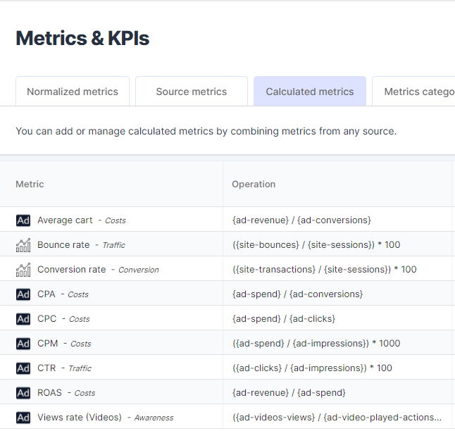

It is important to understand how calculated metrics are measured and their exact meanings. 

 **To help you with that down below you can find a glossary for each calcualated metrics describing their meaning and calculation method.** 

##   Arrival rate

Proportion of landed clicks compared to the advertising clicks. 

It gives you insight as to the proportion of clicks “lost”: the ones that you paid for but never arrived to the website. 

{adloop-clicks} / {ad-clicks}

##  Average cart

The average cart value is calculated by dividing the revenue divided by the number of conversions.

{ad revenue} / {ad conversion}

##  Bounce rate

It represents the percentage of **visitors**  who enter the site and then leave ("bounce") rather than continuing to view other pages within the same site. Bounce rate is calculated by counting the number of single page visits and dividing that by the total visits. It is then represented as a percentage of total visits.

({site-bounces)} / {site-sessions}) \* 100

##  Conversion rate

The conversion rate is the  **number of conversions**  divided by the total  **number of visitors** . For example, if an ecommerce site receives 200 visitors in a month and has 50 sales, the conversion rate would be 50 divided by 200, or 25%.

For our conversion rates, we use the main conversion metric added in the data source.

We have a conversion rate based on Analytics' data and another based on Adloop’s data. 

({site-transactions} / {site-sessions}) \* 100

({adloop-transactions} / {adloop-clicks}) \* 100

##  Cost per completed videos

The cost per completed videos shows on average how much money you paid for a user to watch a video entirely. We use the metrics completed videos (also called videos 100% viewed on some platform) to calculate this KPI. 

{ad-spend} / {ad-video-played-actions}

##  Cost per interaction
The cost per interaction shows on average how much money you paid for a user to engage with your contact on the Paid Social media platforms. The definition of interaction varies accross the different platforms, but includes engagement or shares, comments and likes.  

{ad-spend} / {interactions}

##   Cost per landed click
Average cost for clicks that arrived on your website, measured by us. It is to be compared with the Advertising CPC in order to optimize your digital marketing. 

It shows you the real price you are paying to effectively drive traffic to your website. 

{ad-spend} / {adloop-clicks}

##   Cost per useful click
Average cost for clicks that bring value to your business. It is to be compared with the Advertising CPC and the cost per landed click.

It shows you the real price you are paying to effectively engage users on your website.

It is a great KPI to evaluate traffic sources that are not necessarily converting.  

{ad-spend} / {adloop-useful-clicks}

##  CPA

CPA in marketing stands for  **cost per acquisition**  or action and is a type of conversion rate marketing. Cost per acquisition refers to the fee a company will pay for an advertisement that results in a sale.

For our CPA, we use the main conversion metric added in the data source.

We have a CPA calculated using Advertising platforms' data, one using Analytics' data and another using Adloop’s data. 

{ad-spend} / {ad-conversions}

{ad-spend} / {site-conversions}

{ad-spend} / {adloop-conversions}

##  CPC

 **Cost per click**  shows the average amount of money you are paying to get a user to your website, measured by the platforms. It is also the same for a bidding strategy (especially on Search) in which you define the maximum amount (Max CPC) you are willing to pay for a click.

{ad-spend} / {ad-clicks}

##  CPM

Cost per thousand (CPM), also called  **cost per mille** , is a marketing term used to denote the price of 1,000 advertisement impressions on one web page. If a website publisher charges $2.00 CPM, that means an advertiser must pay $2.00 for every 1,000 impressions of its ad. The "M" in CPM represents the word "mille," which is Latin for "thousands."

({ad-spend} / {ad-impressions}) \* 1000

##  CTR

A ratio showing how often people who see your ad or free product listing end up clicking it. **Clickthrough rate**  (CTR) can be used to gauge how well your keywords and ads, and free listings, are performing. CTR is the number of clicks that your ad receives divided by the number of times your ad is shown: clicks ÷ impressions = CTR. For example, if you had 5 clicks and 100 impressions, then your CTR would be 5%.

({ad-clicks} / {ad-impressions}) \* 100

##   Engagement rate

Proportion of useful clicks compared to the landed clicks. It gives you insight about the proportion of users that engaged with your website.

The higher the ratio, the more users engaged with your website coming from this traffic source. 

({adloop-useful-clicks} / {adloop-clicks}) \* 100

##  ROAS

ROAS is often expressed as a percentage and represents the  **revenue**  gained from each dollar spent on advertising. 

For our ROAS, we use the main conversion metric added in the data source.

We have a ROAS calculated using Advertising platforms' data, one using Analytics' data and another using Adloop’s data. 

{ad-revenue} / {ad-spend}

{site-revenue} / {ad-spend}

{adloop-revenue} / {ad-spend} 

##  Views rate (Videos)

A ratio showing the  **number of paid views**  of a video ad to the number of started videos. It can also be called video completion rate. 

({ad-videos-views} / {ad-video-played-actions}) \* 100

## Calculated metrics
[https://www.youtube.com/watch?v=84wl2Sv0DCs&list=PLQ4YExrLQZJK_n0ICcYT5ijp1bY743qYP&index=6&ab_channel=AdloopMediaOptimizationPlatform](https://www.youtube.com/watch?v=84wl2Sv0DCs&list=PLQ4YExrLQZJK_n0ICcYT5ijp1bY743qYP&index=6&ab_channel=AdloopMediaOptimizationPlatform)

*****

[[category.storage-team]] 
[[category.confluence]] 
