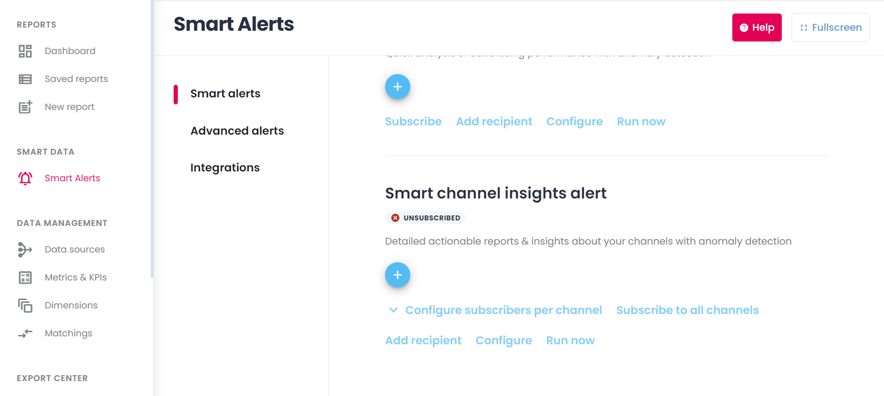
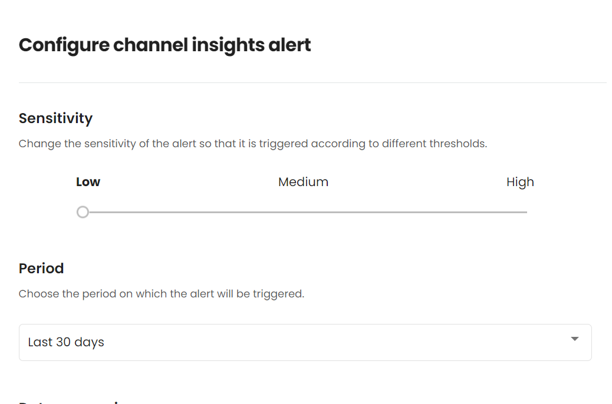
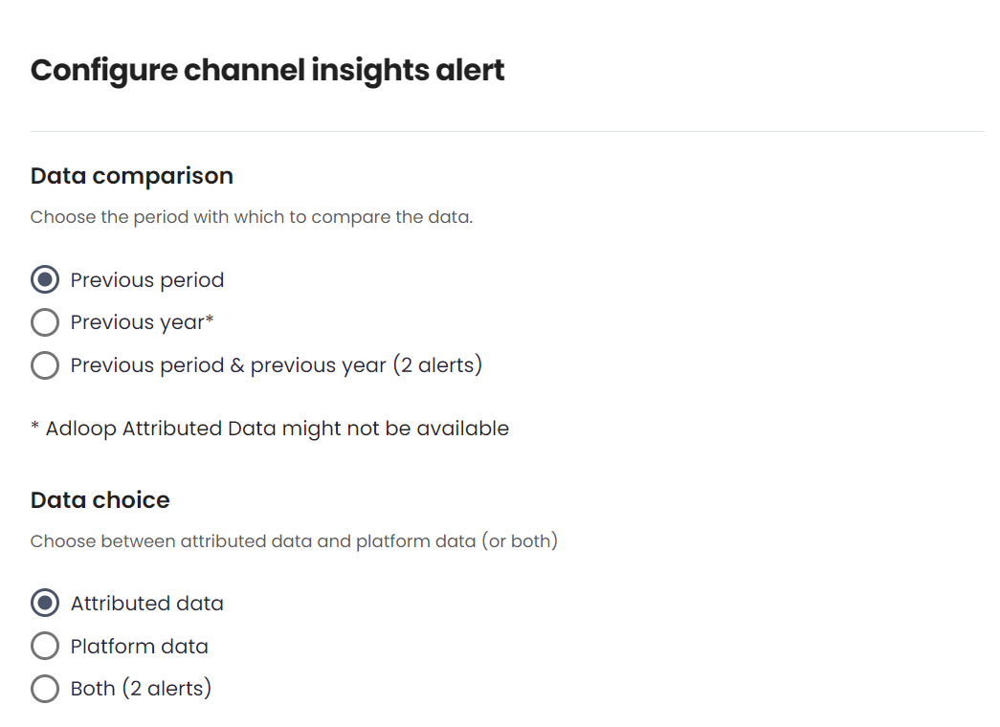
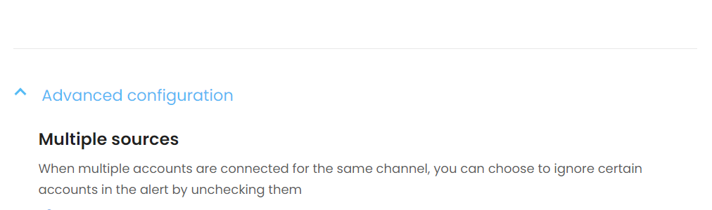
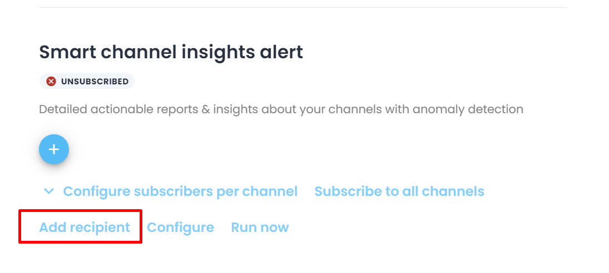
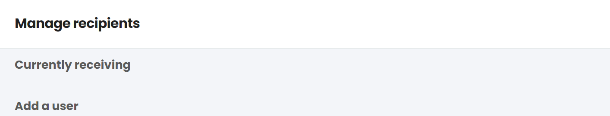
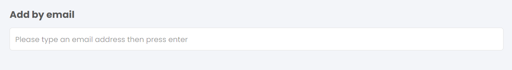
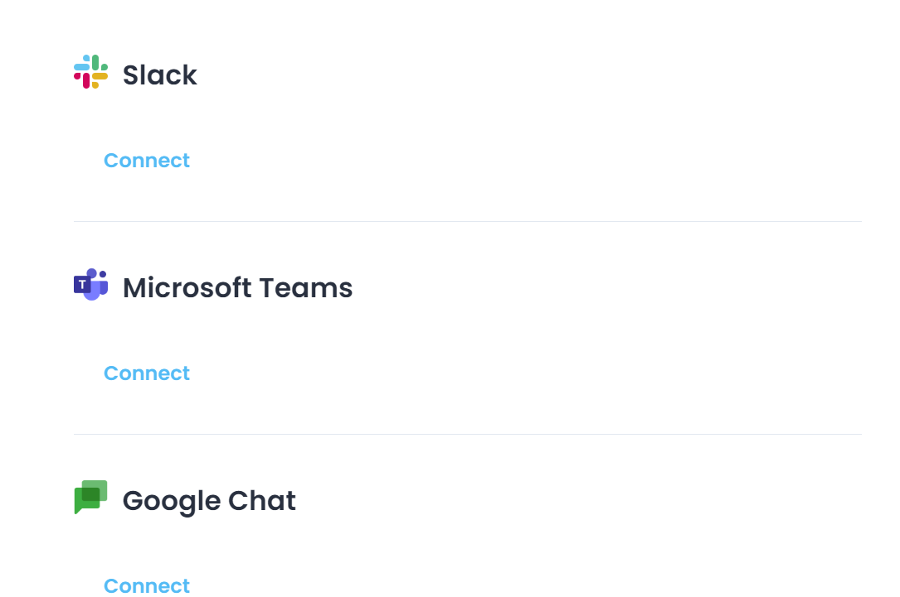
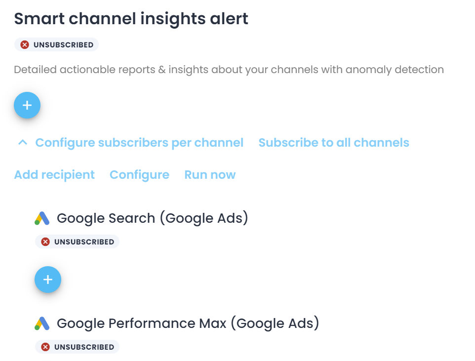

The insights include detailed actionable reports & insights about your channels with anomaly detection.

The goal of the channel insights is to offer reports already filtered with or without attribution for example on your nonperforming marketing channels. The access to actionable information allows you to react quickly to your nonperforming ads and turnover your marketing performances.

### 1. Smart Alerts
To set up you alerts just go to the Smart Alerts section and at the bottom of the page you will find the ‘Smart Channel Insights alert' 

### 2. Set-up
To set up you alert you have to clink on ‘Configure’ and you will be presented with the window featuring all the settings.

First you have to decide the sensitivity of the alert which will determine when the alert is triggered according to different thresholds. You can select Low/Medium/High.

You also have to select the period on which the alert will be triggered. You can select Last 7 days/Last Week/Last 14 days/Last 30 days/Last month

You also need to choose the period with which to compare the data with. It’s important to not that If you choose previous year attributed data might not be available based on your personal setup. You also have the option to select both periods but in that case you will receive two separate alerts.

Lastly you have to choose between attributed data and platform data (or both). This means that whatever you choose your alert will only include that specific data.

In the ‘Advanced configuration’ you have the option to ignore certain accounts in the alert when multiple accounts are connected by simply unchecking them from the list.

### 3. Recipients
When you are a user of Adloop by default you are subscribed to the alerts. To add more recipients click on ‘Add recipient’.

You can add them by user name if they are added to the platform. Or you can add them by email address.

You can also add integrations so your alerts will flow in to a specific channel. You have the options to connect Slack/Microsoft Teams/Google Chat.

### 4. Channel selection
By default you are subscribed to the all the channels, however you have to option to configure the subscribers per channel. 

*****

[[category.storage-team]] 
[[category.confluence]] 
