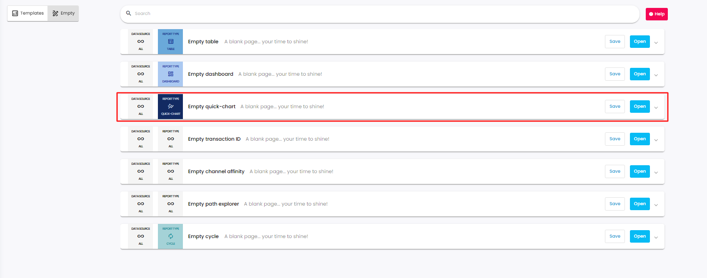
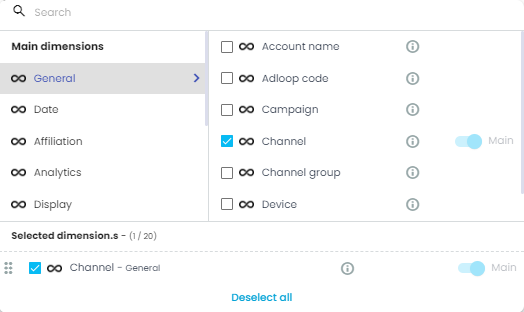
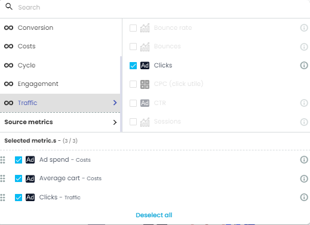
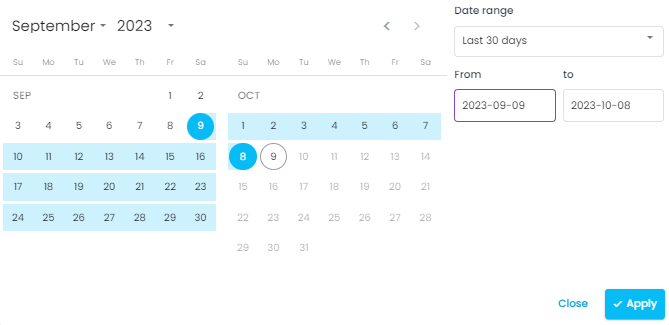
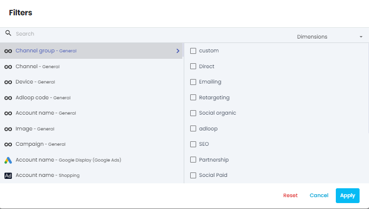
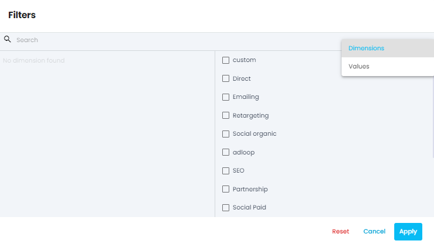

To create a chart report, click on  _+New report_  and select  _Empty chart report_ .

### I- Dimensions
For this report you can select only 1 dimension. You can select any dimension, normalized or source dimensions.

noteYou want to know more about dimensions? [Visit our dedicated page!](https://adloopwiki.atlassian.net/wiki/spaces/AHEN/pages/1770554179)

You want to know more about dimensions? [Visit our dedicated page!](https://adloopwiki.atlassian.net/wiki/spaces/AHEN/pages/1770554179)

## 2- Metrics
Choose the metrics you want to use in the report thanks to the metrics menu. You can choose a maximum of 3 metrics.

noteYou want to know more about metrics? [Visit our dedicated page!](https://adloopwiki.atlassian.net/wiki/spaces/AHEN/pages/1770554272)

You want to know more about metrics? [Visit our dedicated page!](https://adloopwiki.atlassian.net/wiki/spaces/AHEN/pages/1770554272)

## 3- Time period
Using the calendar you can choose the period you want to want to see in your report. We offer standard periods (last 30 days, this month, last week etc.) but you can also choose a custom period.

## 4- Filters (optional)
Clicking on the funnel icon opens the filters menu.

You will find the list of all the dimensions available in your site. You can then select for each dimension the desired values you want to use as filters.

Only data corresponding to the filters will appear in the report.

You can use the search bar either to search for dimensions or for values (once a dimension is chosen) using the switch in the search bar:

If choosing a dimension with lots of possible values (like keyword or ad ID), the loading can be a bit long. Please be patient! Or use another dimension (like ad group or campaign)

You can now click on the Go! button and generate your report!

## Chart report
[https://www.youtube.com/watch?v=VsObczCWyB8&list=PLQ4YExrLQZJK_n0ICcYT5ijp1bY743qYP&index=22&ab_channel=AdloopMediaOptimizationPlatform](https://www.youtube.com/watch?v=VsObczCWyB8&list=PLQ4YExrLQZJK_n0ICcYT5ijp1bY743qYP&index=22&ab_channel=AdloopMediaOptimizationPlatform)

*****

[[category.storage-team]] 
[[category.confluence]] 
