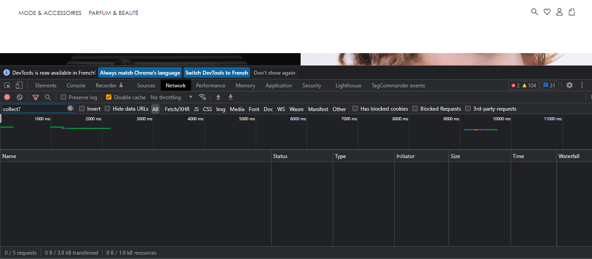
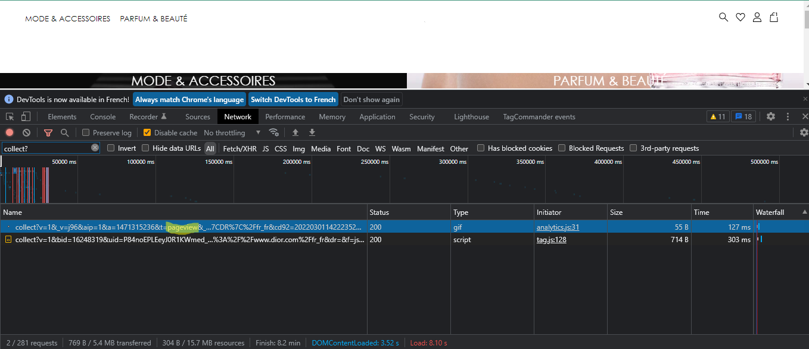
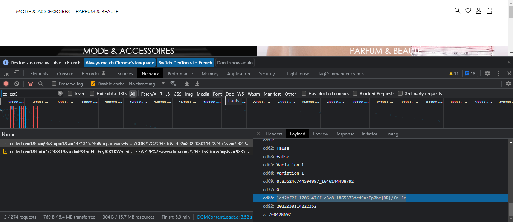
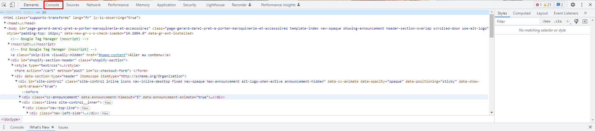
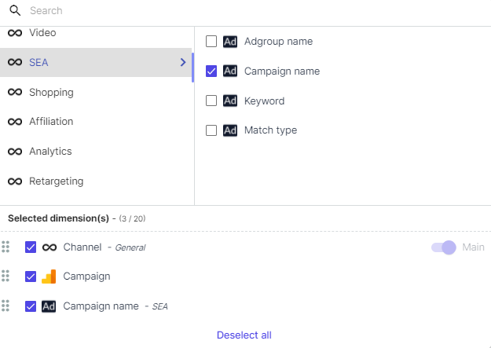

Before publishing the Adloop script, you need to check it is correctly triggered!

The verification of the script is very easy and will take only a couple of minutes. 

On the GTM preview mode, access your website. 

Click on the F12 button of your computer or right-click > Inspect to open the Console and go to the Network tab. In the filter box, type “collect?”

Then reload your page using CTRL+R, still with the Console being open. 

Find the line with “pageview” in it and click on it to open it. 

In the Payload tab, scroll down until you find the list of custom dimensions. They are indicated as cd1, cd2, cd3 etc. Find the custom dimension(s) that you created for Adloop. 

Now, the custom dimension that you created should be filled with an Adloop code, that looks like this: 

1ed2bf2f-1706-47ff-c3c8-1865373dcd9a:Ep0hc|DR|/

If you see the Adloop code, you can publish our script ! 

If your custom dimension is not filled with a value, then there is something wrong with the script. Check carefully once again that you followed every step of our Adloop script installation guide. You can also contact our Customer Success team that will be able to assist you with the script installation! 

There is another alternative way to check if your script Is being triggeredThis method only works when Google Analytics is used asynchronously

On your website: 

Open web console > F12 or right-click and click on the inspect element.

A window like this will open up at the bottom of the page. 

Click on console and type ga.q

In the ‘set’ section you can find our custom dimension, after clicking on the 1st line to open.

*****

[[category.storage-team]] 
[[category.confluence]] 
