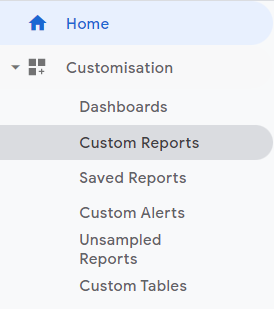
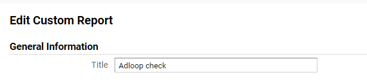
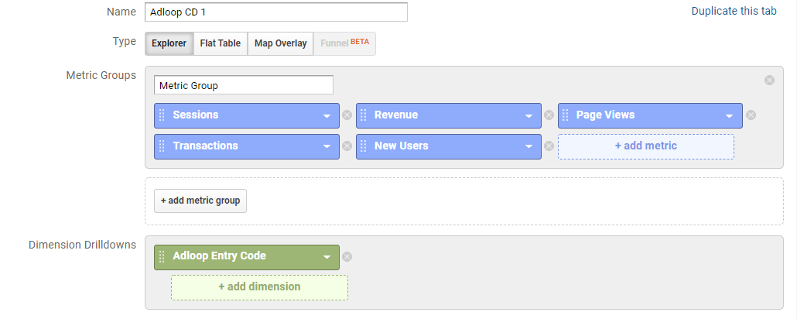
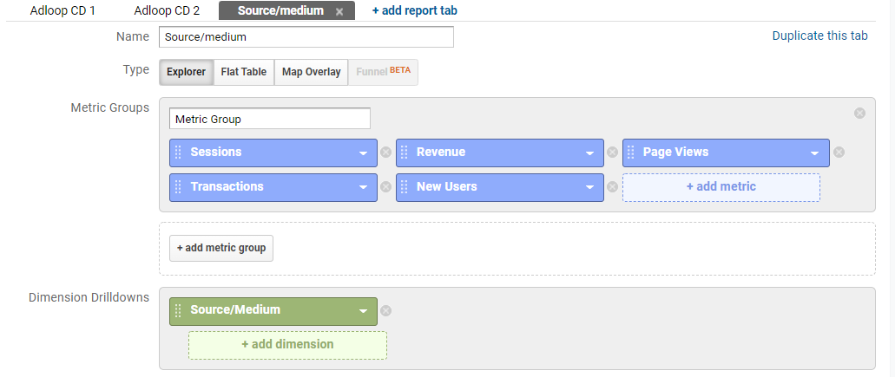
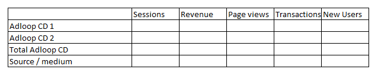
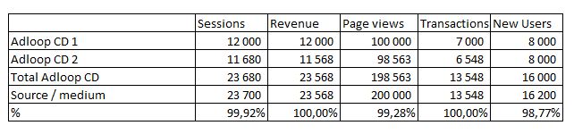
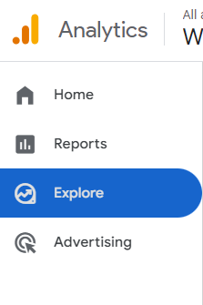
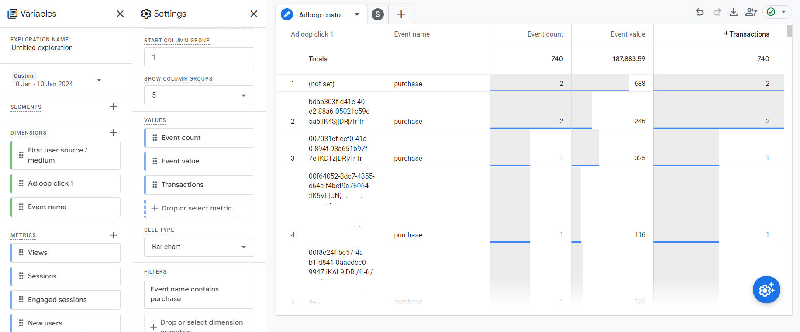
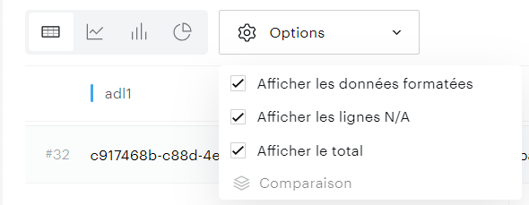

The script was correctly triggered in the preview? Great! But that is not the only thing you need to check when installing the Adloop script. You need to check that we are getting  **all the data**  from your site. 

This verification step can only be done after the Adloop script has been installed for a  **full day** ! 

If the script is installed on a Monday, you can do the checking only on Wednesday for Tuesday’s data.

Also, if you have discrepancies, please keep in mind that Google Analytics data can change for the last  **48 hours** . If you have small discrepancies, especially on the revenue & transactions metrics, please check data that is more than 48 hours old, as it can explain most of the small discrepancies.

Checking with Google Analytics UAFor this verification, you need to go to your Google Analytics account, into the Custom Reports section. 

There click on the New Custom Report button. 

Give an Adloop related title to your report so you can identify it quickly, for example Adloop check.

Name the first report content tab “Adloop CD1”. You will need to create a tab for every custom dimension that you set up for Adloop. 

Choose the Explorer type. 

As metrics, choose: sessions, revenue (if applicable), page views, transactions (or your main conversion event) and new users.

As dimension drilldown, choose the Adloop custom dimension. 

You need to repeat this step for every Adloop custom dimension, using the Duplicate this tab button. Just don’t forget to update the Adloop custom dimension for every report. 

If you have two custom dimensions, you can name the second tab Adloop CD 2, if three the third can be named Adloop CD 3 and so on.

When you are finished, click on duplicate this tab once again. 

Name this tab “source/medium” and as dimension drilldown choose source / medium. 

You can now save the report. 

Now we need to check that the Adloop script is gathering the same information as the Google Analytics one. 

For that, you can open a table (Excel for example) and create the create a file like this one : 

That you will fill out with the informations from the Google Analytics Custom Report we just created in the previous step for each line. 

If you have several custom dimensions, create a Total Adloop CD line in which you will sum all the numbers from the different Adloop custom dimensions. 

You can now create a line to calculate the percentage of difference between the data gathered in the Adloop custom dimension(s) and the data gathered in Google Analytics.

Use the following formula: (Adloop cell) / (GA cell) for every metrics. 

Ideally, you have 100% everywhere, but that is that always the case! 

For revenue and transactions, it is very important that we aim at a 100% score, meaning that we get all conversions. 

But for sessions, pageviews and new users, our script, for some reason (including cookie consent), doesn’t get triggered. The discrepancy should be under 2-3% for those metrics. 

Bigger discrepancies mean that the Adloop tag is not triggered as often as it should. Please check the trigger rule for the Adloop tag: it should be fired before the GA pageviews tag. 

Checking with GA4Go to the Explore section to create a custom report

Create a new table report using the blank canvas.

In the dimension, select: 

* the adloop_click_1 dimension

* event name

In the events, select:

* event count

* event value

* transactions

Filter on the event name to include only your purchase event : 

The amount of events attached to a (not set) Adloop custom dimension must be very low. We allow a tolerance of 5%. 

The same check must be performing for all the events that you track: pageviews, add to cart, product page view etc. That way we are sure that our script is triggered as it should on every page.

Checking with PianoOpen the Data Query section of Piano

Lines : the Adloop custom dimension you created, Events

Columns: Events

Date: From the first full day of data-collection

Be careful to display N/A lines

Compare the number of events attached to an Adloop value to the global number of events on your website for each event. The amount of N/A for each event has to be very low.

The amounts should be very close - we allow a tolerance of 5%. 

If you have discrepancies and need help, please contact our Customer Success team that will help you! 

*****

[[category.storage-team]] 
[[category.confluence]] 
