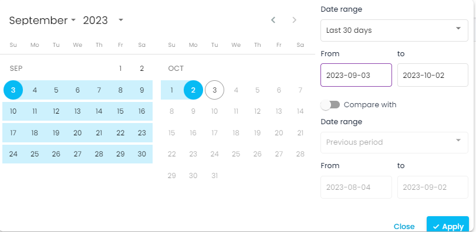
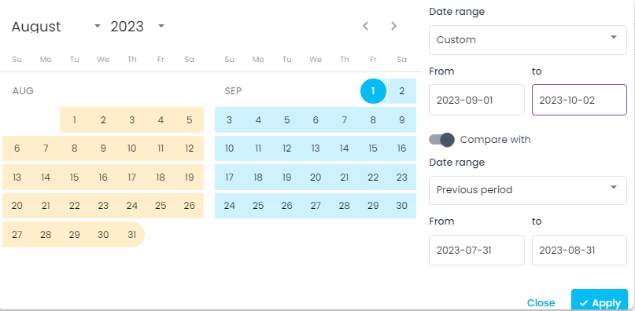

In the calendar, you have the option to compare time periods in your report.

1. Open your calendar and select the time period you want to examine.

2. Select the ‘Compare with’ slide and choose the time period you want to compare.

 The selected time period will appear in orange color.

3. Click on ‘Apply’ and your time period is all set.

*****

[[category.storage-team]] 
[[category.confluence]] 
