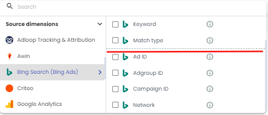
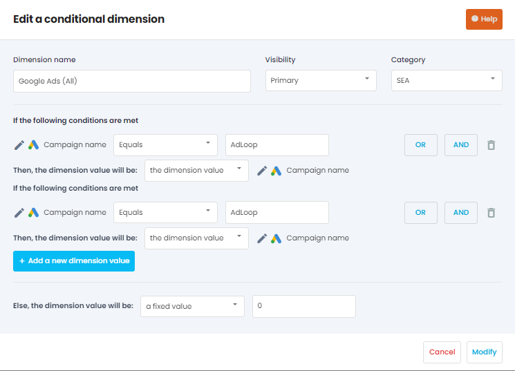
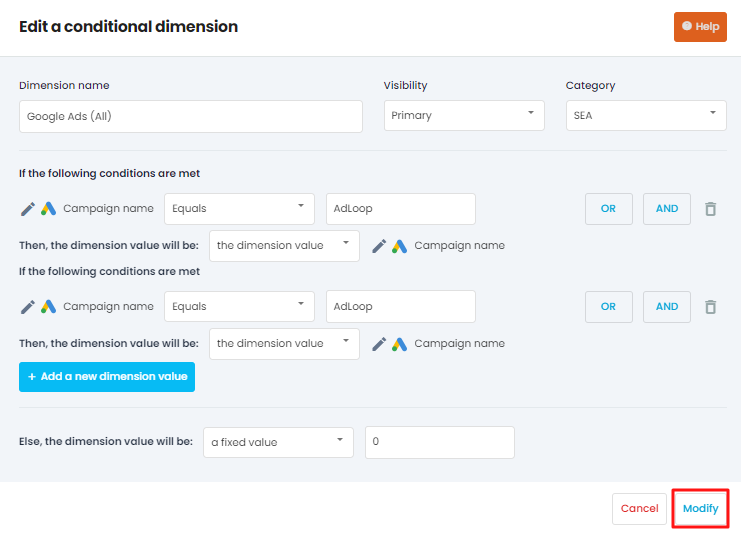

The conditional dimensions can be found in the Dimensions menu.

Want to know more about Dimensions? [ **The Dimensions in Adloop** ](https://adloopwiki.atlassian.net/wiki/spaces/AHEN/pages/1770554179)

.png)

Conditional dimensions are very useful if you want to see your data another way than what’s offered natively in Adloop. For example, you want to check the performances of your Social Ads per campaign objectives. Or you want to compare your branded and non-branded Search performances.

To create a conditional dimension you click on  a conditional dimension

1. Give it a name

1. Select visibility

1. Choose category

1. Select conditions

.png)

## Step 1.
First, You have to give a name to your conditional dimension. Give it a clear name so you can identify it easily when creating a report.

## Step 2.
You have to select a visibility. The options you can choose from are:  **Hidden, Primary, Secondary** 

Ideally, you would chose  **Primary** for those dimensions that are the most important and Secondary for those that will appear below the line.

## Step 3. 
Choose the category based on the dimensions used for the conditional dimension. The categories you can choose from are the following:  **Affiliation, Analytics, Custom, Direct, Display, Email, Retargeting, SEA, Shopping, Social Ads, Social organic, Spot TV, Video** 

## Step 4. 
You have to set the rules for each value that your dimensions will have. For example here, Facebook Ads campaigns can have one of the following objectives : Reach, Interaction, View, Traffic

You  can combine several rules for each value. For example here, there is an added rule: or facebook campaign name contains  **interaction**  in small letters. 

Then the dimension value will be, in this case, a fixed value : “ **interaction** ”.

If you want to set up additional dimension values you can, by clicking on the add a new dimension value button. 

Finally, all of your campaigns have an objective, so nothing should be left blank, but in case that happens you can put “N/A” for not available in the “else the dimension value will be” field.

Then click on the Create/Modify button and you can already use your newly created dimensions in all your reports.

*****

[[category.storage-team]] 
[[category.confluence]] 
