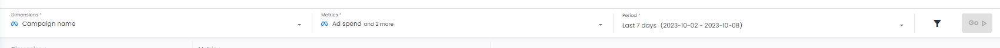
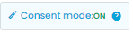
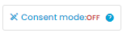
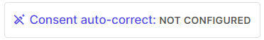
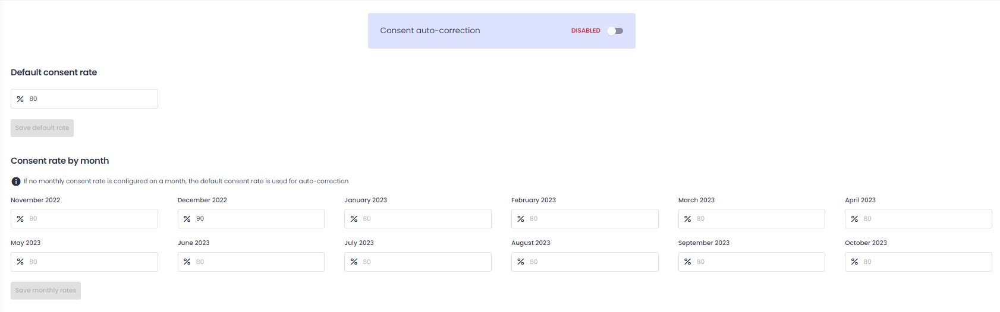
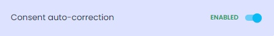
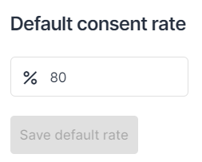
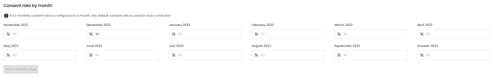
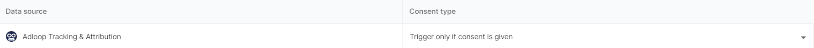
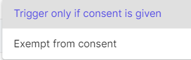

Having headaches lately on correcting your data to take into account the data lost due to  **cookie consent rate** ? Well, we have you covered: you’ll find this functionality directly into the tool and your data will be corrected within seconds.

# Which data do we correct?
Cookie consent affect data measurement happening on-site: number of page views, conversions, revenue and other on-site behaviours. In other words, it does not affect how much money you pay for a click on Google Search or how many reactions your Instagram ads is getting.

We collect data from 3 different types of data-sources : 

*  Advertising data-sources (Google Search, Google Perf Max, Meta etc.) 

*  Analytics data-sources (Google Analytics, Adobe Analytics, Piano etc.)

*  Adloop Attribution data-source (well, this one is only coming from Adloop)  

 When cookie-consent auto correction is on in your the reports, this means that the following metrics are corrected:

*  **Conversions**  and  **Revenue metrics**  coming from  **Advertising sources** . Therefore, KPI that include those metrics in their calculation, like ROAS or CPA, will be corrected as well. Metrics like Ad Spend, Clicks, Impressions, Reactions, Interactions or Completed Videos are not corrected.

*  **All metrics**  coming from  **Analytics data-sources** 

*  **All metrics**  coming from  **Adloop Attribution data-source** 

# See your corrected data in your reports
You can switch between corrected and non-corrected data directly from our reports, within seconds and without reloading the reports. 

You can correct your data on our Table report, Dashboards, Quick Dashboard, Cycle report and Chart report.

You cannot correct your data on paths-to-conversion reports: Order ID, Path Explorer and Channel Affinity reports. 

You will find a button “Consent auto-correct” above your report, close to the “Help” button. 

By clicking on this button, you can switch on and off the consent auto-correct. 

When it is on, it means your data is corrected and it will look like this: 

When it is off, it means your data is not corrected and it will look like this: 

If you haven’t configured yet the consent auto-correct, the button will look like this:

You’ll see your data change instantly in your reports. 

Pay attention: when you download your report, the consent auto-correct setting will be applied. 

If on, your data will be corrected in your export.

If off, your data will not be corrected in your report.

# Set-up your cookie consent rate
The cookie consent rate can be set-up directly in the platform and, good news, it only takes a couple of minutes. 

To do so, go to the  _Metrics & KPIs_  menu, in the  _Data Management_ section and click on the  _Consent auto-correction_ .

You will arrive on this page:

First, activate the consent auto-correction by clicking on the switch. 

Then enter, your average consent rate in the box and save it. It will be your default rate. 

You can enter your cookie consent rate over the last year, past 6 months or past month.

If your consent rate changes a lot month to month, you can also apply specific consent rate for each month by filling up the boxes:

If no specific consent rate is filled in, the default consent rate will be applied. Don’t forget to click on the save button!

Finally, you can decide to exempt channels from consent. By default, the consent auto-correct is applied to all channels. 

To do so, click next to channel you want to exempt to consent and choose the option in the menu:

*****

[[category.storage-team]] 
[[category.confluence]] 
