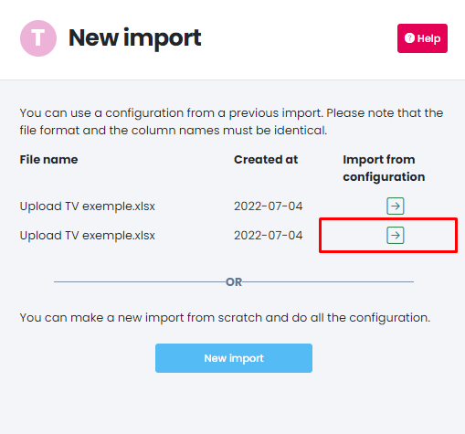

It may happen that a data source you are using is not available in our list of API connectors. In this case, you can create a custom data source.

For each custom data source, you will be able to download external data files for full data completeness.

Only create a custom data source if you plan to import external data! Otherwise you can use the Organic Sources tab in the Matching section.

## 1. Create a custom data source
In the Data Sources tab, click on "Add" and select "Custom Ad Source".

You will then have to give a name to your data source as well as fill in its type (Affiliate, Social, SEO etc.)

Next you will need to import the file containing the data for the desired source into Adloop. This file must have headers and raw data (no formulas).

Supported formats are : XLSX, XLS, ODS and CSV (UTF-8 encoding).

It is better if your file contains a date column! This allows you to add the data of several days at once. Otherwise, you will have to upload one file per day.

This file can be used as a template for future imports. This will facilitate the import process the next time. It is therefore better if you upload a file directly from the advertising platform (unmodified).

You can click "Submit" to upload your file.

Next, Adloop asks you to indicate which row is the header: choose the column with the title of your columns.

You will now be presented with a screen asking you to map your column titles to Adloop dimensions or metrics. For each column you have to indicate which dimension or metric corresponds to.

Example: For my column called "Cost" in my file I choose the corresponding Adloop metric "Ad Spend".

For my column called "Campaign", I choose the corresponding Adloop dimension "Campaign Name".

If the metric or dimension is not available in the list, you can create custom ones. These will then be specific (not standardized) items. To do this, use the "Add metric" or "Add dimension" buttons.

If you don't want to import a column, choose the "Will not import" option. The data in the column will then be left out.

Choose the currency in which the data in the file is entered and, if applicable, the date.

At the end of the set-up you can choose between overwrite & add data options.

Overwrite: a new imported file on the same dates will erase the previous one

Add data: data on the same dates will be summed.

Your data source is now created!

## 2. Importing new data from a custom source
In the Data Source tab, select the data source for which you want to import data and click on the "Load new file" button

By clicking on this button, you have two options: upload a new file (and therefore make the column matches again) or use the configuration of a previous import. (By clicking on the arrow)

In this case, the file format and column names must be absolutely identical between the two files.

## 3. Manage the list of manual imports
By clicking on the button "Display custom imports", you access the list of imports for a given source.

From this list, you can delete one or more imports if the data are no longer up to date.

[https://www.youtube.com/watch?v=n3ZbwelZeQ0](https://www.youtube.com/watch?v=n3ZbwelZeQ0)

*****

[[category.storage-team]] 
[[category.confluence]] 
