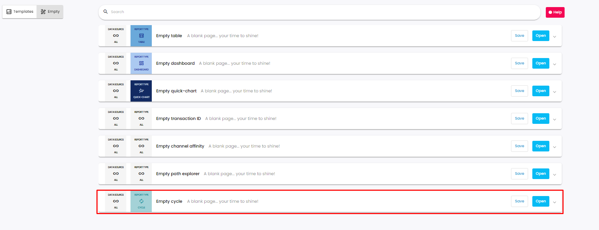
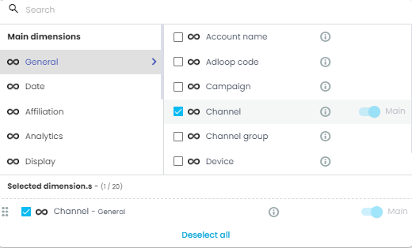
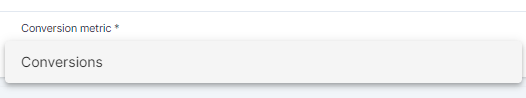
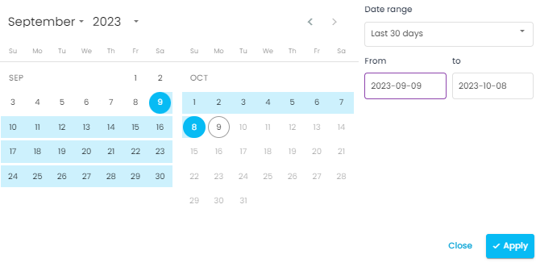
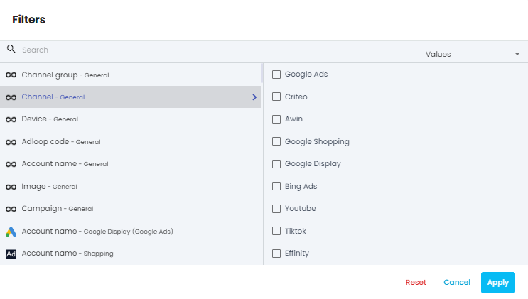

The cycle report is available only with the  **Adloop Tracking & Attribution** ! 

The cycle report will bring you insights about the  **role of your channels & campaigns in the paths to conversion** . 

To create a cycle report, click on  _+New report_  and select  _Empty cycle report_ .

### I- Dimensions 
You can select up to 20 dimensions for this report. You can select any dimension, normalized or source dimensions. 

To analyze in depth your campaigns, use several dimensions and go detailed!

### II- Conversion metric
You have to select a conversion metric among the ones you have set-up in the Adloop Tracking & Attribution data-source. 

You will only find Adloop conversions in this metric selector as this report use the data from attribution. 

### III- Period 
You can choose between pre-defined or custom periods. You can’t compare period on the cycle report.

### IV- Filter
You can filter the report on any dimension you want. You can combine several filters. 

To remove all the filters at once, please select  _Reset_ .

## Understand the data
Single touchpoint conversionsNumber of conversions that were done in a single touchpoint.

Multi touchpoints conversionsNumber of conversions that were done with several touchpoints.

Initiator Presence of the channel in the 1st third of the path to conversion. 

SetterPresence of the channel in the 2nd third of the path to conversion. 

ScorerPresence of the channel in the 3rd third of the path to conversion. 

PhasesRepresentation of the Initiator - Setter - Score phases in %. 

Autonomy rateThe ability of a channel to convert on its own. 

Participation rateRate of the presence of the channel in the paths to conversion. 

TouchpointsNumber of touchpoints.

Touchpoints per conversion / Duplication rateNumber of appearances in the paths to conversion in which the channel is present.

## Cycle report
[https://www.youtube.com/watch?v=EI0Lq4w_OcQ&list=PLQ4YExrLQZJK_n0ICcYT5ijp1bY743qYP&index=24&ab_channel=AdloopMediaOptimizationPlatform](https://www.youtube.com/watch?v=EI0Lq4w_OcQ&list=PLQ4YExrLQZJK_n0ICcYT5ijp1bY743qYP&index=24&ab_channel=AdloopMediaOptimizationPlatform)

*****

[[category.storage-team]] 
[[category.confluence]] 
