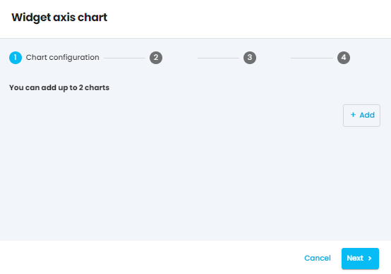

Welcome to your new  **dashboard** 

Use it to create a dashboard with your most important datas and informations.

Down below you can find a detailed description on how to create each **widget**  and all the information you need to create the best dashboard for your reporting.

On Adloop you can customize your dashboard how you want your data to show using different types of widgets.

To create an empty dashboard go to  **New report** and select  **Empty dashboard report.** 

After the empty dashboard is created click on the  **+ Add widget** button to visualize your data.

There are  **5 types of widgets**  available to use.

1.  **Text** 

1.  **Totals** 

1.  **Line / Bar / Area** 

1.  **Pie** 

1.  **Table** 

## 1. Text
The **text widget**  allows the user to place text content on the dashboard, for example setting goals and agendas for your upcoming campaign:

Moving on to the next one you have:

## 2. Totals
With the  **Totals** widget you can add up to 4 totals

The totals are filtered by  **dimension.** 

Want to know more about dimensions?  [[Dimensions|Dimensions]]

After selecting your dimension, you can select your  **metric**  and give a name to your first total figure:

Want to know more about metrics? [[Metrics|Metrics]]

You can continue the selecting process as shown above until you create the Total that shows the data you wanted to configure.

After applying the selected parameters your second widget will appear on your dashboard:

## 3. Line / Bar / Area
When creating an  **axis**  chart you can add up to 2 charts. 

The chart configuration is filtered similar as before, based on dimensions and metrics.

After selecting these dimensions and metrics you can choose the type of your chart you want to use which can be the following 3 types:  **Area, Bar, Line** 

After selecting the type you can select the grouping by Day, Week, Month and Year based on your preference.

 **And now your dashboard is starting to come together!** 

The same data can look these 3 ways based on the type of the axis chart:

 **Area** 

 **Bar** 

 **Line** 

## 4. Pie
Creating a pie chart is similar to creating the previous ones using dimensions and metrics for the data configuration. After selecting these you can also select the time frame and name the chart and your pie chart is created. 

## 5. Table
When creating a Table the same process should be followed as above: choosing the specific  **Dimensions & Metrics** 

You can change the order the lenght and the width of the charts and tables and reorganize it based on how you want them to appear on your dashboard.

If you are not content with a widget you can easily edit by clicking on the configuration (    ) icon or delete them by clicking on the (  ) icon.

##  Dashboard report
[https://www.youtube.com/watch?v=tfFhXB8NWhg&list=PLQ4YExrLQZJK_n0ICcYT5ijp1bY743qYP&index=7&ab_channel=AdloopMediaOptimizationPlatform](https://www.youtube.com/watch?v=tfFhXB8NWhg&list=PLQ4YExrLQZJK_n0ICcYT5ijp1bY743qYP&index=7&ab_channel=AdloopMediaOptimizationPlatform)

*****

[[category.storage-team]] 
[[category.confluence]] 
