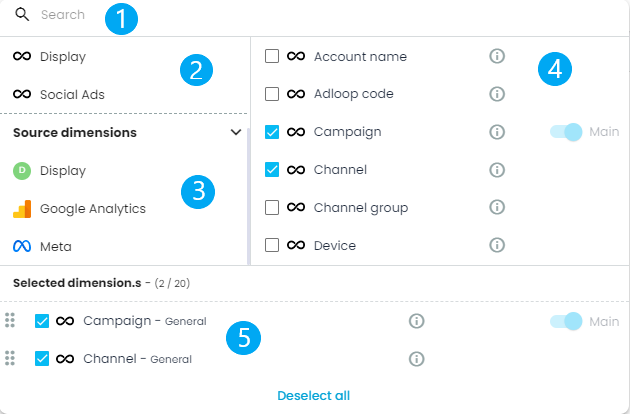

Dimensions are the names, categories or characteristics of the digital marketing campaigns. 

Each platform has its own dimensions, but some are common to many platforms, like  **campaign names** ,  **ad names** ,  **campaign objectives**  etc. 

The dimensions Picker is the first of the  **Reports**  pickers. 

## Dimensions Picker overview

### 1 - Search bar 
Simply type the name of the dimension you are looking for and it will appear, whatever Datasource it comes from or whatever its Visibility settings are. 

The language for the search bar is the same as the language displayed. Some names are different in French and in English. 

### 2 - Normalised dimensions 
For more information, visit the [[ **Normalised Dimensions** |Dimensions-in-Adloop]] page. 

They will appear first, as they are the most commonly used. 

### 3 - Sources dimensions 
There you can access all the dimensions from the Datasources. They are grouped by name of the Source. 

### 4 - Display zone and dimensions selection
Just tick the box to select a dimension that will be displayed in the zone 5 (selected Dimensions). 

You can select up to 20 dimensions. 

The dimension ticked as  _Main_ is the “master” dimension, it sets the values of other dimensions and metrics displayed. 

### 5 - Selected dimensions 
Here are displayed the selected dimensions. 

*****

[[category.storage-team]] 
[[category.confluence]] 
