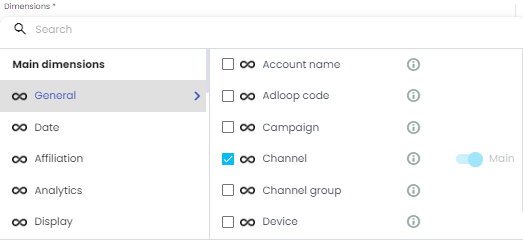

noteOn the same topic, see [[Reports > Dimensions menu|III---Adloop-reports-system-📈]]

On the same topic, see [Reports > Dimensions menu](/wiki/spaces/AHEN/pages/1770553710)

Dimensions are the names, categories or characteristics of digital marketing campaigns. 

Each Platform has its own dimensions, but some are common to most of them, like  **campaigns name** ,  **ads name** ,  **objectives**  etc.

## 1 - Imported dimensions from Data Sources 
For each source in the data Sources list, Adloop team has selected the most relevant dimensions:  

* Some are imported by default ( **default Dimensions** ) - you can’t remove them

* Some are optional and you can select the ones you want to have in Adloop and ignore the others ( **other Dimensions** ).

Facebook Ads example:  

Dimensions always have a logo in front of their name, so you can identify the data source they are coming from. 

Google Ads dimensions will have a  logo in front of them, those from Facebook Ads a  and so on. 

## 2 - Normalised dimensions ( logo)
Some dimensions are common to all sources: the normalized dimensions in Adloop. They have a   logo in front of them. 

### a - Why those normalized dimensions? 
Some dimensions are common to most of the  **Ad platforms** . So instead of having to choose several times the same dimension, we grouped them within the normalized dimensions. 

Example: 

* Google Ads campaigns names exist in Adloop under the dimension  **Campaign name** 

* Bing Ads campaigns names exist in Adloop under the dimension  **Campaign name** 

* Both are grouped under the normalized dimension  **Campaign name (SEA)** 

In a  **Report** , you have  **Dimensions**  from Google Ads and Bing Ads and you want to see the performances of both those channels. Instead of having two columns  **Campaign name** and  **Campaign name** , just use the normalized dimension  **Campaign name (SEA)** , you will only have one column. 

### b - Which are the normalized dimensions? 
Our normalized dimensions in Adloop are:  

|  **Channel type**  |  **Normalized dimension**  | 
|  --- |  --- | 
| SEA |  **Campaign name**  | 
| SEA |  **Adgroup name**  | 
| SEA |  **Keyword**  | 
| SEA |  **Network**  | 
| SEA |  **Matchtype**  | 
| Social Ads |  **Campaign name**  | 
| Social Ads |  **Adgroup name**  | 
| Social Ads |  **Ad name**  | 
| Affiliates |  **Affiliate**  | 
| Affiliates |  **Affiliate type**  | 
| Video |  **Campaign name**  | 
| Video |  **Adgroup name**  | 
| Video |  **Network**  | 
| Video |  **Site**  | 
| Video |  **Title**  | 
| Shopping |  **Campaign name**  | 
| Shopping |  **Adgroup name**  | 
| Shopping |  **Product name**  | 
| Retargeting |  **Campaign name**  | 
| Display |  **Campaign**  | 
| Display |  **Placement**  | 
| Display |  **Ad**  | 
| Display |  **Site**  | 
| Display |  **Creative**  | 

### c - Where to find the normalized dimensions? 
You can find them under the  **Dimensions menu**  in the  **Reports** . 

Dimensions menu: 

Dimensions menu when opened: 

## 3 - Adloop dimensions ( icon)
Some dimensions were created by Adloop to help marketing professionals to make a better use of data. The icon  is in front of them.

The Adloop dimensions are:

|  **Adloop dimensions**  |  **Details**  | 
|  --- |  --- | 
|  **Channel**  | Marketing channel, most of the time it is the Data Source.  | 
|  **Channel type**  | The parent category of the channel: SEA, Affiliate, Social etc.  | 
|  **Device**  | Device used | 
|  **Adloop Code**  |  | 
|  **Day**  | Adds a day (date) segmentation column to the data | 
|  **Week**  | Adds a week (week number) segmentation column to the data  | 
|  **Month**  | Adds a month (month name) segmentation column to the data  | 
|  **Year**  | Adds a year segmentation column to the data  | 

Adloop dimensions can mostly be found in the “General” category of the Dimensions menu:  

## 4 - Dimensions categories
 **Dimensions**  are organized into categories defined by the Adloop teams.

The default categories cannot be deleted but their names can still be edited in the  **Dimensions**  management page. You can add as many  **dimensions**  as you want to organize the menus the way you want.

## Managing dimensions
[https://www.youtube.com/watch?v=gscBg3xYd54&list=PLQ4YExrLQZJK_n0ICcYT5ijp1bY743qYP&index=4&ab_channel=AdloopMediaOptimizationPlatform](https://www.youtube.com/watch?v=gscBg3xYd54&list=PLQ4YExrLQZJK_n0ICcYT5ijp1bY743qYP&index=4&ab_channel=AdloopMediaOptimizationPlatform)

*****

[[category.storage-team]] 
[[category.confluence]] 
