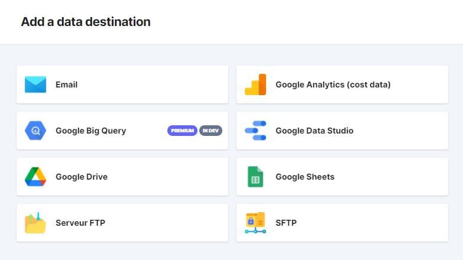

If you want to receive your exports to an email address (yours or someone else’s!), nothing simpler. 

Just add the desired email destination in the Expot destination page, by clicking on the   button.

Then, choose Email

Write in the field the email address you want to use for the export. 

You can write several addresses at once, just put a comma “,” between each address! And remember that if you choose this email export destination later,  **the export will be sent to all the email addresses in the destination** .  

Save your destination and you can already use it!

*****

[[category.storage-team]] 
[[category.confluence]] 
