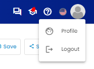
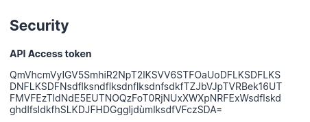

* [1- How to build an Iframe link](#1--how-to-build-an-iframe-link)
* [2- URL query parameters](#2--url-query-parameters)
* [3- Examples](#3--examples)
* [4- Available dimensions for filters](#4--available-dimensions-for-filters)


Adloop give you the possibility to embed a report in an iframe.

To do so,  **you first need to** [ **contact us** ](mailto:email:support@adloop.co) so that we can make the necessary technical adjustements. 

Indeed, by default and for security reasons, the Adloop solution does not accept external requests.


# 1- How to build an Iframe link
Here is a basic example of how to build the Iframe link


```html
<iframe src="https://{{workspace_url}}/iframe-reports/{{data_set_id}}/ad-reports/{{report_type}}/saved/{{report_id}}?auth_token={{auth_token}}&from={{from_date}}&to={{to_date}}"></iframe>
```
The easiest way is to go on one of your saved reports, copy the link then add /iframe-reports after the workspace domain name and ?auth_token=YOUR_TOKEN at the end of the URL.

Other parameters aren’t required.


 **How to find my auth token?** 

Your auth token can be found in your profile, under the “Security” part:






# 2- URL query parameters


|  **URL query parameter name**  |  **Mandatory**  |  **Format**  | 
|  --- |  --- |  --- | 
| auth_token | YESRed | string | 
| from | NOGreen | yyyy-mm-dd | 
| to | NOGreen | yyyy-mm-dd | 
| To filter the report, you can add one or n query parameters: | 
| any-dimension-slug | NOGreen | value1|||value2|||value3 | 


# 3- Examples
Date: 2022-07-28

Report type: Dashboard

Filters: 


* SEA campaign name: Awesome campaign OR Amazing campaign


* SEA keyword: Magnificent product


```html
<iframe src="https://fake.adoop.co/iframe-reports/1/ad-reports/dashboard/saved/1?auth_token=abcd123&from=2022-07-28&to=2022-07-28&sea-campaign-label=Awesome campaign|||Amazing campaign&sea-keywork=Magnificent product"></iframe>
```
Date: From 2022-07-01 to 2022-07-31

Report type: Performance

Filters: 


* Channel: Facebook Ads


* Facebook adgroup name: Breathtaking adgroup


```html
<iframe src="https://fake.adoop.co/iframe-reports/1/ad-reports/performance/saved/2?auth_token=abcd123&from=2022-07-01&to=2022-07-31&channel=Facebook Ads&facebook-adgroup-name=Breathtaking adgroup"></iframe>
```

# 4- Available dimensions for filters


|  **Slug**  |  **Name**  | 
|  --- |  --- | 
|  **General dimensions**  | 
| channel | Channel | 
| channel-group | Channel group | 
| campaign | Campaign name | 
| device | Device | 
|  **Date dimensions**  | 
| day | Day | 
| week | Week | 
| month | Month | 
| year | Year | 
| month_number | Month number | 
| month_by_week | Month and week | 
|  **Normalized dimensions**  | 
| affiliate-aft | Affiliate | 
| affiliate-type-aft | Affiliate Type | 
| display-ad-name | Ad name | 
| display-adgroup | Adgroup ID | 
| display-campaign-name | Campaign | 
| display-crea | Ad Creative | 
| display-network | Network | 
| display-placement | Placement | 
| display-site | Site | 
| email-campaign-name | Campaign | 
| email-send-date | Send date | 
| email-type | Type | 
| rtg-campaign | Campaign Name | 
| rtg-category-id-rtg | Category ID | 
| rtg-category-rtg | Category | 
| sea-ad-name | Ad name | 
| sea-adgroup-label | Adgroup Name | 
| sea-campaign-label | Campaign Name | 
| sea-keyword | Keyword | 
| sea-match-type | Match Type | 
| seo-query | Query | 
| shopping-adgroup-label | Adgroup Name | 
| shopping-campaign-label | Campaign Name | 
| shopping-network | Network | 
| shopping-product | Product | 
| social-ad-name | Ad Name | 
| social-adgroup-name | Adgroup Name | 
| social-campaign-name | Campaign Name | 
| social-organic-description | Post Description | 
| social-organic-format | Post Format | 
| social-organic-name | Account Name | 
| social-organic-placement | Post Placement | 
| social-organic-platforme | Platform | 
| social-placement | Placement | 
| video-ad-id | Ad name | 
| video-adgroup-label | Adgroup Name | 
| video-campaign-label | Campaign Name | 
| video-network | Network | 
| video-site | Site | 
| video-title | Title | 
|  **Data source dimensions**  | 
| active-campaign-campaign-id | Campaign ID | 
| active-campaign-campaign-name | Campaign Name | 
| active-campaign-segment-id | Segment ID | 
| active-campaign-send-date | Send date | 
| active-campaign-send-date | Send date | 
| active-campaign-send-id | Send ID | 
| active-campaign-source | Source | 
| active-campaign-type | Type | 
| adform-ad-id | Ad id | 
| adform-ad-name | Ad name | 
| adform-campaign-id | Campaign id | 
| adform-campaign-name | Campaign name | 
| adform-campaign-type | Campaign type | 
| adform-client | Client | 
| adform-country | Country | 
| adform-creative | Creative | 
| adform-creative-format | Creative format | 
| adform-creative-global-id | Creative global id | 
| adform-creative-id | Creative id | 
| adform-creative-size | Creative size | 
| adform-creative-type | Creative type | 
| adform-network | Network | 
| adform-site-name | Site name | 
| affilae-affiliate | Affiliate | 
| affilae-affiliate-id | Affiliate ID | 
| attr-device | Device | 
| attr-tracking-destination-page | Destination page | 
| attr-tracking-device | Device | 
| attr-tracking-search-engine | Search engine | 
| attr-tracking-utm-campaign | Adloop UTM campaign | 
| attr-tracking-utm-content | Adloop UTM content | 
| attr-tracking-utm-keyword | Adloop UTM keyword | 
| attr-tracking-utm-medium | Adloop UTM medium | 
| attr-tracking-utm-source | Adloop UTM source | 
| awin-device | Device | 
| awin-publisher-id | Affiliate ID | 
| awin-publisher-name | Affiliate | 
| bing-ads-ad-group-id | Adgroup ID | 
| bing-ads-ad-group-name | Adgroup name | 
| bing-ads-ad-id | Ad ID | 
| bing-ads-ad-network-type | Network | 
| bing-ads-campaign-id | Campaign ID | 
| bing-ads-campaign-name | Campaign name | 
| bing-ads-device | Device | 
| bing-ads-keyword-info-text | Keyword | 
| bing-ads-match-type | Match type | 
| bing-shopping-ad-group-id | Adgroup ID | 
| bing-shopping-ad-group-name | Adgroup name | 
| bing-shopping-campaign-id | Campaign ID | 
| bing-shopping-campaign-name | Campaign name | 
| bing-shopping-device | Device | 
| bing-shopping-network-type | Network | 
| bing-shopping-product-id | Product ID | 
| bing-shopping-product-name | Product name | 
| criteo-adset | Adset | 
| criteo-adset-id | Campaign ID | 
| criteo-device | Device | 
| facebook-account-id | Account ID | 
| facebook-account-name | Account name | 
| facebook-ad-id | Ad ID | 
| facebook-ad-name | Ad name | 
| facebook-adgroup-id | Adgroup ID | 
| facebook-adgroup-name | Adgroup name | 
| facebook-campaign-id | Campaign ID | 
| facebook-campaign-name | Campaign name | 
| facebook-country | Country | 
| facebook-organic-account-id | \[Account] ID | 
| facebook-organic-account-name | \[Account] Name | 
| facebook-organic-post-date-created | \[Post] Date created | 
| facebook-organic-post-id | \[Post] ID | 
| facebook-organic-post-message | \[Post] Message | 
| facebook-organic-post-page-id | \[Post] Page ID | 
| facebook-organic-post-page-name | \[Post] Account name | 
| gcm-ad | Ad | 
| gcm-ad-id | Ad ID | 
| gcm-campaign-id | Campaign ID | 
| gcm-campaign-name | Campaign name | 
| gcm-crea | Ad creative | 
| gcm-crea-id | Ad creative ID | 
| gcm-device | Device | 
| gcm-placement | Placement | 
| gcm-placement-id | Placement ID | 
| gcm-site | Site | 
| gcm-site-id | Site ID | 
| google-ads-ad-group-id | Adgroup ID | 
| google-ads-ad-group-labels | Adgroup labels | 
| google-ads-ad-group-name | Adgroup name | 
| google-ads-ad-id | Ad ID | 
| google-ads-ad-network-type | Network | 
| google-ads-campaign-id | Campaign ID | 
| google-ads-campaign-labels | Campaign labels | 
| google-ads-campaign-name | Campaign name | 
| google-ads-device | Device | 
| google-ads-keyword-info-text | Keyword | 
| google-ads-match-type | Match Type | 
| google-analytics-campaign | Campagne | 
| google-analytics-content | Content | 
| google-analytics-device | Device | 
| google-analytics-keyword | Mot-clé | 
| google-analytics-medium | Medium | 
| google-analytics-realtime-browser | Browser | 
| google-analytics-realtime-campaign | Campagne | 
| google-analytics-realtime-country | Country | 
| google-analytics-realtime-event-action | Event action | 
| google-analytics-realtime-event-category | Event category | 
| google-analytics-realtime-event-label | Event label | 
| google-analytics-realtime-goal-id | Goal ID | 
| google-analytics-realtime-keyword | Keyword | 
| google-analytics-realtime-medium | Medium | 
| google-analytics-realtime-mobile-branding | Mobile device branding | 
| google-analytics-realtime-mobile-model | Mobile device model | 
| google-analytics-realtime-operating-system | Operating system | 
| google-analytics-realtime-page-path | Page path | 
| google-analytics-realtime-page-title | Page title | 
| google-analytics-realtime-region | Region | 
| google-analytics-realtime-source | Source | 
| google-analytics-source | Source | 
| google-analytics-transaction-id | Transaction ID | 
| google-analytics-user-id | User ID | 
| google-display-ad-id | Ad ID | 
| google-display-ad-name | Ad name | 
| google-display-ad-network-type | Network | 
| google-display-adgroup-id | Adgroup ID | 
| google-display-campaign-id | Campaign ID | 
| google-display-campaign-name | Campaign name | 
| google-display-device | Device | 
| google-display-placement | Placement | 
| google-display-site | Site | 
| google-performance-max-ad-network-type | Network | 
| google-performance-max-campaign-id | Campaign ID | 
| google-performance-max-campaign-name | Campaign name | 
| google-performance-max-device | Device | 
| google-search-console-country | Country | 
| google-search-console-device | Device | 
| google-search-console-landing-page | Landing page | 
| google-search-console-query | Query | 
| google-shopping-ad-group-id | Adgroup ID | 
| google-shopping-ad-group-name | Adgroup name | 
| google-shopping-ad-network-type | Network | 
| google-shopping-campaign-id | Campaign ID | 
| google-shopping-campaign-name | Campaign name | 
| google-shopping-device | Device | 
| google-shopping-product-id | Product ID | 
| google-shopping-product-title | Product | 
| hawk-ad-name | Ad Name | 
| hawk-ad-size | Creative Size | 
| hawk-ad-type | Creative Type | 
| hawk-advertiser | Advertiser | 
| hawk-campaign-id | Campaign ID | 
| hawk-campaign-name | Campaign Name | 
| hawk-creative-id | Creative ID | 
| hawk-line-id | Line ID | 
| hawk-media-plan-name | Media Plan | 
| hawk-placement-name | Placement Name | 
| hawk-publisher-id | Publisher ID | 
| hawk-site-name | Site Name | 
| instagram-organic-account-id | \[Account] ID | 
| instagram-organic-account-ig-id | \[Account] Instagram ID | 
| instagram-organic-account-name | \[Account] Name | 
| instagram-organic-post-date-created | \[Post] Date created | 
| instagram-organic-post-description | \[Post] Description | 
| instagram-organic-post-format | \[Post] Format | 
| instagram-organic-post-id | \[Post] ID | 
| instagram-organic-post-ig-id | \[Post] Instagram ID | 
| instagram-organic-post-permalink | \[Post] Permalink | 
| instagram-organic-post-placement | \[Post] Placement | 
| instagram-organic-post-username | \[Post] Account name | 
| linkedin-ad | Ad | 
| linkedin-ad-id | Ad ID | 
| linkedin-ad-type | Ad type | 
| linkedin-campaign-group-id | Campaign group id | 
| linkedin-campaign-group-name | Campaign group name | 
| linkedin-campaign-id | Campaign ID | 
| linkedin-campaign-name | Campaign name | 
| net-affiliation-affiliate-id | Affiliate ID | 
| net-affiliation-affiliate-name | Affiliate | 
| net-affiliation-campaign | Campaign ID | 
| net-affiliation-campaign-name | Campaign name | 
| pinterest-account-id | Account ID | 
| pinterest-ad-group-id | Ad Group ID | 
| pinterest-ad-group-name | Ad Group Name | 
| pinterest-ad-id | Ad ID | 
| pinterest-ad-name | Ad Name | 
| pinterest-campaign-id | Campaign ID | 
| pinterest-campaign-name | Campaign name | 
| rakuten-publisher-id | Affiliate ID | 
| rakuten-publisher-name | Affiliate | 
| rtbhouse-campaign-name | Campaign name | 
| rtbhouse-device | Device | 
| snapchat-account-id | Account ID | 
| snapchat-ad | Ad | 
| snapchat-ad-id | Ad ID | 
| snapchat-adgroup-id | Adgroup ID | 
| snapchat-adgroup-name | Adgroup name | 
| snapchat-campaign-id | Campaign ID | 
| snapchat-campaign-name | Campaign name | 
| snapchat-campaign-objective | Campaign objective | 
| tiktok-ad-id | Ad ID | 
| tiktok-ad-name | Ad Name | 
| tiktok-adgroup-id | Adgroup ID | 
| tiktok-adgroup-name | Adgroup Name | 
| tiktok-campaign-id | Campaign ID | 
| tiktok-campaign-name | Campaign Name | 
| tradedoubler-affiliate | Affiliate | 
| tradedoubler-affiliate-id | Affiliate ID | 
| tradedoubler-affiliate-type | Affiliate type | 
| tradedoubler-device | Device | 
| twitter-ad-id | Ad ID | 
| twitter-adgroup-id | Adgroup ID | 
| twitter-adgroup-name | Adgroup name | 
| twitter-campaign-creative-type | Creative type | 
| twitter-campaign-id | Campaign ID | 
| twitter-campaign-name | Campaign name | 
| twitter-campaign-objective | Campaign objective | 
| twitter-device | Device | 
| xandr-ad-id | Ad ID | 
| xandr-ad-name | Ad name | 
| xandr-advertiser-id | Advertiser ID | 
| xandr-campaign-id | Campaign ID | 
| xandr-campaign-name | Campaign name | 
| xandr-country | Country | 
| xandr-crea | Ad creative | 
| xandr-crea-id | Creative ID | 
| xandr-crea-type | Creative type | 
| xandr-site | Site | 
| xandr-site-id | Site ID | 
| youtube-ad-group-id | Adgroup ID | 
| youtube-ad-group-name | Adgroup name | 
| youtube-ad-id | Ad ID | 
| youtube-ad-network-type | Network | 
| youtube-campaign-id | Campaign ID | 
| youtube-campaign-name | Campaign name | 
| youtube-device | Device | 
| youtube-organic-channel-id | Channel ID | 
| youtube-organic-channel-title | Channel title | 
| youtube-organic-playlist-id | Playlist ID | 
| youtube-organic-playlist-title | Playlist title | 
| youtube-organic-video-id | Video ID | 
| youtube-organic-video-title | Video title | 
| youtube-site | Site | 
| youtube-title | Title | 


*****

[[category.storage-team]] 
[[category.confluence]] 
