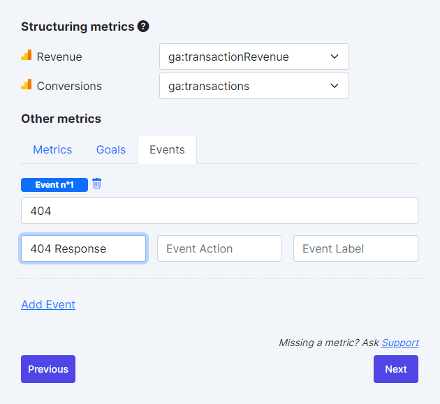
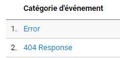
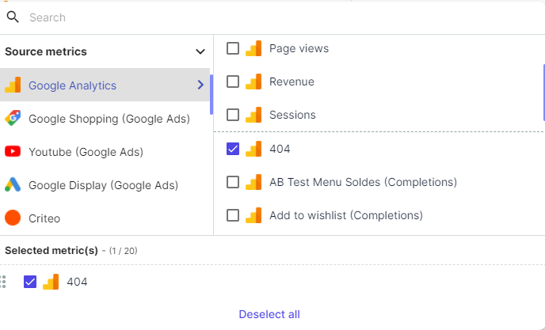

## 1-New variable and new trigger

One of the easiest ways to distinguish a 404 page from a normal page in your analytics reports is the  _Page Title_ 

You must first create a user-defined variable in Google Tag Manager:  **Page Title** .

To do this, log into your Google Tag Manager account, go to Variables and create a new one with the following parameters:

Title -  **Javascript - Page Title** 

Type - **Javascript** 

Name of the global variable -  **document.title** 

This variable will return the value of the title of the page the visitor is currently on.

Then, you have to create a trigger that is triggered when the page title contains "Page not found". In your case, the title may be different, so use whatever works best for your website.

In your Google Tag Manager account, go to Triggers and create a trigger with the following settings:

Important - this trigger is case sensitive. So, if your 404 page title is Page Not Found, then the Page Not Found trigger will not work because Not Found ≠ not found.

Or you can simply use this trigger condition instead:

## 2-New Tag

The second step is to create a Tag, for this go to Tags and create a new tag:

Title -  **GA Event - 404 Error** 

Type -  **Universal Analytics** 

Enter the Tracking ID (if you still haven't done it, I recommend you to add the Google Analytics Tracking ID as a constant variable. This will save you a lot of time and trouble in the long run).

Tracking type -  **Event** 

Event category -  **404 error** 

Event Action - **{{Page URL}}** . Each time this event is triggered, Google Tag Manager dynamically fills in the page URL (full web address) as the event action. This way, you will see which URLs get the most 404 error occurrences.

You can also use {{Page Path}} instead of {{Page URL}}, if you wish. If your web project spans multiple domains and all data is visible in a single Google Analytics account, you should definitely use {{Page URL}} as an action.

Event without interaction -  **true** 

Link the  **Pageview - 404 Error**  trigger created earlier to this Universal Analytics tag.

Click  **Save** , enable Preview and Debug mode and check if the tag ONLY fires when it is supposed to.

## 3- Creating a custom event in Adloop

Once the event is created, it is visible in Google Analytics under "Behavior" → "Events."

When connecting the Analytics data source to Adloop, you will be able to add one or more events manually:

In this case it will be Event Name "404" and Event Category "404 Response".

You have to copy/paste what is written in Analytics:

To then find the event in Adloop, it is very simple, just go to a performance report:

In the metrics menu, you can go to Metrics by Source → Google Analytics and you can see your 404 appear!

*****

[[category.storage-team]] 
[[category.confluence]] 
