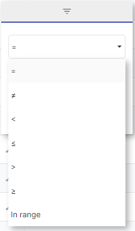

## A - Column filters
You can access column filters thanks to the small  **Filter** icon. 

Non applied filter (grey colour):  

Applied filter (blue colour):

### 1 - Text filters  

By default, the filter value is  **Contains**  but you can access multiple values: 

* Contains, does not contain

* Equals to, different from

* Begins with 

* Ends with

Once you enter the value, it is applied  **automatically** . 

You can combine two filters thanks to the  **AND/OR**  functions. 

By hitting the  **RESET**  button, you can delete all the filters. 

### 2 - Number filters

By default, the filter value is  **Equals to** , but you can access multiple values: 

* Equals to 

* Different from 

* Stricly inferior to

* Inferior or equal to

* Stricly superior to 

* Superior or equal to 

* Between X and Y 

Once you enter the value, it is applied  **automatically** . 

You can combine two filters thanks to the  **AND/OR**  functions. 

By hitting the  **RESET**  button, you can delete all the filters. 

## B - Data filters
The data Filters Picker can be accessed by clicking on the ‘Funnel’ button in the reports top bar. 

### 1 - Filters Picker
By using the Filters Picker, you can filter the data displayed in your report. Filters can be applied to one or several  **Dimensions Values** , even if the Dimension is not displayed in your report. 

Example : I want to see the Adgroups and the Keywords of the Google Ads ‘Brand’ campaign. 

It is quite easy to use. 

a - Areas (1) and (2): SearchYou can search the  **Dimensions** names or  **Values**  of the selected dimension. You can choose where you are looking for in the zone (2). 

b - Area (3): Available Dimensions list All the dimensions in which you can select filtering values will appear here.  

c - Area (4) : Available values When you select a dimension, the possible values will appear here. 

### 2 - Add quickly a filter directly from your report 
You can also add a Filter value by clicking on the Filter icon in any cell with a Dimension value. 

*****

[[category.storage-team]] 
[[category.confluence]] 
