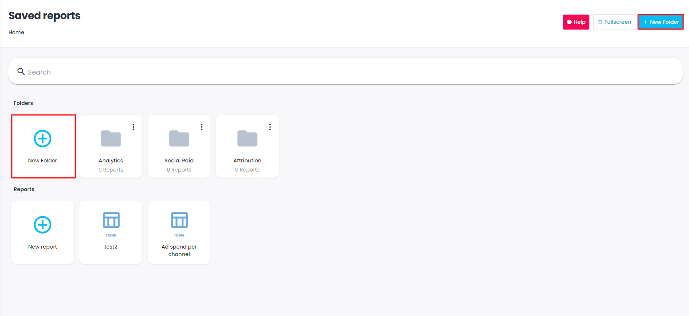
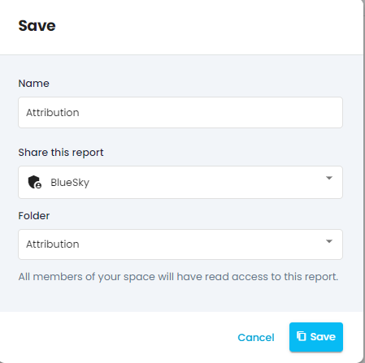
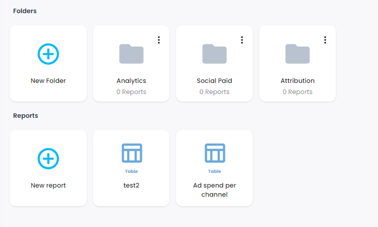
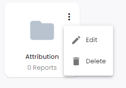

Sometimes saved reports can get messy so we created our new folder system to make your life easier. 

With folders, you can organize your reports into different categories of your preference. It is a very easy process. You will find the folder system in the saved reports section. 

## 1. Create a new folder
To create a folder just click on the  **+New folder** button.

## 2. Naming and type
Give a name to your folder and choose its type.

##  3. Created a folder
And just like that, your folder is created. To put reports in your folder you can just drag and drop the reports or click on the folder and create a new report from scratch. You can use the search bar to make browsing more efficient 

Zou can add more granularity by creating sub-folders within your chosen folder. Your main folder will always be at the front of the list named as ‘Parent folder’

## 4. Edit and delete
If you want to edit or delete your folder just click on the 3 dots in the corner of your folder and the settings will open.

*****

[[category.storage-team]] 
[[category.confluence]] 
