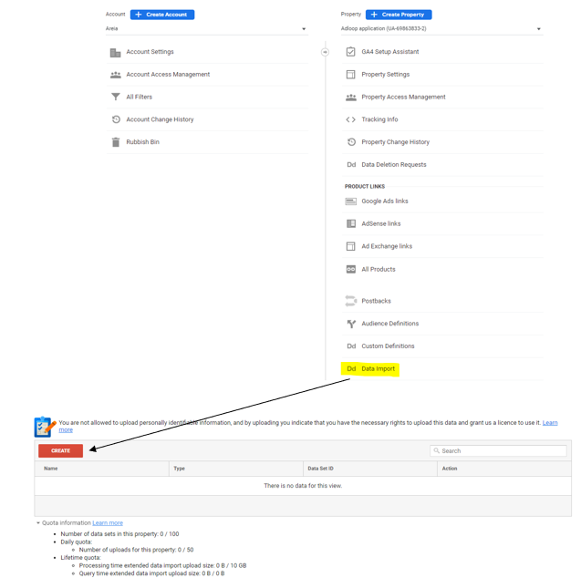
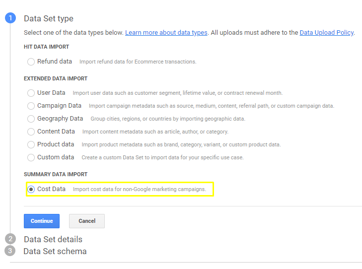
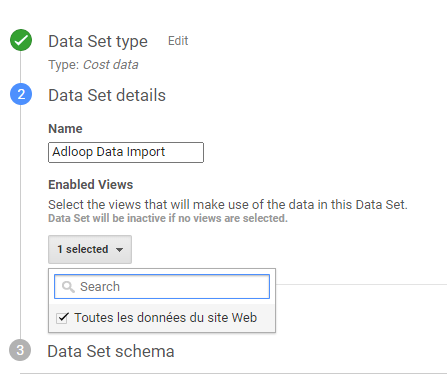
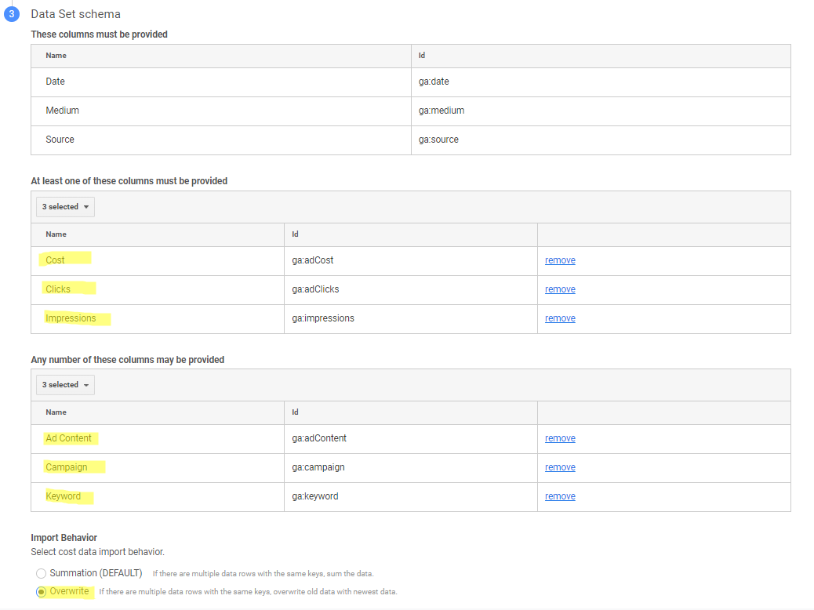
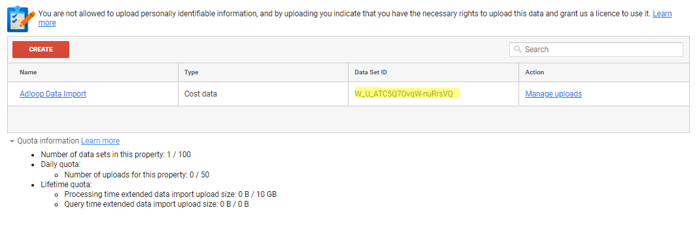
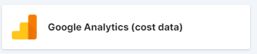
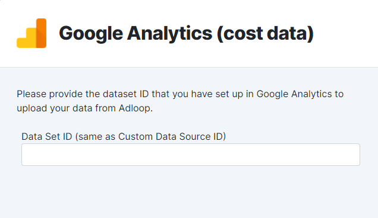
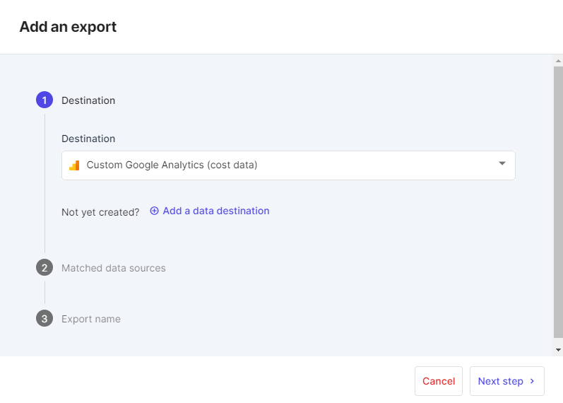
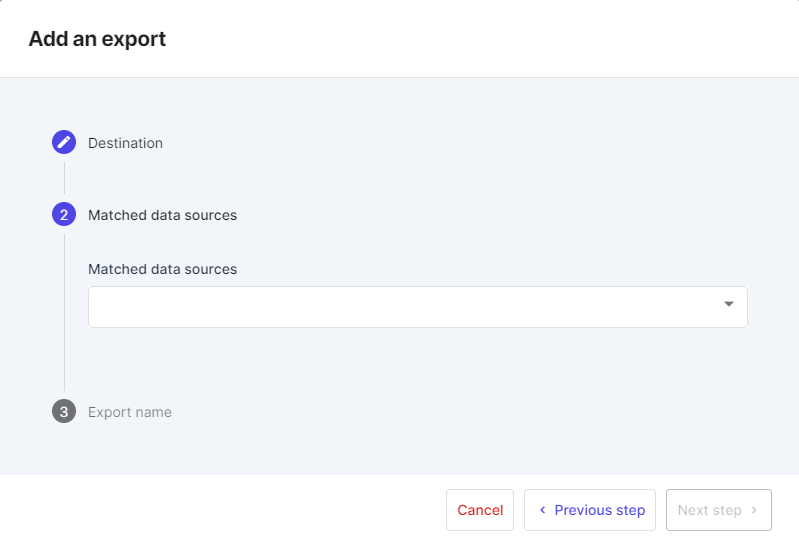

The  **Google Analytics**  export connector concerns what Google calls ' _Cost Data_ ', i.e. the ability to import    Impression,   Clicks and   Adspend metrics from the selected Data Sources in the Google Analytics Acquisition reports against the UTM dimensions.

### How often will the import happen?

Once the connector is in place, Adloop will send daily data from the previous day.

To ensure quality data, Adloop will also send data from D-3 on a daily basis (this may change as we indicate in our [[quality policy|Data-Quality]]).

## A. Requirements for using the Google Analytics connector (cost data)

Only data from campaigns not managed by  **Google**  can be imported by this connector. Therefore, data from campaigns managed in   Google Ads or Google Campaign Manager will not be imported.

### 1. Prepare the Matching between Data Sources and Google Analytics UTM

 **Google Analytics**  identifies the acquisition sources thanks to the  **UTM**  parameters (Source, Medium, Campaign etc.). The Platforms  **Data Sources**  have another form of nomenclature with specific  **dimensions.** 

Matching consists in matching the dimensions of the Platforms  **Data Sources**  you want to import with the UTM values of  **Google Analytics** . This way Google will know where to put the data.

For more information about Matching, see the [[dedicated section|Matching]].

### 2. Create a Dataset in Google Analytics

To create a Dataset, follow the procedure below:

 **Admin > Data Import > Create** 

Select  **Cost Data**  then  **Continue** 

Give a name to the  **Dataset**  and select the  **Views**  it will impact (one or more)

Indicate the Data that will be sent as shown in the screenshot below (in yellow, what must be added or selected) :

Do not forget to select the  **Overwrite**  option. This is because Adloop sends data over several days to ensure that the indicators are completely reliable (see information on [[data quality|Data-Quality]]). If you leave the Summation option, the data will be added instead of replaced.

After validation the Google Analytics data set is created and you can  **copy its ID** :

## B. Creating the Export Destination and the Export in Adloop

### 1. Create the Export Destination

In the Export Destination, select the following connector:

Follow the configuration process:

* Name of the Destination

* Google Analytics account to send the data to

until you get to the screen where you are asked for the  **Data Set ID** : (the ID retrieved from Google Analytics above)

Validate everything and that's it, your Destination is ready.

### 2. Create the Export itself
No difficulties in this process.

Step 1: Select the Destination you just created

Step 2: Select the Data Sources you want to send to Google Analytics

This is where you need to make sure you have configured consistent matching rules for the  **Data Sources**  you want to send, otherwise you will get an error like this:

Step 3: Name your export

*****

[[category.storage-team]] 
[[category.confluence]] 
