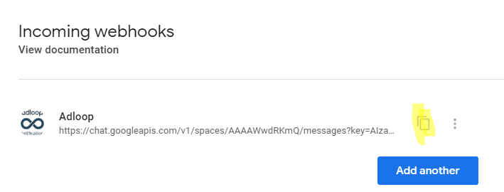

We send our Export files or our Notifications into a Google Chat room.

To add Adloop to your room, you must: 

## 1 - Create a  _webhook_ 
From the Google Chat interface, in the room into which you want the notifications to arrive, click on ‘Manage webhooks’ as seen below: 

The creation process is simple, you just have to name the webhook -  _Adloop_ , for example. 

If you want a special Adloop logo, copy-paste the link below: 

[https://cdn.adloop.co/images/adloop_notifications_logo.png](https://cdn.adloop.co/images/adloop_notifications_logo.png)

After saving, you will have access to the  _webhook_  link that you can copy:

## 2 - Copy and paste the webhook link in Adloop 
In Adloop, when adding a Google Chat Destination, paste the  _webhook_  link and save.

Name this Destination and you are done! 

Your Google Chat Destination now appears in the destinations lists. 

*****

[[category.storage-team]] 
[[category.confluence]] 
