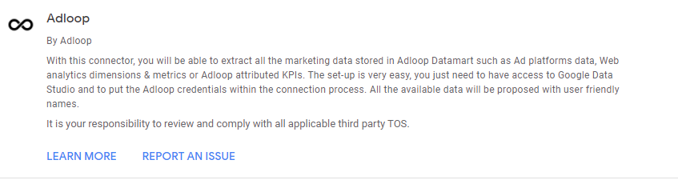
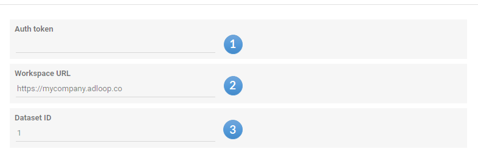
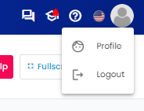
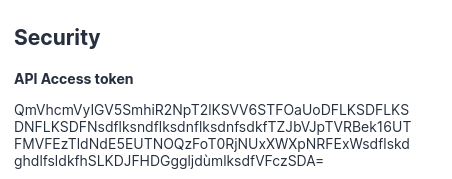
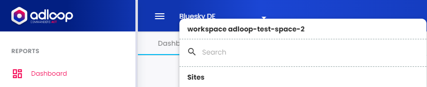
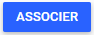

For help with this Google Data Studio connector, please use the Adloop chatbot.

## Connecting your Adloop Dataset to Data Studio

### 

Creating a Google Data Studio Export Destination

### Information needed by Data Studio

In the connection process, Data Studio will ask you for 3 pieces of information from Adloop.

  This information can be pre-populated directly by Adloop but in some cases it is not present.

 **(1)**  The Auth Token can be found in your user profile in Adloop

Profile Access

 **(2)**  Workspace URL

This is the URL of the Workspace in which the Dataset you want to connect is located.

 **(3)**  Dataset ID

You can find it in the Dastasets page as a number: 1, 2, 3 ...

### Adloop / Data Studio Connection

To start the connection, just click on :

*****

[[category.storage-team]] 
[[category.confluence]] 
