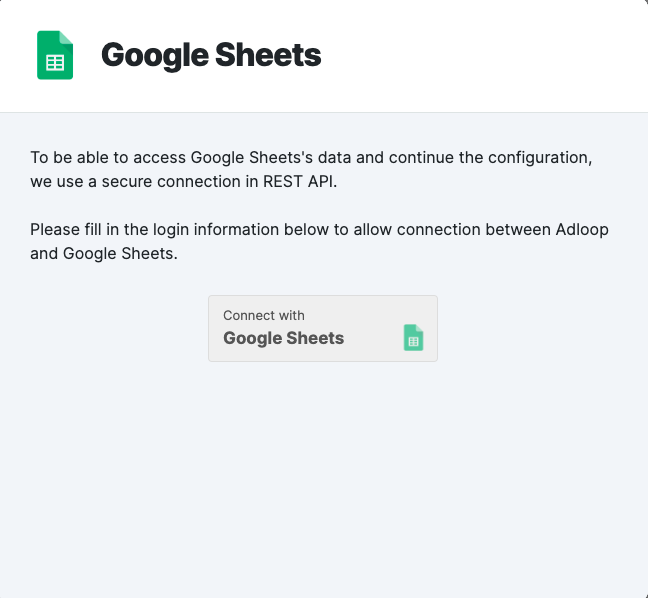
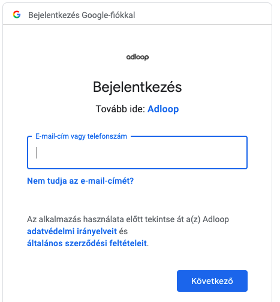
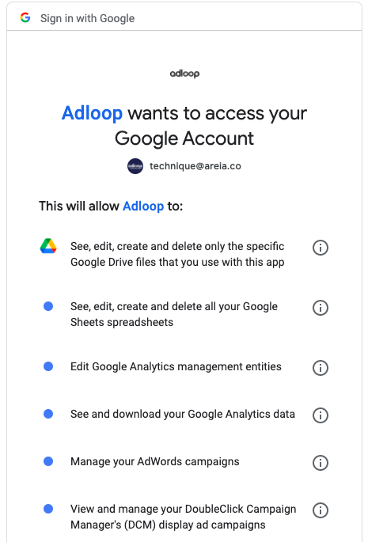
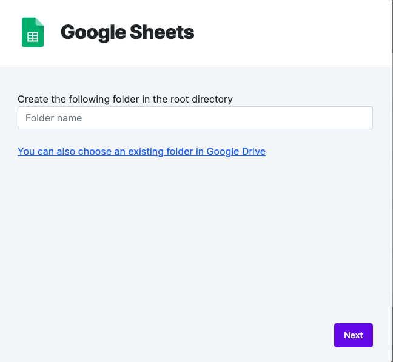
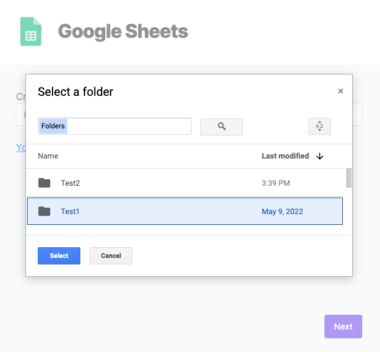

Adloop sends and updates the exports with a file in Google Sheets.

To enable Adloop to write in your Google Sheets, you have to connect it to Adloop by using your usual ID.

## 1 - Connect Adloop to Google Sheets
The connection procedure is usual.

Click on Google Sheets > Select an account

Your Google account is also linked to Google Ads or Google Analytics, the authorization will be valid for all the Google applications, you will only have to give once the connection authorization.

## 2 - Select a destination file
Once the connection set, you can create a destination file or select an existing folder for the Adloop exports.

New folder creation:

Existing folder selection:

Name this destination and you are done!

Your Google Sheets Destination will now appear in the destinations list.

*****

[[category.storage-team]] 
[[category.confluence]] 
