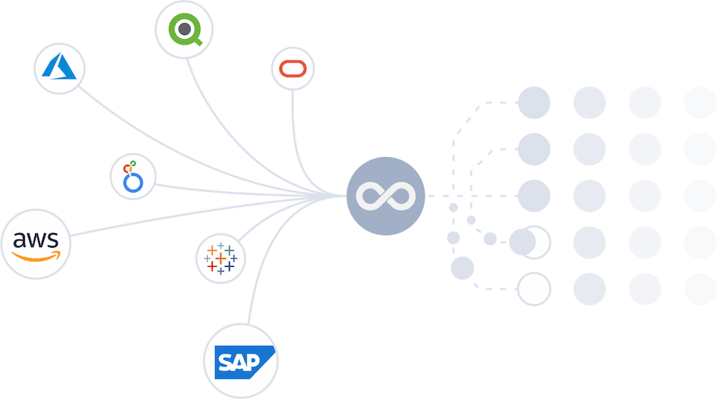
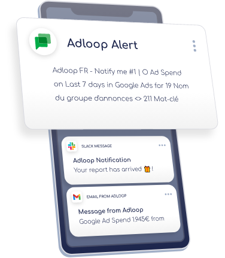

# 

# Everything you need to know

 **General** 

[[Start your Adloop discovery|I---Start-your-Adloop-discovery!]]

[[Quick start|Quick-start]]

[[Basic informations|Basic-informations]]

[[What’s new in Adloop’s world|0---What's-new-in-Adloop's-world--(changelog)]]

[[FAQ|FAQ]]

.png) **Data sources** 

[[Data sources page|Data-Sources-page]]

[[Data Sources (Workflow)|Data-Sources-(Workflow)]]

[[Metrics & dimensions per data source|Metrics-&-dimensions-per-Data-Source]]

[[Data Quality|Data-Quality]]

[[Data destinations|Data-destinations-(Exports-or-Notifications)]]

 **Reports** 

[[Data Sources page|Data-Sources-page]]

[[Data Sources (Workflow)|Data-Sources-(Workflow)]]

[[Metrics & dimensions per data source|Metrics-&-dimensions-per-Data-Source]]

[[Data Quality|Data-Quality]]

[[Data destinations|Data-destinations-(Exports-or-Notifications)]]

.png) **Data management** 

[[Data management|VI---Data-Management-📁]]

[[Dimensions management|Dimensions-management-page]]

[[Metrics management|Metrics-management-page]]

[[Matching|Matching]]

[[Marketing budgets|Marketing-budgets-(coming-soon)]]

.png) **Exports** 

[[Export destinations|Export-Destinations]]

[[Exports|7---Exports]]

.png) **Notifications** 

[[Notification destinations|Integrations]]

[[Notifications|8---Notifications]]

## Popular topics

Need inspiration? Get a quick intro into what Adloop is and how to best use it at  [[Start your Adloop disovery|Quick-start]].

 Check out our guide for ideas on how to set up your [[dashboard|Dashboard]].

 If starting from the beginning is daunting, try using one of our report templates.

noteOther ways of learning?If you are a visual learner dont worry we got you covered!  Our video turorials will guide you through each step from [[setting up your dashboard|Tutorials-📽-&-step-by-step-guides-🚶‍♀️🚶‍♂️]] to [[report creation|Step-by-step-report-creation]] and so on. 

Other ways of learning?If you are a visual learner dont worry we got you covered!  Our video turorials will guide you through each step from [setting up your dashboard](/wiki/spaces/AHEN/pages/1770553413) to [report creation](/wiki/spaces/AHEN/pages/1770553779/Step+by+step+report+creation) and so on. 

[https://www.youtube.com/watch?time_continue=2&v=UTmafJrDreU&feature=emb_logo](https://www.youtube.com/watch?time_continue=2&v=UTmafJrDreU&feature=emb_logo)

[https://youtu.be/BiBYYhq1tPg](https://youtu.be/BiBYYhq1tPg)

[[FAQ|FAQ]]

If you cannot find an answer to your question, you can use the chat or the contact in the Adloop interface. You can also simply send an email to[ **support@adloop.co** ](mailto:support@adloop.co)

*****

[[category.storage-team]] 
[[category.confluence]] 
