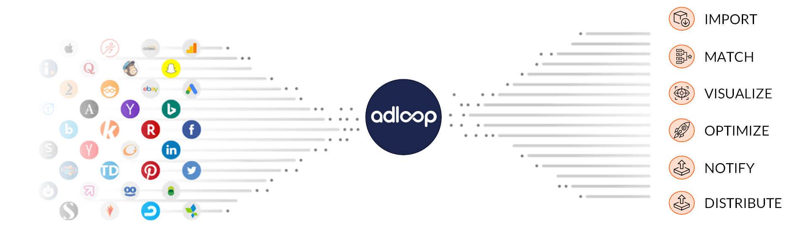

## What is Adloop? 
Adloop is a data marketing hub and, at the same time, a set of features designed to make digital marketing professionals' lives easier. 

### It all starts with data 
Adloop does not collect data itselft, but we are retrieving data from external sources such as :  

* Your  **Ad Platforms** , that provide data generally called **_Ad-Centric_**  : impressions, clicks, ad spends, ad name, campaign type etc..

* Your  **Analytics**  tool feed Adloop with behavioural data on your websites and your apps ( **_Site-Centric_** data) : pageviews, add to cart, account creation, purchase, sources of traffic etc. 

* Your  **CRM**  or  **transactionnal**  apps, used for identifying clients or prospects, communicating with them, knowing what they bought etc. This is  **_User-Centric_**  data. 

0d48fb58-907b-4e9f-a908-0e9372c035d6DECIDEDbc6e6512-26fe-45f4-b6ac-9a89e8b11a77The Data Source  **Adloop Tracking & Attribution**  will collect data that are specific to Adloop. It must be activated in order to enjoy the  **Attribution**  and  **Recommendations**  features. 
* The Data Source  **Adloop Tracking & Attribution**  will collect data that are specific to Adloop. It must be activated in order to enjoy the  **Attribution**  and  **Recommendations**  features. 

All those data are sent to Adloop thanks to API data connections without any manual intervention. 

To connect a Data Source to Adloop, go to the  **Data Sources**  menu!

## Introducing Adloop
[https://www.youtube.com/watch?time_continue=2&v=UTmafJrDreU&feature=emb_logo](https://www.youtube.com/watch?time_continue=2&v=UTmafJrDreU&feature=emb_logo)

*****

[[category.storage-team]] 
[[category.confluence]] 
