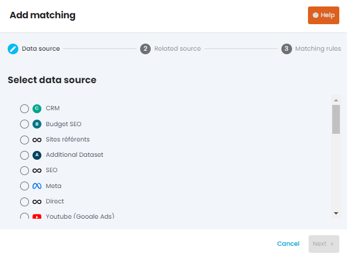
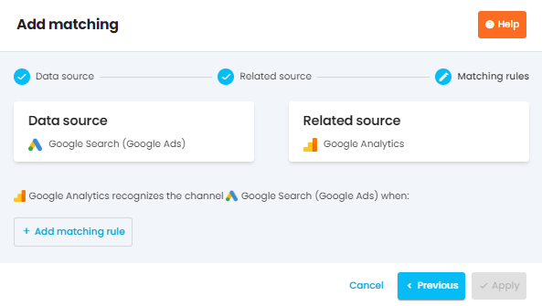
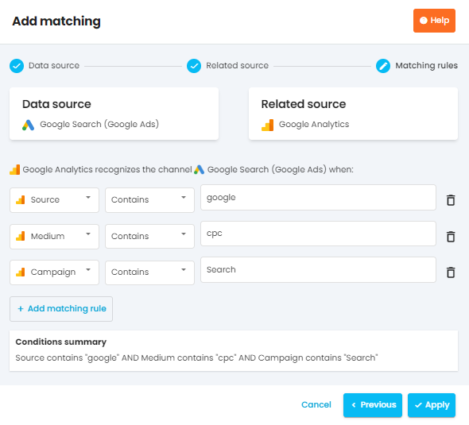
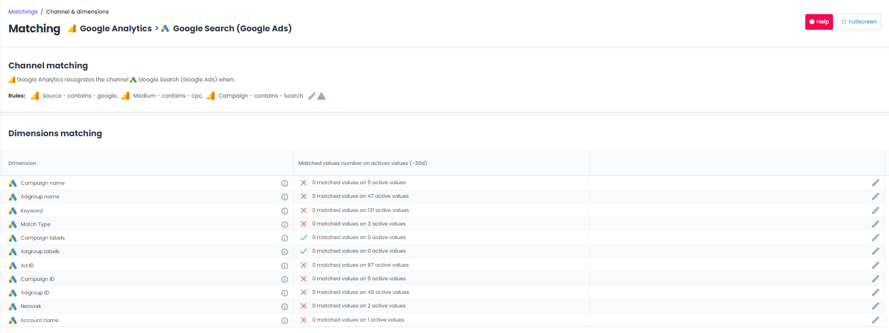
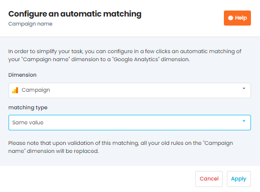
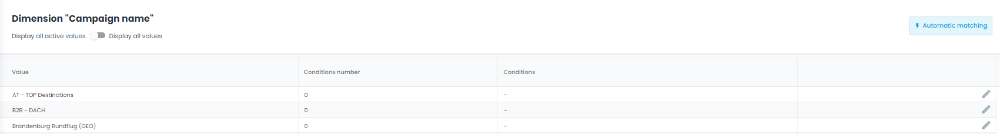
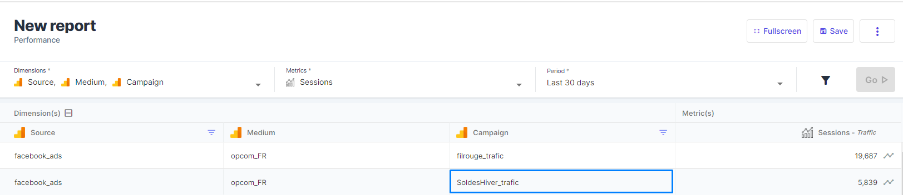
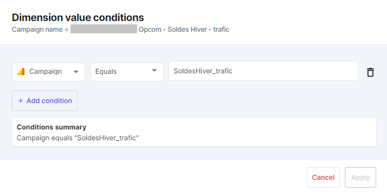

noteThe  **Matching** is associating one by one  **Ad Sources**  with  **Analytics or Attribution Sources**  in order to create relationships between all their  **Dimensions** . 

The  **Matching** is associating one by one  **Ad Sources**  with  **Analytics or Attribution Sources**  in order to create relationships between all their  **Dimensions** . 

 _Note_  : If you have the Adloop Tracking & Attribution Premium option, the matching is automatic - you don’t have to do anything.

Thanks to the matching, Adloop can link Ad platforms dimensions (campaign name, keyword etc.) et Analytics dimensions (UTM). It helps marketers saving time, because they don’t have to go anymore to each platform to compare data and calculate all the ratios and KPI.

To create a matching, click on the “Add” button in  **Matchings** .

# Matching on channel level
Choose in the list the data source for which you want to create the matching

Here we will create the matching for Google Ads.

Here, we will add matching rules to indicate Adloop when Google Search campaigns have to be recognized. In other words, what are the UTM parameters used for my Google Search campaigns?

Attention: We have separate connectors for Search, Shopping, Display, Video (Google). Campaigns must have different namings in order for the matching to work properly.

To do so, we advise you to open in a separate tab an Adloop report with the following UTM parameters: source, medium and campaign (in this order). For metrics, choose sessions. This will help you know what UTM parameteres are used for your channels. 

* source : google

* medium : cpc

* campaign : contains “Search” (as opposed to Shopping campaigns)

For Adloop matching to work properly, you need to have a clear campaign tracking and to have UTM parameters correctly set-up. If this is not the case, you should work on your tracking before setting-up Adloop matching. Otherwise, you may have incoherent data. 

I will add the UTM parameters above by adding 3 matching rules: 

Validate and your channel matching is ready! 

# Matching on campaign level
Don’t stop there! We offer matching on more granular levels too, like campaign, ad group or even creative. 

To get the most out of Adloop, we advise you to do the matching at least on the campaign level. 

To do so, once the matching on the channel level is done, click on the “Pen” button on the right of your screen. 

You arrive then on the dimensions list of your data source. Choose the dimension for which you want to set-up the matching by clicking on the “Pen” icon. 

We advise you to proceed by descending granularity: first, campaign, then adgroup, then keyword. We will start here with the campaign (“Campaign name”). 

On granular levels, we offer two types of matching: automatic or manual.  

## Automatic matching
You can use the automatic matching  **only if the campaign name is absolutely identical**  between the Ad platform and one of the UTM parameters. 

 _Example : your Search campaign is named AD - Search - Campaign 1 in Google Search and the Campaign UTM parameter is also AD - Search - Campaign 1_ 

This is the case, most of the time, for  **campaigns** of the Google universe thanks to the native connection between Google Ads and Google Analytics. Thanks to this connection, the name of the campaign is sent to the UTM campaign (following the same principle, the keyword is sent to the UTM keyword). This is also the case when you use dynamic tracking parameters, like the {{[campaign.name](http://campaign.name)}} in Facebook Ads for example. 

We encourage to use as much as possible dynamic parameters as they make Adloop matching easier but also tracking simpler. 

To do so, just click on the “Automac matching” and indicate in which UTM parameters to find the identical value as well as the matching type.

Here my campaign name is found in the UTM campaign.

There are 3 types of matching:

* iso value: lowercases and uppercases are identical between the Ad source and the Analytics one.

* iso value in lowercases

* iso value in uppercases

Click on “Validate” and you are done with the matching! Easy, right?  

## Manual matching
If manual matching is a bit more complicated than the automatic one, we encourage you to set it up, at least on the campaign level. 

More granular levels are more complicated to maintain, especially if you have an important number of adgroups or keywords.  

You will have to set up a manual matching for channels that don’t have direct connection with Google Analytics and those that don’t have dynamic tracking. This is the case for Facebook Ads or Criteo, for example.

The same way as for automatic matching, go to the dimension for which you want to set-up the matching. 

For each campaign (“Value” column), you create a matching by indicating which UTM parameters are used for this campaign. 

For that, we advise you to create two Adloop reports in two differents tabs: 

* one with UTM source, medium and campaign (and/or keyword and/or content) (filter the report according to the source and medium values used for the matching on the channel level) and sessions

* one with the dimension chosen for the matching (here, “Campaign name Facebook”) and clicks. 

Those two reports will help you find easily what the UTM parameters used. If you don’t find them or if the campaign naming is not explicit, you can check the tracking on the Ad platform or ask your traffic manager or your media agency. 

Here I see that my campaign “Soldes Hiver” uses the UTM campaign “SoldesHiver_trafic”

I set up my matching like that: 

Tip: when you click on the field to fill while it is still empty, a list with the available values will be displayed. You can then directly click on it. 

Validate and the matching on the campaign level is done! The process is to be repeated for every campaigns and for other dimensions, if you choose to.  

## Matching for advertising sources
[https://www.youtube.com/watch?v=z_5W5g0QdjI&list=PLQ4YExrLQZJK_n0ICcYT5ijp1bY743qYP&index=21&ab_channel=AdloopMediaOptimizationPlatform](https://www.youtube.com/watch?v=z_5W5g0QdjI&list=PLQ4YExrLQZJK_n0ICcYT5ijp1bY743qYP&index=21&ab_channel=AdloopMediaOptimizationPlatform)

*****

[[category.storage-team]] 
[[category.confluence]] 
