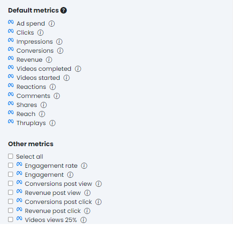
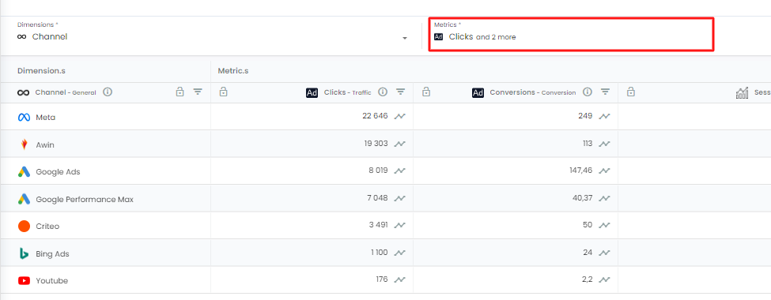
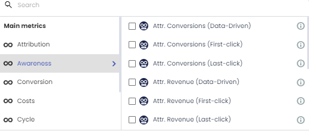
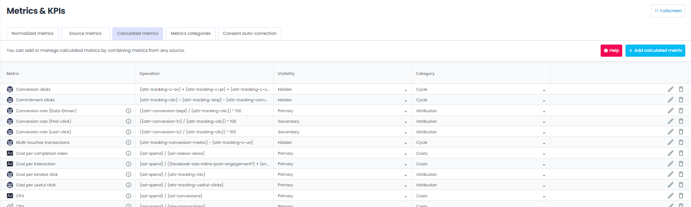
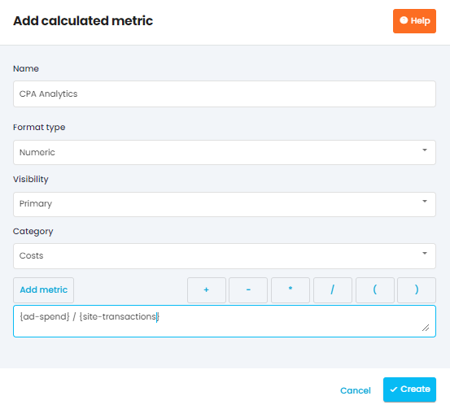
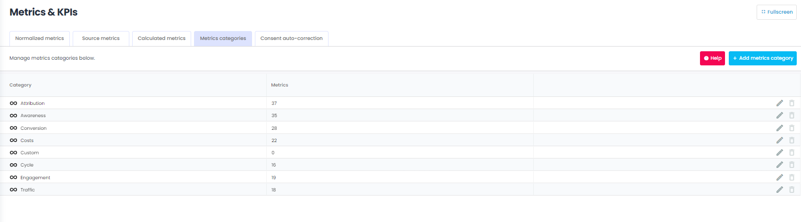

noteOn the same topic, see [[Report > Metrics menu|III---Adloop-reports-system-📈]]

On the same topic, see [Report > Metrics menu](/wiki/spaces/AHEN/pages/1770553710)

Metrics are units or measure indicators used to evaluate the efficiency of web marketing campaigns. 

Each platform has its own metrics but some of them are common to most of the platforms, like  **clicks** ,  **impressions** ,  **conversions**  or  **revenue** . 

## 1 - Metrics imported from Data sources 
For each source in the data Sources list, Adloop team has selected the most relevant metrics:

* Some are imported by default ( **default Metrics** ) - you can’t remove them

* Some are optional and you can select the ones you want to have in Adloop and ignore the others ( **other Metrics** ).

Facebook Ads example: 

Metrics always have a logo in front of their name, so you can identify the data source they are coming from.

Google Ads metrics will have a  logo in front of them, those from Facebook Ads a   and so on.

## 2 - Normalized metrics ( logo)
Some metrics are common to all sources: the normalized metrics in Adloop. They have a  logo in front of them. 

### a - Why those normalized metrics? 
Some metrics are common to most of the  **Ad platforms** . So, instead of having to choose several times the same metric, we grouped them within the normalized metrics. 

Example:

* Google Ads impressions exist in Adloop under the dimension  **Impressions** 

* Bing Ads impressions exist in Adloop under the dimension  **Impressions** 

* Both are grouped under the normalized dimension  **Impressions** 

In a  **Report** , you have  **Metrics**  from Google Ads and Bing Ads and you want to see the performances of both those channels. Instead of having two columns  **Impressions** and  **Impressions** , just use the normalized metric  **Impressions** , you will only have one column.

### b - Which are the normalized metrics? 
Our normalized metrics in Adloop are:

|  **Normalized metrics**  |  **Details and particularities**  | 
|  --- |  --- | 
|  **Impressions**  | Ad impressions  | 
|  **Clicks**  | Clicks on ads (from the platforms, not to be confused with clicks that arrived on the website).In some cases, a click is a particular event (example: Snapchat, clicks are Swipes) | 
|  **Adspend**  | Spendings as sent by the platform  | 
|  **Share of voice**  | Ratio of impressions compared to the total potentialFew platforms offer this indicator  | 
|  **Conversions**  | Conversions generated by the platform ads on the website, as measured by the platform. They can be very different from the ones measured by the Analytics platform.  | 
|  **Revenue**  | Revenue generated by the platform ads on the website, as measured by the platform. It can be very different from the one measured by the Analytics platform.  | 
|  **Started videos**  | Videos that were startedOnly available for video plaforms  | 
|  **Videos views**  | Videos that were fully (100%) viewedOnly available for video plaforms | 
|  **Sent emails**  | Emails sent by the platformOnly available for emailing plaforms  | 
|  **Opened emails**  | Emails opened by the users, as measured by the platformOnly available for emailing platforms | 

### c - Where can I find the normalized Metrics? 
Normalized metrics can be found in the Metrics menu of the Reports. 

The Metrics can be found there: 

Opened Metrics menu: 

## 3 - Calculated Metrics

Another exceptional feature offered by Adloop. Create an unlimited number of calculated metrics from all available metrics.

The calculated metrics are - like other metrics - put in a category with a visibility criteria to choose.

To create/modify a metric nothing could be simpler: the interface is so intuitive and user-friendly with its formula editor that there is no need to give more explanations: there are + and -, \* and / and ( ). 

If you do percentages calculations, don't forget to divide by 100

Some precisions about the icons linked to the calculated metrics :

* If the formula is only made up of metrics from advertising sources (Ad-Centric) : icon 

* If the formula is only made of analytics source metrics (Site-Centric) : icon 

* If the formula is only made of Adloop source metrics (Ad-Centric) : icon 

* If the formula is made of a mix of metrics : icon 

    

## 4 - Metrics categories
 **Metrics**  are categorized by the Adloop teams.

The default categories cannot be deleted but their names can be edited in the  **metrics**  management page. You can add as many categories of  **metrics**  as you want to organize the menus the way you want.

## Managing metrics
[https://www.youtube.com/watch?v=u0Wj3-Brd2w&list=PLQ4YExrLQZJK_n0ICcYT5ijp1bY743qYP&index=5&ab_channel=AdloopMediaOptimizationPlatform](https://www.youtube.com/watch?v=u0Wj3-Brd2w&list=PLQ4YExrLQZJK_n0ICcYT5ijp1bY743qYP&index=5&ab_channel=AdloopMediaOptimizationPlatform)

*****

[[category.storage-team]] 
[[category.confluence]] 
