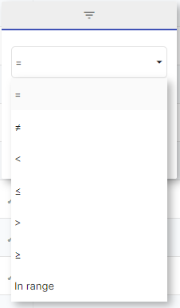
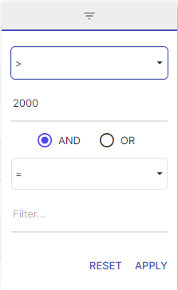
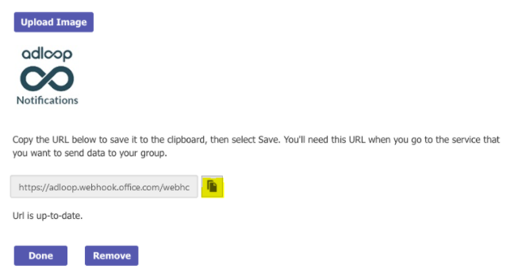
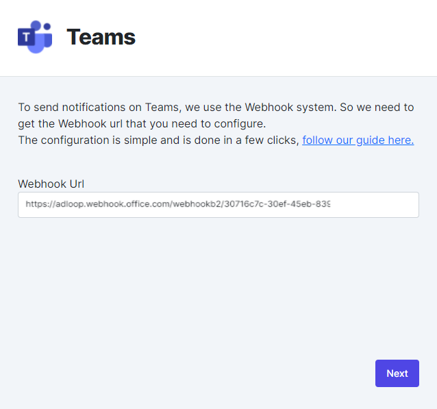

Adloop sends its Export files or Notifications to a Teams Room.

To add Adloop to your room, you need to:

## 1 - Create a webhook

From the Teams interface, in the room you want to send notifications to, click on the room management icon (3 dots menu) and then select the Connectors menu as shown below.

The creation process is simple, just name the _webhook_  as you want -  _Adloop_  for example.

If you want a special Adloop avatar, you can use or download the image below:

[https://cdn.adloop.co/images/adloop_notifications_logo.png](https://cdn.adloop.co/images/adloop_notifications_logo.png)

To create the webhook link, just click on Create :

After saving, you will have access to the webhook link that you can copy:

## 2 - Copy and paste the webhook link into Adloop

In the window for adding a Google Chat Destination, copy the generated webhook link and validate.

Give this Destination a name and you're done!

Your Teams Destination now appears in the list of destinations.

*****

[[category.storage-team]] 
[[category.confluence]] 
