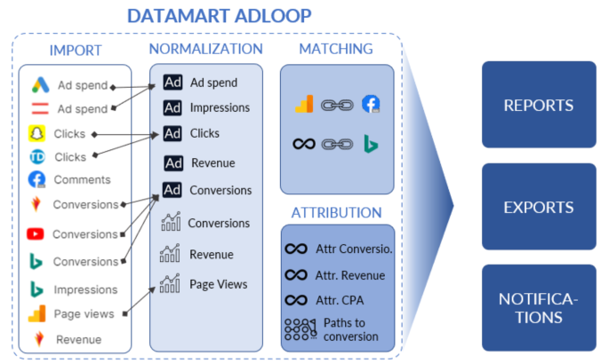
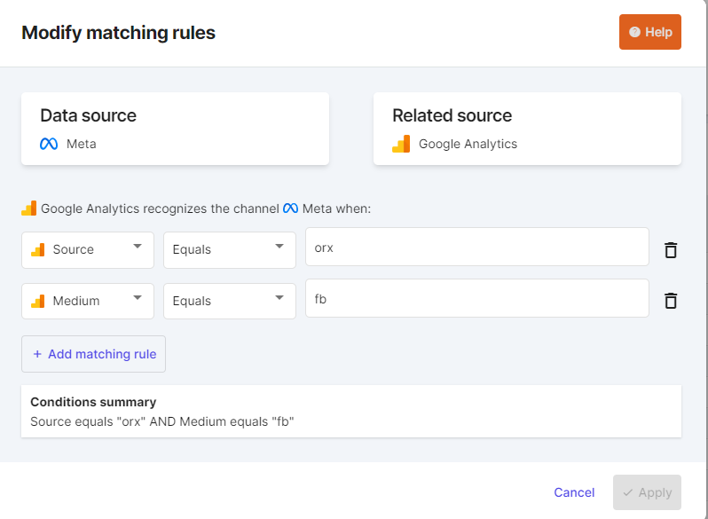

A small synthetic diagram to understand

 _Hi, I'm Adloop!_ 

Let's try to explain this simply.

## A. For starters we import data from Data Sources

You set the API connectors in  **Data Sources**  that will retrieve information from the Ad Platforms and Analytics.

First we retrieve 1 year of data and then every day we add fresh data.

The 'raw' data retrieved from the platforms is stored and identified by the small logo of the  **Data Source**  and a name. An example for the  **metrics** :

*   Impressions: these are the Impressions retrieved from  Google Ads

*  Conversions: the conversions indicated by  Facebook Ads

It's the same for the  **Dimensions**  from the  **Data Sources** :

*  Campaign name: identifies the name of the campaigns  Google Ads

*  Name of the ad: the ads from   Facebook Ads

noteAt this point, we have just retrieved the information from the data sources without changing anything. A kind of copy and paste of what is in the platforms (but without manual intervention).

At this point, we have just retrieved the information from the data sources without changing anything. A kind of copy and paste of what is in the platforms (but without manual intervention).

## B. We then make a Normalization to simplify the reading

As you operate many marketing channels, you will import a lot of data. Now it happens that some  **Dimensions**  or  **Metrics**  are common to several  **Data Sources** .

For example, we have Impressions in   Google Ads and   Facebook Ads, as well as Clicks, for the distribution costs (called Ad spend in Adloop). The same goes for campaign names, ad names, etc.

We therefore operate a Normalization to arrange Dimensions or Metrics of the same nature in a common place.

|  **Source variable**  |  **Normalized Variable**  | 
|  --- |  --- | 
| The metrics :<ul><li>Impressions

</li><li> Impressions

</li><li> Impressions

</li></ul> | Normalized (copied) into :<ul><li> Impressions

</li></ul> | 
| Dimensions :<ul><li>Campaign name

</li><li>  Campaign name

</li></ul> | Normalize (copy) to:<ul><li>  Campaign name - SEA

</li></ul> | 

This operation allows you to have several Variables of the same nature gathered in a single Variable, which considerably simplifies the reporting.

The origin of the normalized variables is indicated by two icons:

Advertising Sources (  etc.) are normalized in the Ad Centric, icon 

Analytics Sources (    etc.) are normalized in the Site Centric, icon 

And to complete the explanation, Adloop specific Variables are illustrated by the icon 

## C. Matching or how to make sure that the   Ad and   Analytics or    Adloop Source understand each other

Adloop's goal is to offer the most appropriate KPIs for all levels of campaign granularity. In order to match a campaign name coming from an Advertising Source with indicators coming from Analytics or Adloop, it is necessary to make sure that the two worlds recognize each other, this is the purpose of  **Matching** .

As an example:

Let’s say I want to see the number of  **Sessions**  in my  **Data Source**   Facebook Ads

In   Google Analytics, the Facebook channel is identified when the   Source dimension is 'facebook' and the   Medium dimension is 'paid social'.

 **Matching**  allows you to create this connection:

## D. Attribution (  function) for optimal quality indicators

Adloop offers a Data-Driven Attribution feature that allows you to reconstruct the conversion and engagement paths of users and calculate attributed metrics and KPIs.

The  **Adloop Tracking & Attribution**  feature will generate many new metrics in Adloop, all of which will be identified by an   icon. For example:

*   Conversions attr. (for  **Attributed**  Conversions)

*   Income attr. (for  **Attributed**  income)

* etc.

Adloop's attribution functionality takes the form of a  **Data Source**  that needs to be activated and configured. A  subscription to Adloop is required to activate it.

## E. Data is available for use

All data presented here is available for use in  **Reports** ,  **Exports**  and  **Notifications** .

More information in the following sections:

* [[ **Dimensions** |Dimensions-in-Adloop]]

* [[ **Metrics** |Metrics-in-Adloop]]

* [[ **Matching** |Matching]]

*****

[[category.storage-team]] 
[[category.confluence]] 
