The Path explorer report aims to show the most common paths to conversion while displaying the amount of revenue and the number of conversion it represents. This is a very useful report to use when creating your strategy.

To create a Path Explorer report click on the _New report_ tab and select Empty  _path explorer_ 

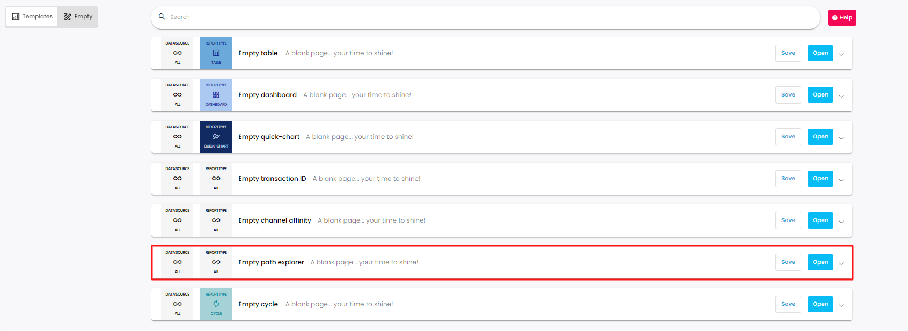

To create a Path explorer report you have to choose 3 elements:

* Conversion metrics

* Time period

* Filters (optional)

### I- Metrics
Choosing a conversion metric is compulsory. The Conversion metric is there by default but it is possible to choose other custom attributed metrics that were defined previously in the attribution setting up process.

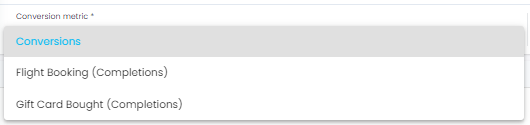

Important to note that at the same time you can only choose one conversion metric!

noteYou want to know more about attribution settings? [Visit our dedicated page!](https://adloopwiki.atlassian.net/wiki/spaces/AHEN/pages/1999208449)

You want to know more about attribution settings? [Visit our dedicated page!](https://adloopwiki.atlassian.net/wiki/spaces/AHEN/pages/1999208449)

### II- Time period
Using the calendar you can choose the period you want to see in your report. We offer standard periods (last 30 days, this month, last week etc.) but you can also choose a custom period.

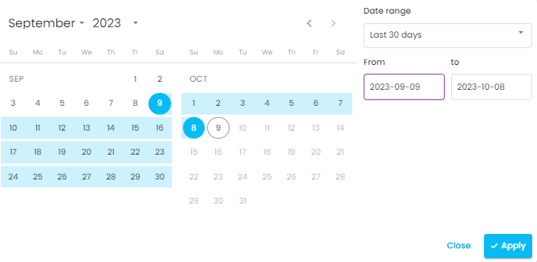

### III- Filters
Clicking on the funnel icon opens the filters menu.

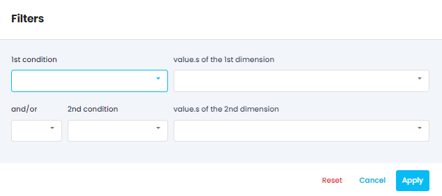

There are two conditions you can use to filter your report. The filtering process starts with setting your first condition. For conditions you can select from the following: contain / does not contain / begins with / ends with. And then choose the values of the 1st dimension. If you want to have a second filter you can choose and/or and do the same process.

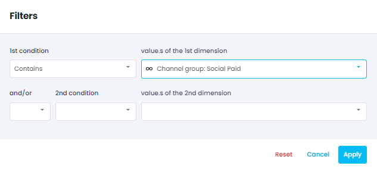

For example here the report will be filtered to show path to conversions that contain a social channel.

You can now click on the Go! button and generate your report!

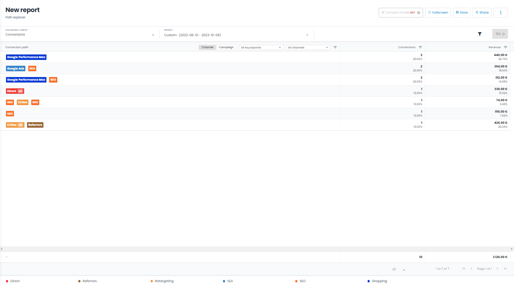

In the report, you can see the number of conversions and the amount of revenue each conversion path represents. 

At the top of the page there are additional filterst that can be used:

You can set to see the report on a channel level view:

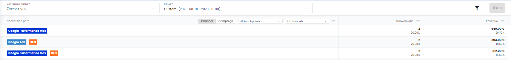

Or on a campaign level view:

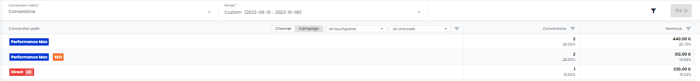

You can select to display different numbers of touchpoints:

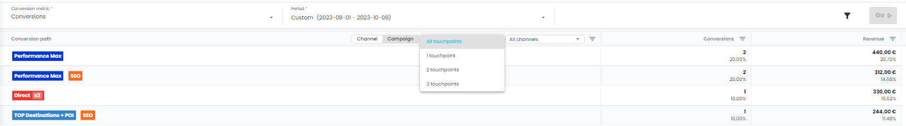

And lastly you can display the selected amount of channels:

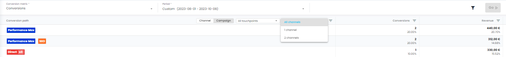

At the bottom of the page can be found a colour glossary. This aims to make the report more readable. There are different colours to represent the different types of channels in the report.

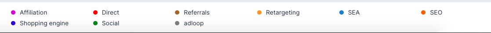

*****

[[category.storage-team]] 
[[category.confluence]] 
