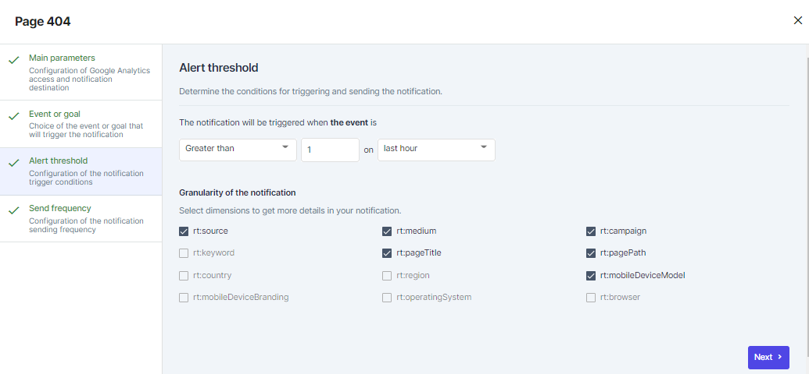

 **This function is now depleted.** 

Real time notifications can be very useful to stay on top of the competition, by getting personalised alerts on  **errors affecting key pages**  or  **errors on destination pages**  from online ads.

The real time notifications can be found under the Notification center menu as Notifications. You can easily add your new alert by clicking on  .

And choose GA Real time notification to configure.

### 1. Name
Give your notification a name so you can find it easily.

### 2. Source
Choose Google Analytics data source that will be used to configure the real time notifications.

### 3. Notification destination
Choose a notification destination which could be an email address that you check regularly.

### 4. Choose the event or goal you want to track. 
You have to choose the event or goal you want to track and want to get notified by. 

You can then add filters on the UTMs to target your notifications.

### 5. Alert threshold
Determine the conditions for triggering and sending the notification.

### 6. Frequency of sending
Choose precisely how often you want to be notified in order to follow your preferences.

### You’re Done! 
After finishing the last step your notifications will arrive to your inbox according to you setting preferences.

## Real-time notifications
[https://www.youtube.com/watch?v=2-q3M1hBo9o&list=PLQ4YExrLQZJK_n0ICcYT5ijp1bY743qYP&index=14&ab_channel=AdloopMediaOptimizationPlatform](https://www.youtube.com/watch?v=2-q3M1hBo9o&list=PLQ4YExrLQZJK_n0ICcYT5ijp1bY743qYP&index=14&ab_channel=AdloopMediaOptimizationPlatform)

*****

[[category.storage-team]] 
[[category.confluence]] 
