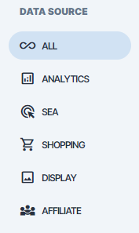
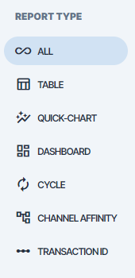
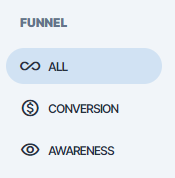
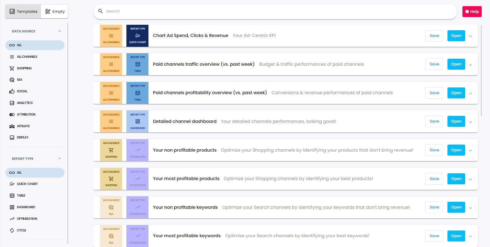
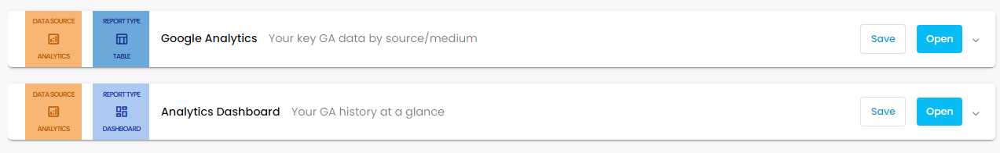
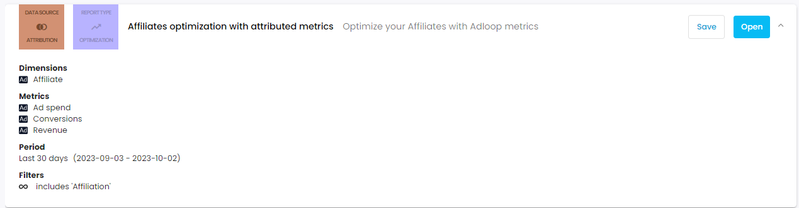

The Adloop report template system is very useful as it offers empty as well as already filled out reports for each report type that is available. It aims to serve the user to have a more seamless experience when using Adloop.

On the left-hand side, you can see 3 segments  _Data source, Report type, Funnel_ .

These aim to bring a clear order within the reporting system. All data sources, report types and funnels are displayed with an icon and a different colour to show the type of the report and the data sources that are included. 

There are two main segments of the reporting page: Empty reports, Report templates. 

## 1- Empty reports
The empty reports can be found at the top of the page. There are 6 different types of reports:

* Table report

* Chart report

* Dashboard report

* Cycle report

* Channel Affinity report

* Transaction ID report

By clicking on the Open button an empty report will open. 

## 2- Report templates
Below you can access some of the report templates that were created by the Adloop team to provide basic templates for the different types of reports.

There are 16 types of report templates available:

* Google Analytics                                               _Key Google Analytics data by source/medium_ 

* Channels overview                                              _Quick overview of your channels_ 

* Chart clicks & CPC                                           _Click related data in a graph_ 

* Dashboard channels                                            _Channel perfomances in a dashboard_ 

* Analytics Dashboard                                           _Google Analytics data in a dashboard_ 

* Detailed SEA performances                                 _Performances at keyword level_ 

* Detailed Shopping performances                        _Performances at product level_ 

* Detailed Display performances                                 _Performances at creative level_ 

* Detailed Affiliates performances                           _Performances at affiliate level_ 

* SEA Dashboard                                                    _SEA campaign performances in a dashboard_ 

* Shopping dashboard                                  _Shopping campaign performances in a dashboard_ 

* Display dashboard                                             _Display campaign performances in a dashboard_ 

* Affiliates dashboard                                     _Affiliates campaign performances in a dashboard_ 

* Affiliates / Channels Conversion Cycle           _Affilites autonomy_ 

* Channels conversion cycle                                       _Channel roles in the path to conversion_ 

* Chart Ad Spend & Revenue                                   _Ad-centric KPI’s_ 

To save the report template to your saved reports you can just easily click on the save button and the report will appear in the list of your saved reports.

By clicking on the arrow more detailed information about the report template such as dimensions, period and filters will be displayed. 

*****

[[category.storage-team]] 
[[category.confluence]] 
