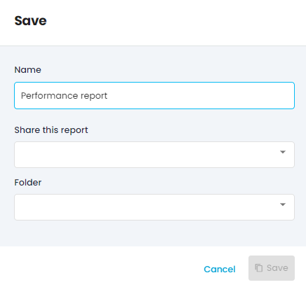

Saving & sharing system is the same for all types of reports!

# 1- Saving a report
When you are done creating your report, you can click on the “Save” button.

You will have first to give it a name. Please, choose a clear and easy-to-understand name, so you can identify easily your different reports in the Saved reports list.

note“Google Ads campaign performances” is a better name than “Report 2”,  _just saying_ ! 

“Google Ads campaign performances” is a better name than “Report 2”,  _just saying_ ! 

Then you will have to choose a share option : 

* Private

* Your site

* Users with the link

a- PrivateOnly you can access and edit reports with private settings. You won’t be able to see private reports made by other Adloop users, even if you are an admin.

b- Your siteAnyone with an Adloop access to the Site can open and edit the report. You will be able to see such reports made by fellow Adloop users as well. 

c- Users with the link Anyone can access this report, as long as they have the link. They don’t need to have an Adloop report to display the report. But, they can’t make any change to the report.

For more safety, you have to enter a password to create this report. So when you share the link, don’t forget to send the password along with it! 

The public sharing mode is ideal if you want to send data to partners (agencies, other teams etc.) but you do not want to give them access to Adloop

# 2- Editing a report
When you open an existing report from the “Saved report” tab, you can edit it and you can, of course, save those edits. 

You have two options : 

* update: the new version will erase the old version

* duplicate: your edits will be saved as a new report (in this case, remember to change the name of the report!) 

## Saving reports
[https://www.youtube.com/watch?v=teeCnTkloIk&list=PLQ4YExrLQZJK_n0ICcYT5ijp1bY743qYP&index=8&ab_channel=AdloopMediaOptimizationPlatform](https://www.youtube.com/watch?v=teeCnTkloIk&list=PLQ4YExrLQZJK_n0ICcYT5ijp1bY743qYP&index=8&ab_channel=AdloopMediaOptimizationPlatform)

*****

[[category.storage-team]] 
[[category.confluence]] 
