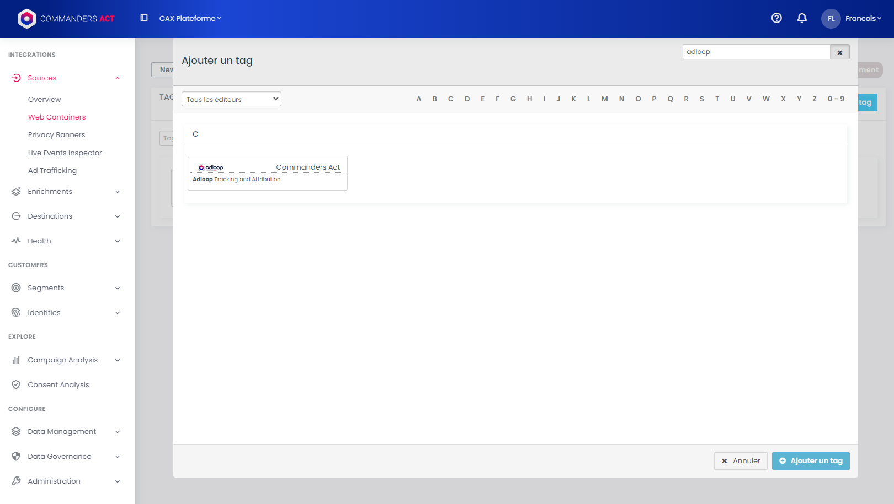
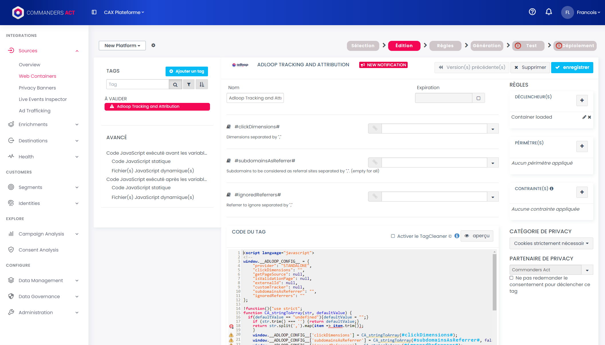
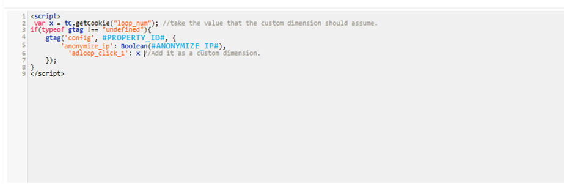

 **Contener connection and selection** 

* Go onto the Commanders Act platform

* Choose the appropriate contener. It is essential that the tag is triggered on all landing pages.

 **Tags template selection** 

* Go to the step of choosing tag templates 

* Search for “Adloop” in the search bar

* Choose the “Adloop Tracking and Attribution” template. You’ll be redirected to the editing step.

 **Template edition** 

Fill in the 3 following fields: 

* The custom dimension configured in your Analytics tool

* Subdomains that should be considered as a separate referrer

* Referrers to be excluded (the list should be the same as the one in your Analytics tool), like payment platforms

 **Consent** 

* Set the consent for the Adloop tag (Analytics/Measurement category)

 **Publishing** 

* Place the Adloop tag between the initialization of your Analytics solution and the pageview event being sent

* Proceed with the contener generation and make sure there are no error during the auto-test step

* Publish the contener

 **In the case of the a single tag for initialization** 

If you use a single tag for initializing your analytics solution and for sending the page view event, then simply place the Adloop tag before your Analytics tag and modify your Analytics tag to include the code for populating the custom dimension. Below is an example of how you can implement it with Google Analytics 4 (add line 2 and 6 in your GA4 code) :

*****

[[category.storage-team]] 
[[category.confluence]] 
