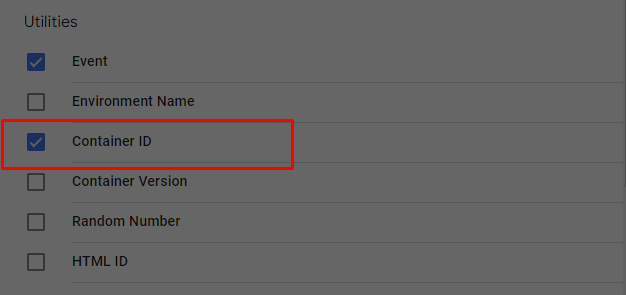
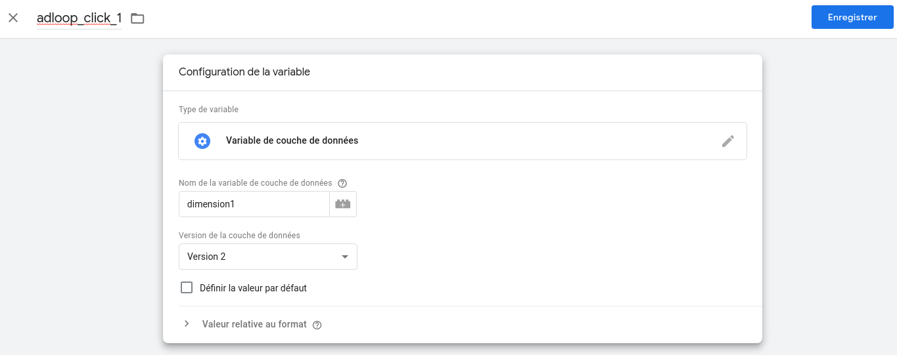
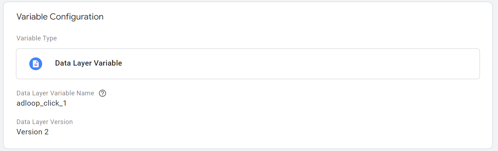
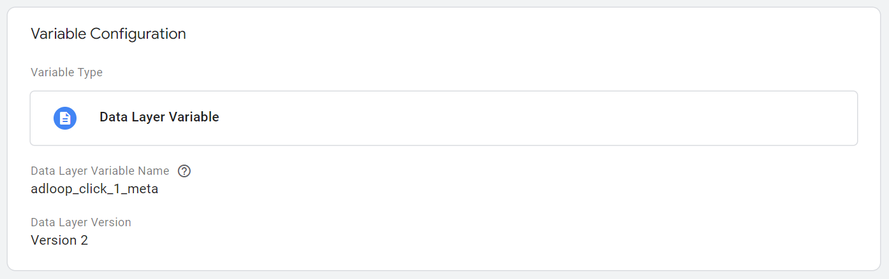
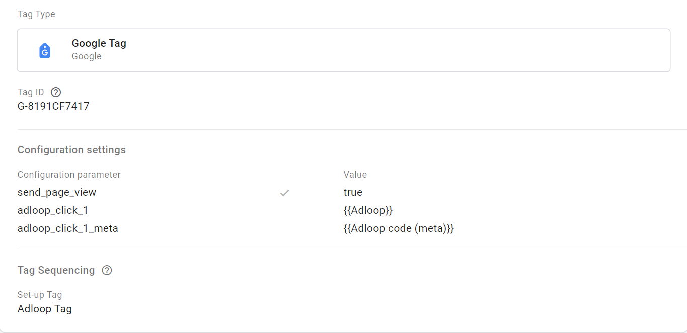
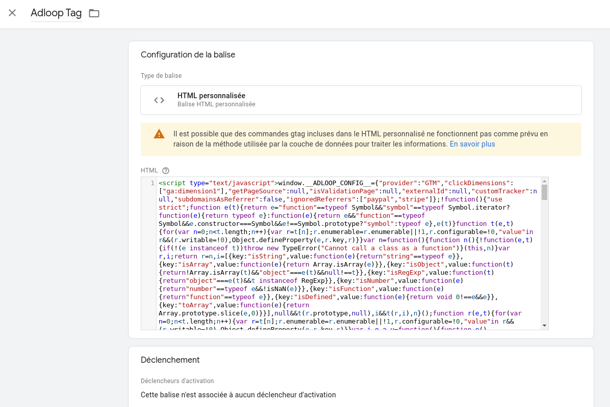
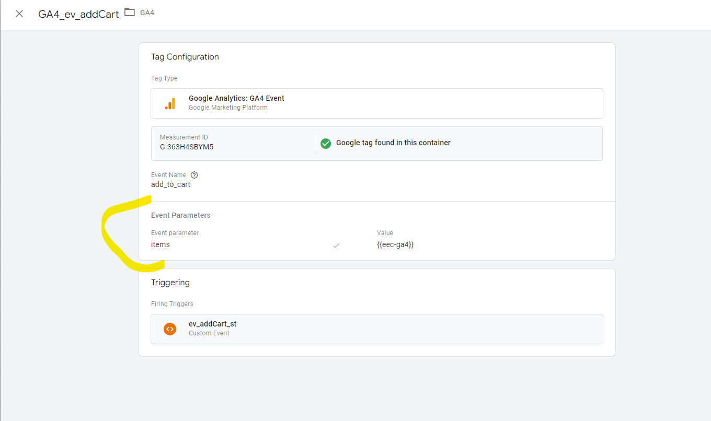
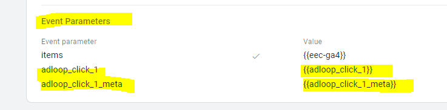
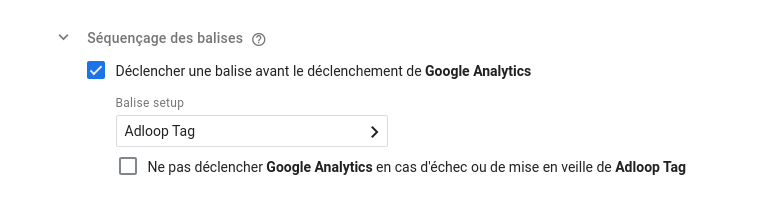

With Google Analytics UA
* Go to the "Variables" section

* Make sure the Container ID is listed under the Build-In Variables

    * If not, click “Configure”, search for Container ID under “Utilities” and enable it

    

* Create "User defined variables" following this scheme:

    * Type of variable: Data layer variable

    * Name of the data layer variable: indicate the value you set up in your custom dimension on GA4 in the event parameter field (ex: adloop_click_1).

    * And give it an adloop related name

    * Repeat these operations for all custom dimensions created in GA

    

* Open the configuration of the "Google Analytics settings" variable, 

* In "More Settings -> Custom Dimensions, click on "Add Custom Dimension"

* Fill in the following information:

    * Index: XX (where "XX" is the index of the dimension created on GA)

    * Dimension value: {{adloop_click_XX}} (Use the brick to choose the previously created variable)

    * Repeat these operations for all variables created in GTM

    

* Go to the "Tags" section and add a new tag of type "Custom HTML", with the name "Adloop tag".

* Copy and paste the content provided on the Adloop interface into the "HTML" field of the tag

* Save the tag without trigger

* Open the configuration of the Google Analytics tag with the largest trigger ("All pages" or “Pageviews” for example). 

* In the advanced settings of this tag, in "Tag sequencing", check "Trigger a tag before Google Analytics is triggered" and choose the "Adloop tag" previously created

* 

* Check if the script is working without error in the preview mode (find our documentation [[here|Checking-that-the-script-is-triggered]]), then deploy the new version.

Google Analytics 4
* Make sure the Container ID is listed under the Build-In Variables

    * If not, click “Configure”, search for Container ID under “Utilities” and enable it

    
* Go to the "Variables" section

* According to the custom dimensions created earlier, create "User defined variables" following this scheme:

    * First one: 

    * Type of variable: Data layer variable

    * Name of the data layer variable name : adloop_click_1 

    * Give the variable an Adloop related name

    
    * 
    * Second one: 

    * Type of variable: Data layer variable

    * Name of the data layer variable: adloop_click_1_meta

    * Give the variable an Adloop related name

    

    

* Open the configuration of the GA4 Configuration tag (type: Google Tag)

* In "Fields to Set”, click on "Add Row"

* Fill in the following information:

    * Field Name: adloop_click_1 

    * Value: Use the brick to choose the previously created variable (the 1st one)

    * Add another filed: adloop_click_1_meta

    * Value: Use the brick to choose the previously created variable (the 2nd one)

    

* Go to the "Tags" section and add a new tag of type "Custom HTML", with the name "Adloop tag"

* Copy and paste the content provided on the Adloop interface into the "HTML" field of the tag

* Save the tag without trigger

* Open the GA4 Configuration tag (type: Google Tag) that was opened in a previous step

* In the advanced settings of this tag, in "Tag sequencing", check "Trigger a tag before this tag is triggered" and choose the "Adloop tag" previously created

* For your GA4 events (purchase, add to cart, view item etc.) set-up on GTM, add the Adloop event parameters & values : 

adloop_click_1 and for the value select the first user defined variable you created previously using the brick button

adloop_click_1_meta and for the value select the second user defined variable you created previously using the brick button 

Note: the name of the value between {{ }} depends on how you named your user defined variable ; it might be different from the screenshot above. 

* Check that all your events (add to cart, purchase etc.) are triggered after the pageview is sent. Otherwise our script won’t be able to catch those events. 

* Deploy the new version

*****

[[category.storage-team]] 
[[category.confluence]] 
