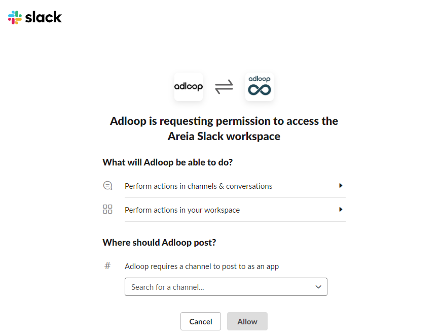

Adloop sends Notifications into a Slack Channel.

To add Adloop to your Slack Channel, you must have: 

1. Your Slack Space name

1. Your Slack ID

1. The Channel you want us to send Notifications to

## 1 - Where to find the Slack informations?

### a - Your Slack Space name
You can find it in your Slack app by opening the top-left menu, it looks like \[space_name].slack.com. 

### b - Slack ID
It consists of a login (email address) and a password. 

If you don’t remember the address you used, you can find it in the ‘View Profile’ link in your personnal menu, on the top-right corner of the Slack app.  

### c - Channel name 
The connection system will display all the available channels, whether they are shared (beginning with a #) or personnal (one or several people) 

## 2 - Connection procedure 
Adding a Slack Destination starts with opening a connection with Slack. 

If you are not already logged in, you will have to enter the previously indicated information in the different fields. 

If you are already logged-in or after entering all the informations, you will have to choose the channel in a screen looking like this one: 

After authorizing, you are done! Your Slack Destination is ready. 

*****

[[category.storage-team]] 
[[category.confluence]] 
