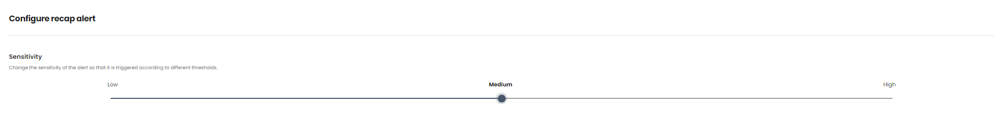
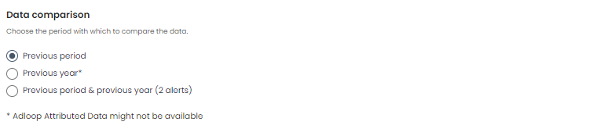
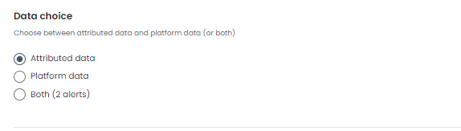
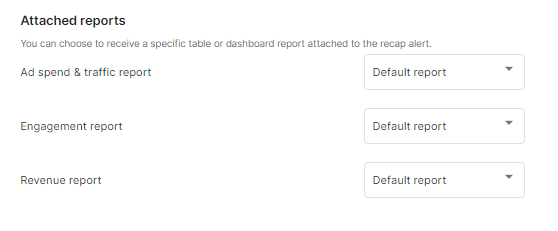

 **We want to save time for you!** This is why we created our  **Adloop Smart Alerts - Recap**  feature. The goal is to give an overview of the performance of your digital marketing channels for you to keep track of your paid channels as effectively as possible!

You will receive this alert on a weekly and monthly basis with a comparison to the previous period to keep track of the changes.

The Recap will include the following:

### For clients with attribution

* Adspend

* Traffic

    * Landed clicks

    * Cost per landed clicks

    
* Engagement

    * Useful clicks

    * Cost per useful clicks

    
* Revenue

    * Real Revenue

    * Real ROAS

    

### For clients without attribution

* Adspend

* Traffic

    * Platform clicks

    
* Revenue

    * Platform Revenue

    * Platform ROAS

    

1.  **_You can subscribe, add recipients, configure and test the smart recap alerts_** 

.png)
1.  **_You manage recipients_** 

.png)
1.  **_You can set the sensitivity of your alerts_** 

1.  **_You can choose the period in which to compare the data_** 

1.  **_You can choose between attributed data and platform data (or both)_** 

1.  **_You can choose to receive a specific table or dashboard report attached to the recap alert_** 

*****

[[category.storage-team]] 
[[category.confluence]] 
