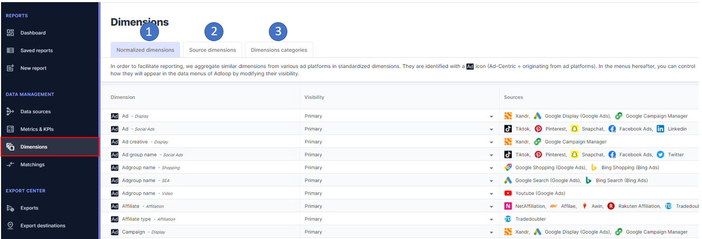
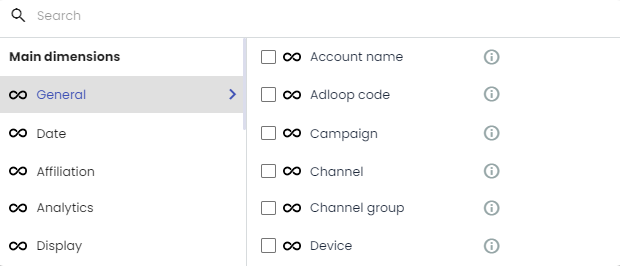
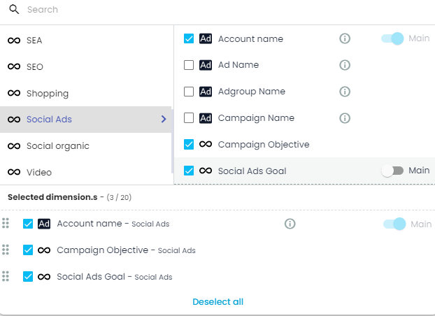
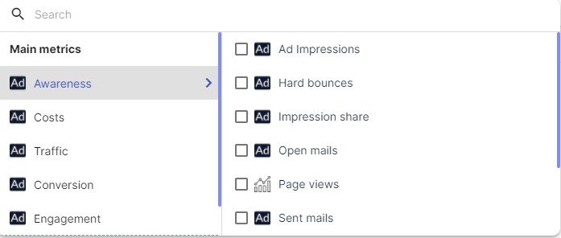
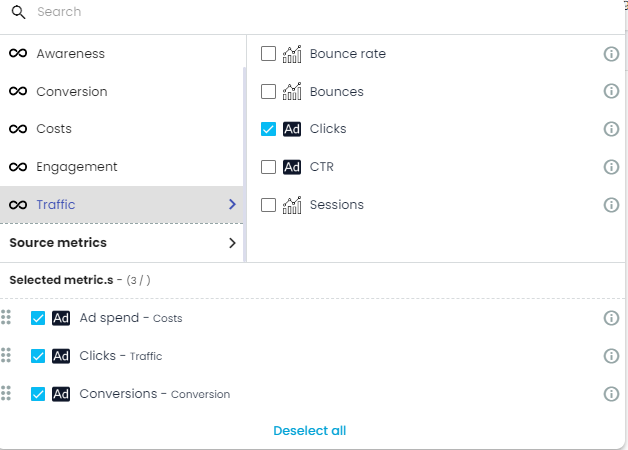
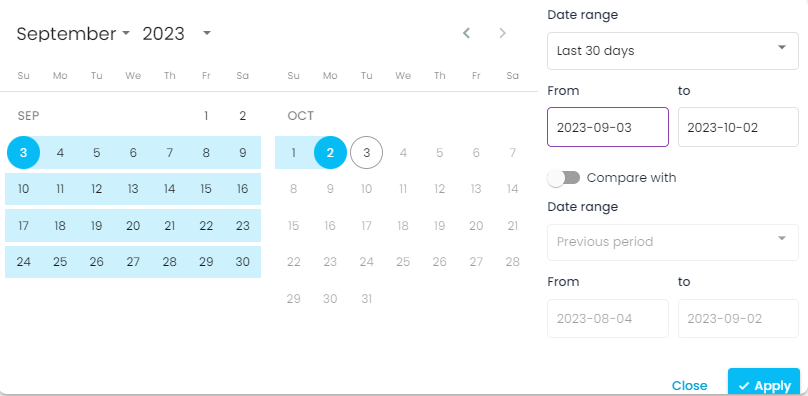

Adloop reporting tool is very powerful: you can combine any data type from multiples Sources, filter them, order them etc. 

All reports use at least one of the following four elements: 

* dimensions 

* metrics

* period

* “go” button

## Step 1: Choose Dimensions 
You can, using the  **Dimensions Pickers** , choose the  **Dimensions**  from  **Data Sources**  you added. 

Dimensions can be used either as the base of your report or as filters.

Want to know more about Dimensions? [[ **The Dimensions in Adloop** |Dimensions-in-Adloop]]

Detailled presentation of the [[ **Dimensions Picker** |Dimensions-Picker]]

## Step 2: Select Metrics
You can, using the  **Metrics Piker** , choose the Metrics from  **Data Sources**  you added. 

Want to know more about Metrics? [[ **The Metrics in Adloop** |Metrics-in-Adloop]]

Detailled presentation of the [[ **Metrics Picker** |Metrics-picker]]

## Step 3: Pick a time period
Choose the period you want to analyze:

Step 4 : Validation

When steps 1, 2 and 3 are finished the “Go” button becomes clickable. Click on it and your report is ready. 

|  **Non clickable Go button**  |  **Clickable Go button**  | 
|  --- |  --- | 
|  |  | 

If you want a complete presentation of the reports items, you can watch: 

* Our [[ **video tutorials** |Tutorials-📽-&-step-by-step-guides-🚶‍♀️🚶‍♂️]]

* The detailled presentation of the Reports [[ **screen items** |Screen-items]].

*****

[[category.storage-team]] 
[[category.confluence]] 
