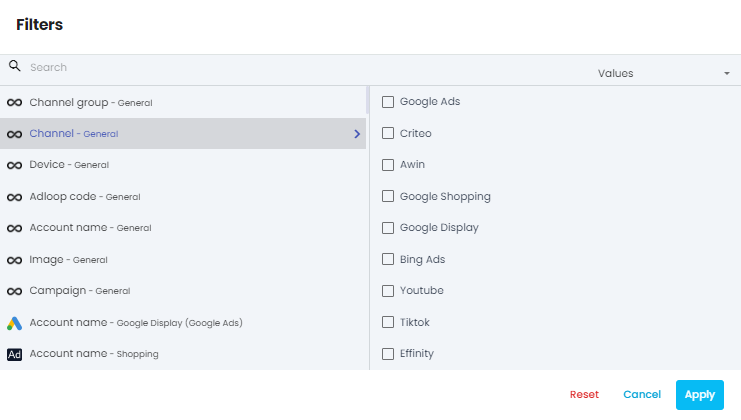

 **Table report**  is your basic go-to table kind of report! They can be used either for  **macro overview**  of your performances or for  **micro granula** r  **analysis**  of your digital marketing.

To create an empty table reports, click on the New report button in the left-hand menu and choose Empty table report.

To create a table you have to choose 4 elements : 

* dimensions

* metrics

* time period

* filters (optionnal)

## 1- Dimensions
Choose the dimensions you want to use in your report thanks to the dimension menu. You can select a maximum of 5 dimensions. 

One of your dimension will be the main dimension of your report. You can change which dimension is the main using the switch. 

noteYou want to know more about dimensions? [[Visit our dedicated page!|Dimensions-in-Adloop]]

You want to know more about dimensions? [Visit our dedicated page!](/wiki/spaces/AHEN/pages/1770554179/Dimensions+in+Adloop)

## 2- Metrics
Choose the metrics you want to use in the report thanks to the metrics menu. You can choose a maximum of 20 metrics.

noteYou want to know more about metrics? [[Visit our dedicated page!|Metrics-in-Adloop]]

You want to know more about metrics? [Visit our dedicated page!](/wiki/spaces/AHEN/pages/1770554272/Metrics+in+Adloop)

## 3- Time period
Using the calendar you can choose the period you want to want to see in your report. We offer standard periods (last 30 days, this month, last week etc.) but you can also choose a custom period.

Using the comparison switch you can compare two different periods : 

The initial period is identified with the purple colour, while the comparison period is in yellow.

## 4- Filters (optionnal)
Clicking on the funnel icon opens the filters menu.

You will find the list of all the dimensions available in your site. You can then select for each dimension the desired values you want to use as filters.

Only data corresponding to the filters will appear in the report. 

You can use the search bar either to search for dimensions or for values (once a dimension is chosen) using the switch in the search bar: 

If choosing a dimension with lots of possible values (like keyword or ad ID), the loading can be a bit long. Please be patient! Or use another dimension (like ad group or campaign) 

You can now click on the Go! button and generate your report! 

## Table report
[https://www.youtube.com/watch?v=E6xFmxmPjUc&list=PLQ4YExrLQZJK_n0ICcYT5ijp1bY743qYP&index=11&ab_channel=AdloopMediaOptimizationPlatform](https://www.youtube.com/watch?v=E6xFmxmPjUc&list=PLQ4YExrLQZJK_n0ICcYT5ijp1bY743qYP&index=11&ab_channel=AdloopMediaOptimizationPlatform)

*****

[[category.storage-team]] 
[[category.confluence]] 
