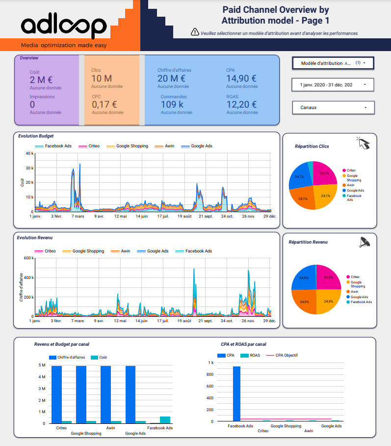

##  Template 1: Paid Channel Performance by Adloop
[Template 1 - Paid Channel Mix Adloop](https://datastudio.google.com/u/0/reporting/423d3a6d-d838-4b3a-ad3c-69b95411a5b2/page/F2tyB)

In this template, you will find an overview of your costs and revenues according to the different channels you use in your marketing mix. Different graphs and tables allow you to see your most important metrics according to a table by channel. Your budgets and revenues are displayed by period so that you have a clear idea of the evolution of your campaigns.

The goal is to offer you a very visual template that allows you to know at a glance where you stand, either thanks to our color codes that easily show the profitable channels and those that are less profitable, or the pie charts at the bottom of the page highlighting the most dominant channels according to the metrics of your choice.

## Template 2: Comparison of paid channels by attribution model
[Template Adloop 2 - Paid Channel Comparison by Attribution model](https://datastudio.google.com/u/0/reporting/b4669876-ba8a-4069-8662-2166d9843ef5/page/phO0B)

In this template, the focus is on the comparison of channels by attribution model between Ad-centric and Site-centric. In this example, it is Facebook Ads and Google Ads, of course, any channel can be added.

You will find classic metrics such as budget, conversions and CPA with their evolution but also a global view on each channel.

## Template 3: Channel performance by attribution model
[Template Adloop 3 - Paid Channel Overview by Attribution model](https://datastudio.google.com/u/0/reporting/b3a8419c-16dc-4e4c-99fd-5cd5d4089d01/page/OEe1B)

This template is separated in 2 pages, a first page with the possibility to choose an attribution model: Last click, Ad-centric or Adloop (behavioral) for any chosen channel. Different diagrams are given to choose from, as well as the evolution of the metrics over time.

The second page gives you an incremental view of your report. Allowing you to add what you want.

*****

[[category.storage-team]] 
[[category.confluence]] 
