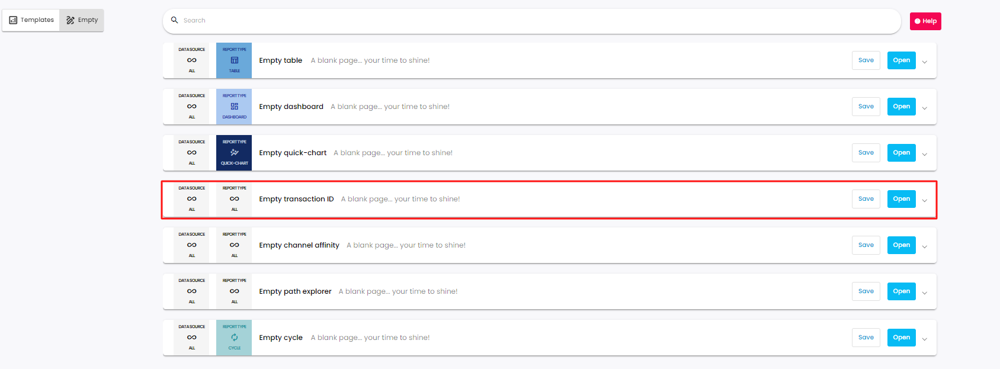
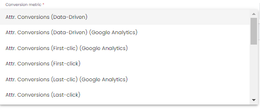
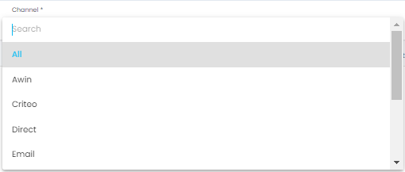
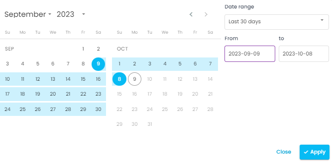
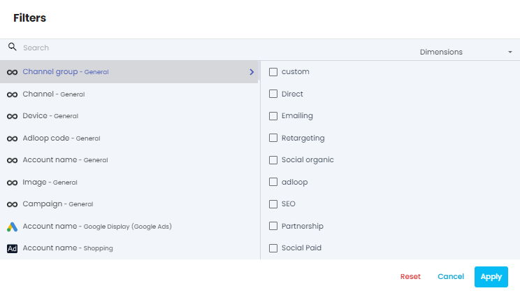
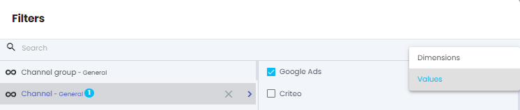
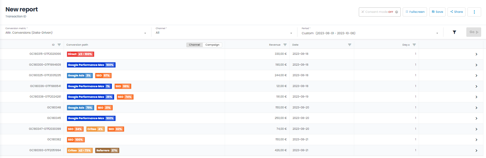
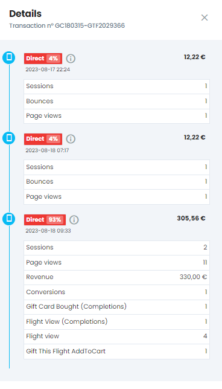

The transaction ID report aims to show the conversion path by displaying a detailed path to conversion with attributed measures.

To create a Transaction ID report click on the _New report_ tab and select  _Empty transaction ID_ 

To create a Transaction ID report you have to choose 4 elements:

* Conversion metrics

* Channel

* Time period

* Filters (optional)

### I- Metrics
Choosing a conversion metric is compulsory. The Conversion metric is there by default but it is possible to choose other custom attributed metrics that were defined previously in the attribution setting up process.

Important to note that at the same time you can only choose one conversion metric!

noteYou want to know more about attribution settings? [Visit our dedicated page!](https://adloopwiki.atlassian.net/wiki/spaces/AHEN/pages/1999208449)

You want to know more about attribution settings? [Visit our dedicated page!](https://adloopwiki.atlassian.net/wiki/spaces/AHEN/pages/1999208449)

### II- Channels
After choosing the metric the channel has to be selected as well. You can either select one specific channel or choose “All”.

### III- Time period
Using the calendar you can choose the period you want to see in your report. We offer standard periods (last 30 days, this month, last week etc.) but you can also choose a custom period.

### IV- Filters (optional)
Clicking on the funnel icon opens the filters menu.

You will find the list of all the dimensions available in your site. You can then select for each dimension the desired values you want to use as filters.

Only data corresponding to the filters will appear in the report.

You can use the search bar either to search for dimensions or for values (once a dimension is chosen) using the switch in the search bar:

If choosing a dimension with lots of possible values (like keyword or ad ID), the loading can be a bit long. Please be patient! Or use another dimension (like ad group or campaign)

You can now click on the Go! button and generate your report!

In the report you can see the source of the conversion and the attributed % in the conversion process. By clicking on the arrow you will see a detailed report with a more granular view on the conversion.

*****

[[category.storage-team]] 
[[category.confluence]] 
