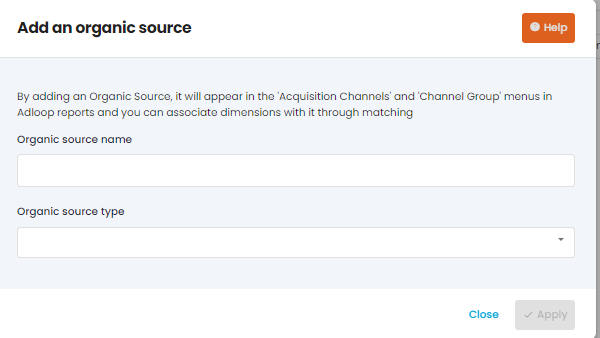
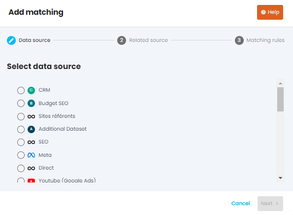
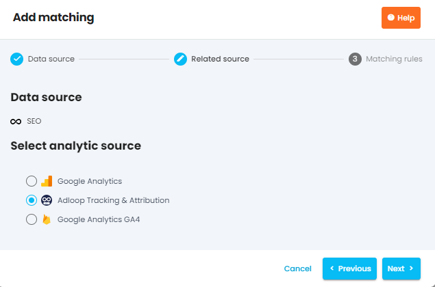
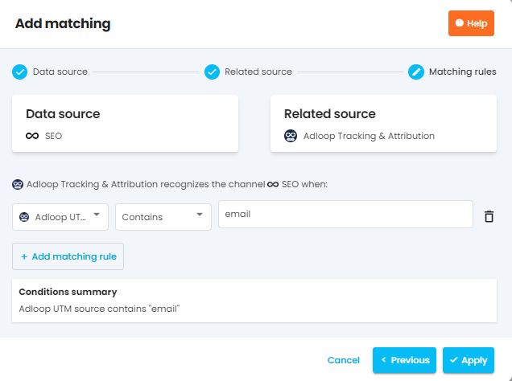

In some cases, it is possible that you have to create organic sources to match some of the sources such as Email, SMS, and Newsletter that normally wouldn’t belong to any data source.

By adding an Organic Source, it will appear in the 'Acquisition Channels' and 'Channel Group' menus in Adloop reports and you can associate dimensions with it through matching

## 1. Create the organic source 
First, you have to create the organic source to do so go to the  _Data Sources_  menu and click on Organic sources. After clicking on  _+Add_  you have to name your organic source and name its type.

## 2. Create the matching for the source
To do so you have to go to the  _Matchings_  menu and click on  _+Add_ and select your created organic data source.

After selecting your data source you also have to select your related source which in this case will be the Adloop Tracking & Attribution source.

Here, we will add matching rules to indicate Adloop when the specific channel you created has to be recognized.

To do so, we advise you to open in a separate tab an Adloop report with the following parameters: Channel and Adloop code. For metrics, choose sessions. This will help you know what UTM parameters are used for your channels.

For Adloop matching to work properly, you need to have a clear campaign tracking and to have UTM parameters correctly set-up. If this is not the case, you should work on your tracking before setting-up Adloop matching. Otherwise, you may have incoherent data.

Validate and your channel matching is ready!

*****

[[category.storage-team]] 
[[category.confluence]] 
