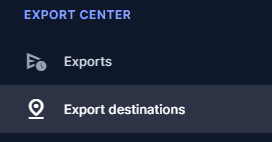
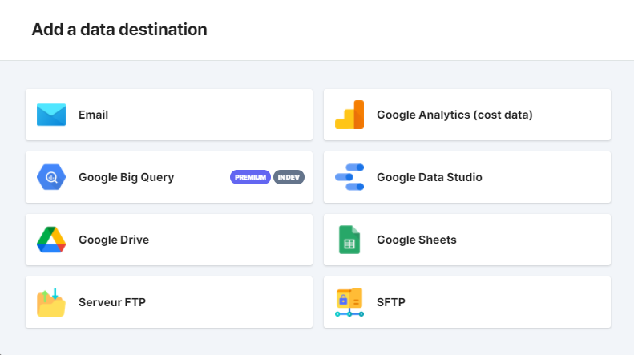
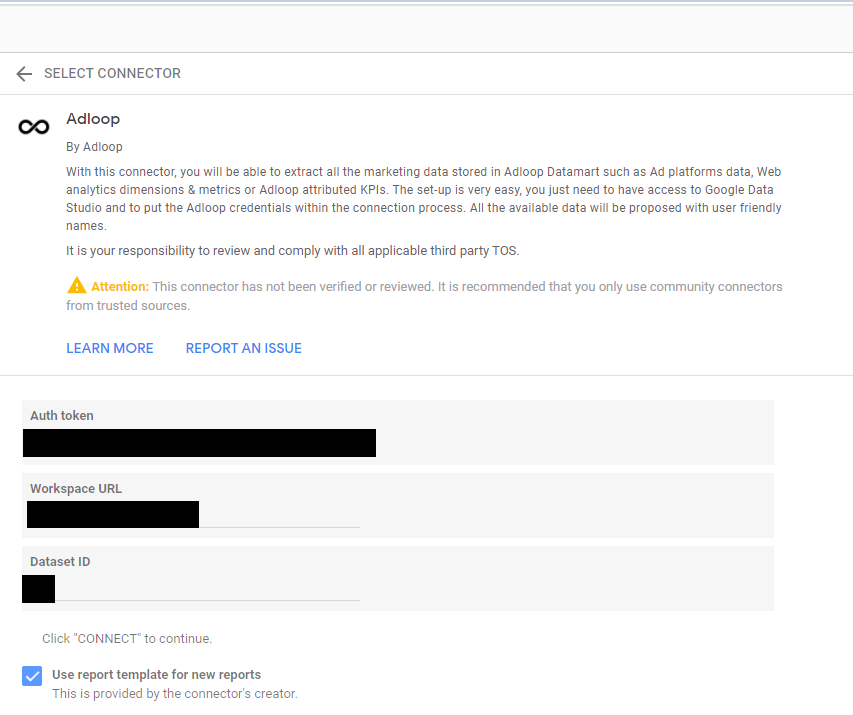
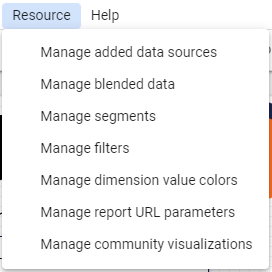
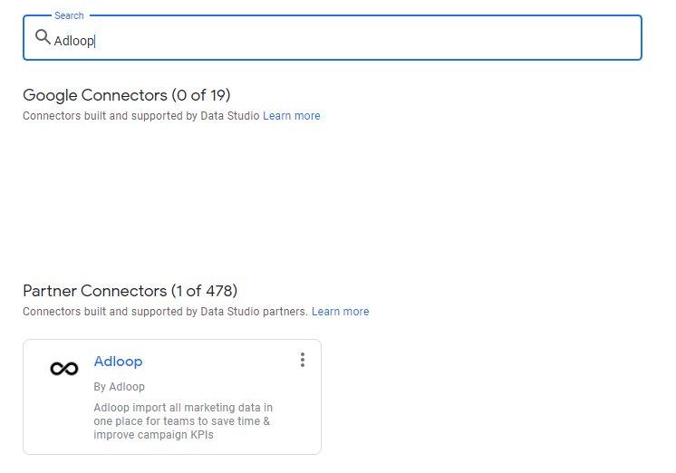
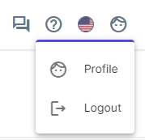
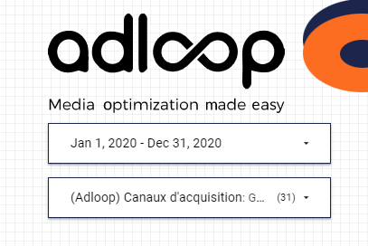
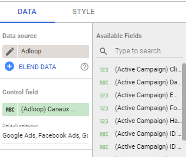
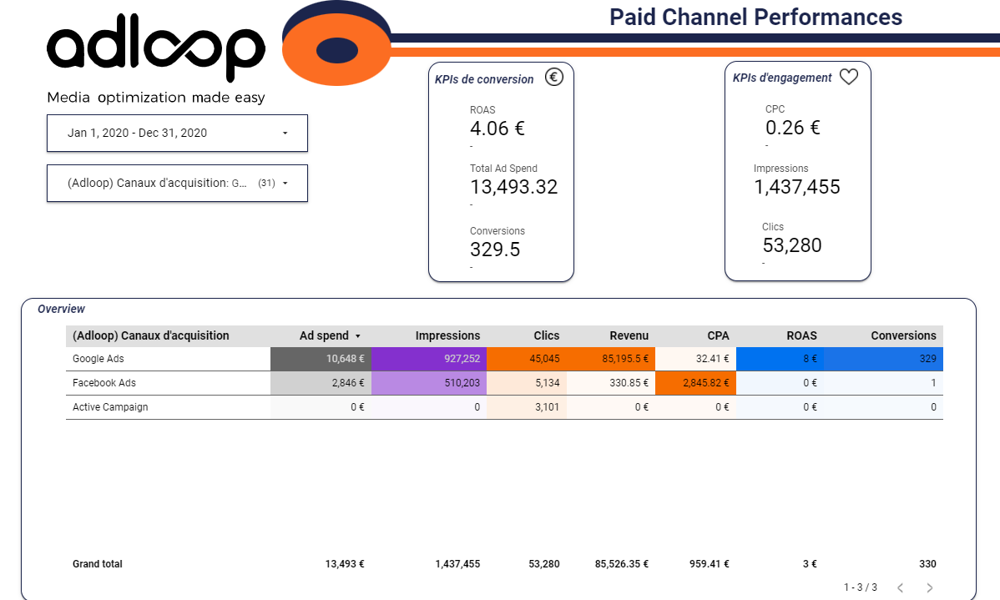

A Data Studio dashboard in 5 minutes ⏱ 

This step by step guide will teach you how to create your Data Studio dashboard for it be updated daily with Adloop. 

## 1 - Connecting your Adloop Space to Data Studio (Method 1)

The first method of connecting to the Adloop Data Studio is on Adloop, for this you need to go to the menu on the left:

Click on "Export Destinations", once the page loads, click on "+ Add" in the upper right hand corner.

A window appears with several choices of export destination, in this case we will choose Google Data Studio :

You arrive on Data Studio :

The auth token is your API access token which is available in your Adloop profile,

the Workspace URL is your Adloop space URL and your Dataset ID is your Dataset number (if you have more than one)

All of this information is already pre-populated in Data Studio.

## 1 - Connecting your Adloop Space to Data Studio (Method 2)

Using Data Studio Adloop templates is very simple, we have developed an Adloop connector for Data Studio:

Once on your Data Studio template, go to "Resource" - "Manage added data sources"

Once on the new page, you are offered "Add a new data source".

Click on it and search for Adloop as shown below.

The connector is not yet verified and validated by Google but this will be done shortly. It is however already fully usable and operable.

Click on the Adloop connector, you will be directed to a page where you have to fill in your API access token, this is available in your Adloop space:

Top right of your page in profile.

In this new page, scrolling down, you arrive in "Security" and just below you will find the API access token.

Now back to DataStudio where you can copy/paste your access token, then select the space to use and the dataset to use. Then click on "Associate". All your dimensions and metrics will be exported to Datastudio.

## 2 - Check your acquisition channels

Although we have already integrated an exhaustive list of acquisition channels, it is possible that one of the channels that you use is not present in the list, in particular the email channel as well as the partnership channels that you will have to add manually in the selector.

To do this, simply go to the "Edit" of the template. Click on the selector.

On the right side a menu will open, under the tab "Data", go to "Default selection" and add the channels you want. After a quick refresh, they will appear in the selector.

(In the example above, it is template 1, however it is a completely identical process for the other templates that use a selector).

## 3 - Check that your data is correct

Finally, you are back on the template and you can view the data that has been inserted on the report.

Remember to check one last time the readability and validity of the data by asking yourself these two questions:

Is my value in the right format? (text, number, currency...)

Does my value use the right aggregation? (sum, average, none...)

You can now read your Adloop reports in Datastudio!

If you have any problems or questions, please do not hesitate to contact our support team. We will be happy to assist you.

*****

[[category.storage-team]] 
[[category.confluence]] 
