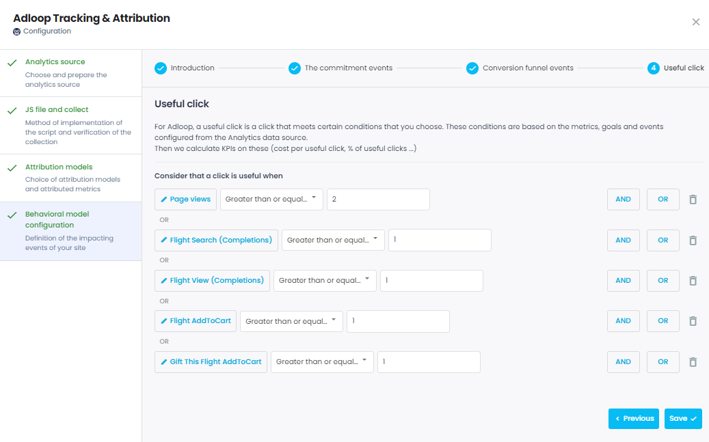

Optimizating your digital marketing only on conversions & revenue would mean that you leave out most of your campaigns. To answer this challenge, Adloop created the  **useful click** .

## 1- What are useful clicks?
Well, that’s up to you! 

YOU decide what makes a click useful to your business. Is a click useful only if the user sees more than 2 pageviews? Or if he sees a product page? 

When setting up the Adloop Tracking & Attribution data source, you will have to choose the useful click definition, using goals & events from your Analytics data source. You can combine several goals & events if you want, using logical connectors “or” & “and”. 

Here for example, a click will be considered useful if: 

* there is at least 2 pageviews, or

* at least one product search, or

* at least one product view

## 2- Useful clicks KPI
noteTo create custom metric, visit [[our dedicated page|Calculated-metrics]]! 

To create custom metric, visit [our dedicated page](/wiki/spaces/AHEN/pages/2001469485/Calculated+metrics)! 

To analyze your digital marketing, we advise you to create two KPI using the useful clicks: 

a - Cost per useful click Ad Spend / Useful Clicks

b - Useful click ratioUseful Clicks / Adloop Clicks

Adding those two KPI to your report will enable you to highlight any elements not driving enough qualified traffic. 

It is especially interesting to compare the cost per useful click with the Advertising CPC, to highlight the difference between the two. 

*****

[[category.storage-team]] 
[[category.confluence]] 
