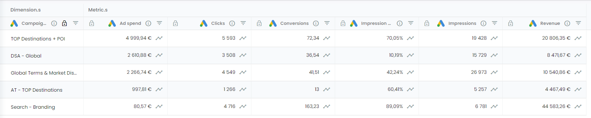

It is an often-asked question “What is the difference between Platform and Attributed data? and “Is it normal that the difference between my platform and my attributed data is very significant?”

It is often suggested by the team of Adloop to use both Platform and Attributed data for analysis as it is a good way of comparing data.

### Platform data
The platform data is the raw data we fetch from the data sources. You will have platform data for the channels you connect on Adloop.

The platform data has the channel’s logo before it just like here for  Google Search: 

The  normalized metrics also consist of platform data:

### Attributed data
The  Attributed data is only available for clients with attribution

If you don’t have Attribution but you would be interested please contact our support team.

The attributed data is based on Adloop's Data-Driven model which is a highly sophisticated model based on behavioral analysis. We use user behavior (materialized by actions on the site such as adding a product to the shopping cart or signing up for a newsletter), visit depth, and time spent on pages to measure the importance of each touchpoint in a conversion path.

The analysis carried out by our self-learning algorithms results in a percentage contribution for each touchpoint in the path, which is applied to the conversion metric (and associated revenue). 

 _For example:_ 

Let's take a channel with 3 touchpoints resulting in a purchase of €500: Google Ads > Meta > Email (Conversion):

The visitor is new to Google Ads and visits the site in depth (10 pages viewed, including 5 product sheets, 2 additions to basket).

Returns 2 days later via a Meta ad, but leaves immediately (bounce)

He converts a few hours later via a promotional e-mail, taking back his already-formed basket.

In this example, the Google Ads visit is highly engaging compared to the other two, and it's likely that the customer has almost made up his mind by now. The Meta visit is anecdotal, and the email visit validates a choice already made (basket taken from the Google Ads session).

The Data-Driven Adloop model will propose a breakdown of contributions:

Google Ads 75% (€375 revenue) > Meta 1% (€5 revenue) > Email 24% (€120 revenue).

The attributed data has the  Attribution logo before

Attributed metricsThere are some additional metrics that are only available with attribution

|  **Attributed metrics**  |  **Description**  | 
|  --- |  --- | 
| Attributed Conversions | The attributed conversion is the amount of conversion that can be attributed to a traffic source or campaign. It is very useful in analyzing return on ad spend and determining the digital marketing budgets. _Attributed Conversion to be compared with Platform Conversion_ 

 | 
| Attributed Revenue | The attributed revenue is the amount of revenue that can be attributed to a traffic source or campaign. It is very useful in analyzing return on ad spend and determining the digital marketing budgets. _Attributed Revenue to be compared with Platform Revenue_ 

 | 
| Attributed ROAS | Calculated by Adloop, based on our attribution data. _Attributed ROAS to be compared with platform ROAS_ 

 | 
| Landed Clicks | Clicks that arrive on your website measured by our script. _Cost per landed click to be compared with Platform CPC_ 

 | 
| Useful clicks | You decide! When setting up the Adloop Tracking & Attribution data source, you will have to choose the useful click definition, using goals & events from your Analytics data source. _Cost per useful click to be compared with Platform CPC_ 

 | 

Comparing Platform and Attributed dataComparing platform data and attributed data can be very useful when making an analysis of your campaigns. The difference between the two types of data can be explained by the usually biased measurements of the advertising platforms and the measurement of our attribution system which is further explained in how our attribution model works.

So it is “normal” when you see a difference between your platform and attributed data. 

Here are some reasons: 

*  **Deduplicated vs duplicated conversions** 

On  Advertising Platforms, the same conversion is being claimed by all the platforms that took part in the path to conversion, while in reality, there is only one conversion happening. This is why our attribution method is very important.

*  **Post-view on Social Media** 

We usually experience this on Meta and other social media platforms - the conversion is linked to a view (scrolling) and not to a click / an outbound click, thanks to their people-based attribution. It is worth checking the breakdown of post-view and post-click for your conversions. 

 _Reminder_ : Our attribution model is based on click-only tracking! 

*  **“Fake clicks”** 

We call ‘fake clicks’ clicks that in the end didn’t arrive on your page, however, the advertising platforms would measure them as clicks (like, share, photo zoom etc. but also outbound clicks for which the user left your page immediately) 

*  **Last non-direct click on GA** 

On Google Analytics the measuring system can be biased by attributing the conversion to the last non-direct click on the platform instead of the direct click.

*  **Google putting the conversion to the date of the click vs Adloop date of conversion** 

Google puts the conversion on the date of the click while Adloop puts the conversion on the day of the purchase which can lead to discrepancies between Adloop and the advertising platform.

Platform Conversion&Revenue vs. Attributed Conversion&RevenueCost per useful clicks vs. CPCPlatform ROAS vs. Attributed ROAS

*****

[[category.storage-team]] 
[[category.confluence]] 
