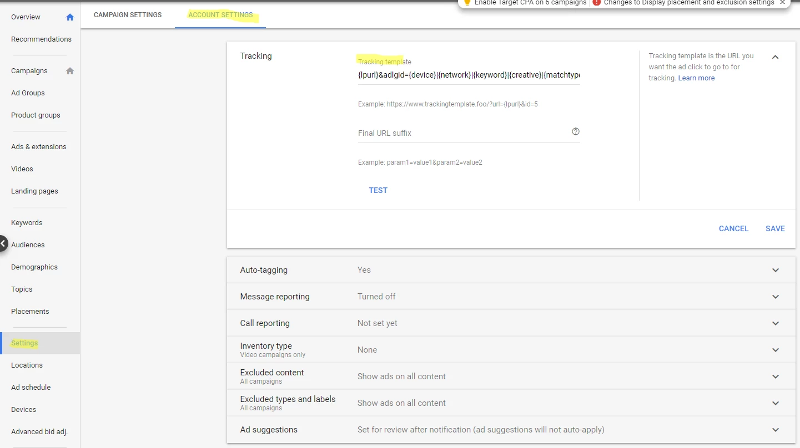
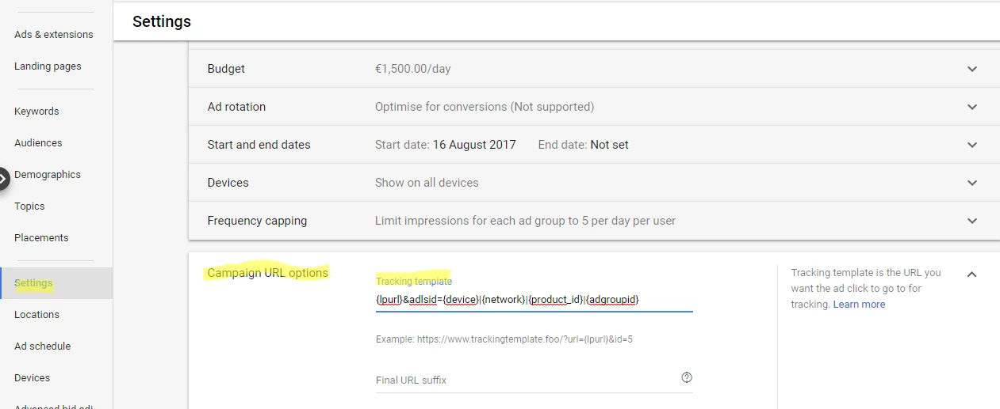
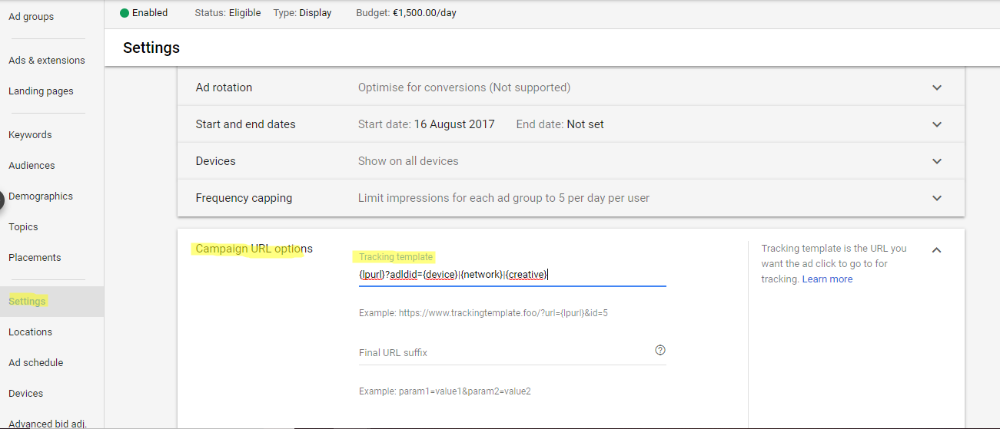
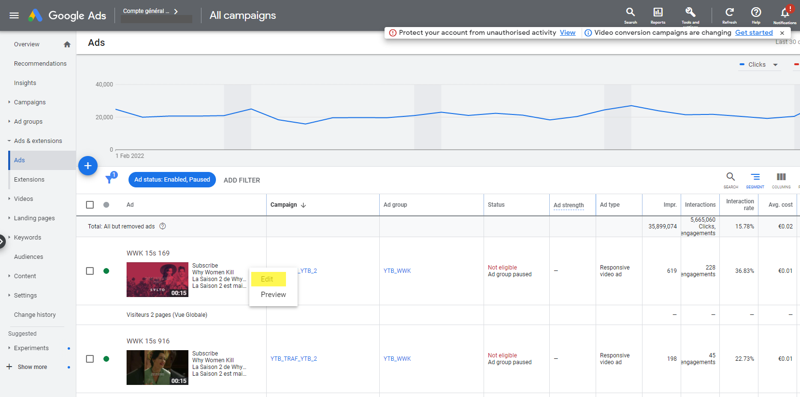
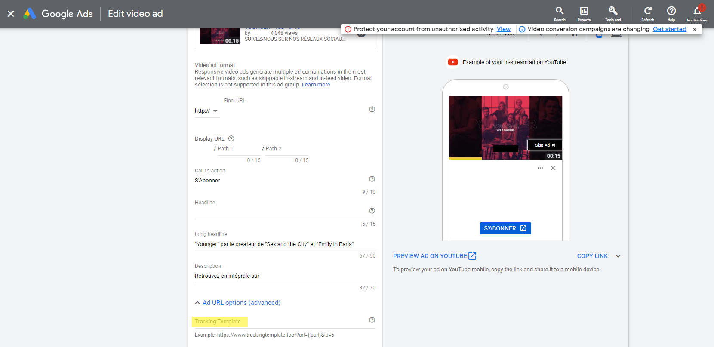

Search is the (default ) mode of URL templates for  **Google**  Ads. 

If you run  **Shopping** or  **Display,**  **Youtube,**  **Performance Max**  or  **Discovery** campaigns, don’t forget to follow the dedicated instructions below  .

##  a. Google Search Campaigns

| Account level | 
| Go to  _"All campaigns" > "Settings" > "Account Settings" > Tracking_  | 
| loopcd → (for all analytics platforms) | 
|  **If Adloop is the only tracking template** , just copy-paste the following{lpurl}?loopcd=SEg|{device}|{network}|{keyword}|{creative}|{matchtype} **If Adloop isn't the only tracking template,**  add the following to the existing template &loopcd=SEg|{device}|{network}|{keyword}|{creative}|{matchtype} | 
|  --- | 
|  --- | 
|  --- | 
|  --- | 
| Account level | 
| Go to  _"All campaigns" > "Settings" > "Account Settings" > Tracking_  | 
| loopcd → (for all analytics platforms) | 
|  **If Adloop is the only tracking template** , just copy-paste the following{lpurl}?loopcd=SEg|{device}|{network}|{keyword}|{creative}|{matchtype} **If Adloop isn't the only tracking template,**  add the following to the existing template &loopcd=SEg|{device}|{network}|{keyword}|{creative}|{matchtype} | 

##  b. Google Shopping Campaigns

| Campaign level | 
| Go to your _Shopping campaign  > Settings > Campaign URL options_  | 
| loopcd → (for all analytics platforms) | 
|  **If Adloop is the only tracking template** , just copy-paste the following{lpurl}?loopcd=COg|{device}|{network}|{product_id}|{adgroupid} **If Adloop isn't the only tracking template,**  add the following to the existing template &loopcd=COg|{device}|{network}|{product_id}|{adgroupid} | 
|  --- | 
|  --- | 
|  --- | 
|  --- | 
| Campaign level | 
| Go to your _Shopping campaign  > Settings > Campaign URL options_  | 
| loopcd → (for all analytics platforms) | 
|  **If Adloop is the only tracking template** , just copy-paste the following{lpurl}?loopcd=COg|{device}|{network}|{product_id}|{adgroupid} **If Adloop isn't the only tracking template,**  add the following to the existing template &loopcd=COg|{device}|{network}|{product_id}|{adgroupid} | 

##  c. Google Display Campaigns

| Campaign level | 
| Go to your _Display campaign  > Settings > Campaign URL options_  | 
| loopcd → (for all analytics platforms) | 
|  **If Adloop is the only tracking template** , just copy-paste the following{lpurl}?loopcd=DIs|{device}|{network}|{creative} **If Adloop isn't the only tracking template,**  add the following to the existing template &loopcd=DIs|{device}|{network}|{creative} | 
|  --- | 
|  --- | 
|  --- | 
|  --- | 
| Campaign level | 
| Go to your _Display campaign  > Settings > Campaign URL options_  | 
| loopcd → (for all analytics platforms) | 
|  **If Adloop is the only tracking template** , just copy-paste the following{lpurl}?loopcd=DIs|{device}|{network}|{creative} **If Adloop isn't the only tracking template,**  add the following to the existing template &loopcd=DIs|{device}|{network}|{creative} | 

##  d. Youtube Campaigns

| Video Ad level | 
| Go to your  _Video campaign > Ad & Extensions_ Select the video ad, click on  _Edit_ and go to  _Ad URL options (advanced)_ There you can find the  _Tracking Template field_ Copy paste the URL template & Save changes | 
| loopcd → (for all analytics platforms) | 
|  **If Adloop is the only tracking template** , just copy-paste the following{lpurl}?loopcd=DIy|{device}|{network}|{creative} **If Adloop isn't the only tracking template,**  add the following to the existing template &loopcd=DIy|{device}|{network}|{creative} | 
|  --- | 
|  --- | 
|  --- | 
|  --- | 
| Video Ad level | 
| Go to your  _Video campaign > Ad & Extensions_ Select the video ad, click on  _Edit_ and go to  _Ad URL options (advanced)_ There you can find the  _Tracking Template field_ Copy paste the URL template & Save changes | 
| loopcd → (for all analytics platforms) | 
|  **If Adloop is the only tracking template** , just copy-paste the following{lpurl}?loopcd=DIy|{device}|{network}|{creative} **If Adloop isn't the only tracking template,**  add the following to the existing template &loopcd=DIy|{device}|{network}|{creative} | 

## e.  Performance Max campaigns 

| Campaign level | 
| Go to your _Performance Max campaign  > Settings > Campaign URL options_  | 
| loopcd → (for all analytics platforms) | 
|  **If Adloop is the only tracking template** , just copy-paste the following{lpurl}?loopcd=COp|{device}|{network}|{campaignid}|{product_id} **If Adloop isn't the only tracking template,**  add the following to the existing template &loopcd=COp|{device}|{network}|{campaignid}|{product_id} | 
|  --- | 
|  --- | 
|  --- | 
|  --- | 
| Campaign level | 
| Go to your _Performance Max campaign  > Settings > Campaign URL options_  | 
| loopcd → (for all analytics platforms) | 
|  **If Adloop is the only tracking template** , just copy-paste the following{lpurl}?loopcd=COp|{device}|{network}|{campaignid}|{product_id} **If Adloop isn't the only tracking template,**  add the following to the existing template &loopcd=COp|{device}|{network}|{campaignid}|{product_id} | 

##  f.  Discovery / Demand Gen campaigns 

| Campaign level | 
| Go to your _Discovery campaign  > Settings > Campaign URL options_  | 
| loopcd → (for all analytics platforms) | 
|  **If Adloop is the only tracking template** , just copy-paste the following{lpurl}?loopcd=DIc|{device}|{creative} **If Adloop isn't the only tracking template,**  add the following to the existing template &loopcd=DIc|{device}|{creative} | 
|  --- | 
|  --- | 
|  --- | 
|  --- | 
| Campaign level | 
| Go to your _Discovery campaign  > Settings > Campaign URL options_  | 
| loopcd → (for all analytics platforms) | 
|  **If Adloop is the only tracking template** , just copy-paste the following{lpurl}?loopcd=DIc|{device}|{creative} **If Adloop isn't the only tracking template,**  add the following to the existing template &loopcd=DIc|{device}|{creative} | 

*****

[[category.storage-team]] 
[[category.confluence]] 
