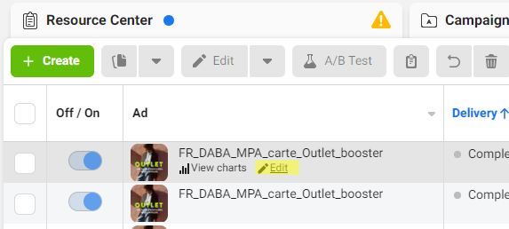
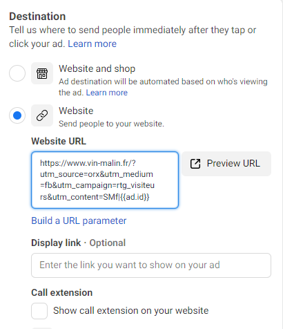

Those URLs are valid for Facebook Ads and Instagram Ads

| Ad level (all existing active Ads + new Ads) Instructions to be integrated in the trafficking process | 
| <ul><li>Go to the  _edit window_  of the Facebook Ad

</li><li>Go to the  _Website URL_  field

</li><li>Edit the destination URL to include the URL parameter

</li></ul> | 
|  _loopcd_ (for all analytics platforms including Adobe, Google or Piano Analytics)using the  _utm_content_  parameter in substitution is possible (only for Google Analytics) | 
| Just add the following string at the end of the destination URL&loopcd=SMf|{{ad.id}}&loopcd=SMf|{{ad.id}}|{{placement}}If Adloop is the only tracking parameter:?loopcd=SMf|{{ad.id}}?loopcd=SMf|{{ad.id}}|{{placement}}If you opt for the  _utm_content_ , use this value : &utm_content=SMf|{{ad.id}}&utm_content=SMf|{{ad.id}}|{{placement}} | 
| No, just chose one parameter and keep it consistent for all Facebook Ads Campaigns for now and the future  | 
|  --- | 
|  --- | 
|  --- | 
|  --- | 
|  --- | 
| Ad level (all existing active Ads + new Ads) Instructions to be integrated in the trafficking process | 
| <ul><li>Go to the  _edit window_  of the Facebook Ad

</li><li>Go to the  _Website URL_  field

</li><li>Edit the destination URL to include the URL parameter

</li></ul> | 
|  _loopcd_ (for all analytics platforms including Adobe, Google or Piano Analytics)using the  _utm_content_  parameter in substitution is possible (only for Google Analytics) | 
| Just add the following string at the end of the destination URL&loopcd=SMf|{{ad.id}}&loopcd=SMf|{{ad.id}}|{{placement}}If Adloop is the only tracking parameter:?loopcd=SMf|{{ad.id}}?loopcd=SMf|{{ad.id}}|{{placement}}If you opt for the  _utm_content_ , use this value : &utm_content=SMf|{{ad.id}}&utm_content=SMf|{{ad.id}}|{{placement}} | 
| No, just chose one parameter and keep it consistent for all Facebook Ads Campaigns for now and the future  | 

*****

[[category.storage-team]] 
[[category.confluence]] 
